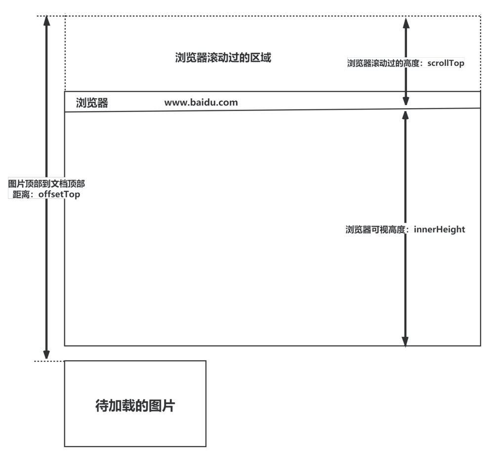
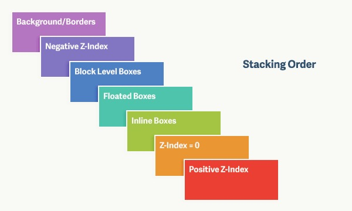
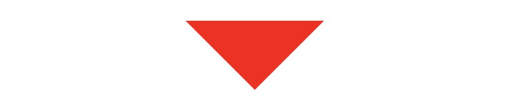
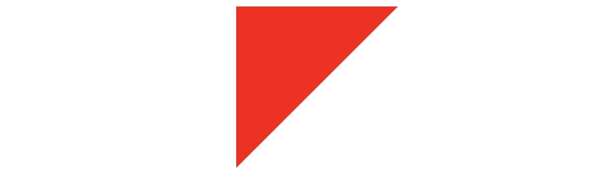
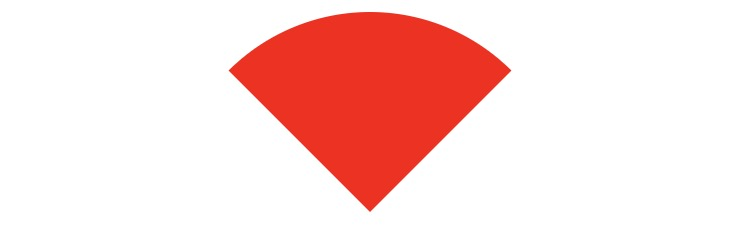
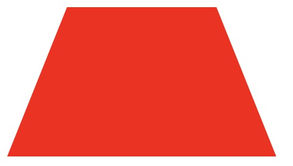

## CSS 基础
### 1. CSS 选择器及其优先级
* `!important` 优先级最高
* 内联/行内样式：1000
* id 选择器：100
* 类选择器、伪类选择器、属性选择器：10
* 标签选择器、伪元素选择器：1

| 选择器         | 格式          | 优先级权重 |
|-------------|---------------|------------|
| id选择器       | #id           | 100        |
| 类选择         | .classname    | 10         |
| 属性选择器     | a[ref=“eee”]  | 10         |
| 伪类选择器     | li:last-child | 10         |
| 标签选择器     | div           | 1          |
| 伪元素选择器   | li::after     | 1          |
| 相邻兄弟选择器 | h1+p          | 0          |
| 子选择器       | ul>li         | 0          |
| 后代选择器     | li a          | 0          |
| 通配符选择器   | *             | 0          |

---

### 2. 属性继承
#### 不可继承
* 盒子属性
  * `display`
  * `width、height、min-width、min-height、max-width、max-height、margin、border、padding`
* 文本属性
  * vertical-align：垂直文本对齐
  * text-decoration：规定添加到文本的装饰
  * text-shadow：文本阴影效果
  * white-space：空白符的处理
  * unicode-bidi：设置文本的方向
* 背景属性
  * `background、background-color、background-image、background-repeat、background-position、background-attachment`
* 定位属性
  * `float、clear、position、top、right、bottom、left、overflow、clip、z-index`
* 轮廓样式属性
  * `outline-style、outline-width、outline-color、outline`

#### 可继承
* 字体系列属性
  * font-family：字体系列
  * font-weight：字体的粗细
  * font-size：字体的大小
  * font-style：字体的风格
* 文本属性
  * text-indent：文本缩进
  * text-align：文本水平对齐
  * line-height：行高
  * word-spacing：单词之间的间距
  * letter-spacing：中文或者字母之间的间距
  * text-transform：控制文本大小写（就是uppercase、lowercase、capitalize这三个）
  * color：文本颜色
* 元素可见性
  * `visibility`
* 列表布局属性
  * list-style：列表风格，包括list-style-type、list-style-image等
* 光标属性
  * cursor：光标显示为何种形态

---

### 3. display
* block：独占一行，可以设置 `width、height、margin、padding`；
* inline：元素不会独占一行，设置width、height属性无效。**但可以设置水平方向的margin和padding属性，不能设置垂直方向的padding和margin**；
* inline-block：元素不会独占一行，可以设置 `width、height、margin、padding`。

---

### 4. 隐藏标签
* `display: none`。不会在页面中占据位置，也不会响应绑定的监听事件
* `visibility: hidden`。元素在页面中仍占据空间，但是不会响应绑定的监听事件。
* `opacity: 0`。元素在页面中仍然占据空间，并且能够响应元素绑定的监听事件。
* `position: absolute`
* `z-index: 负值`
* `transform: scale(0,0)`。将元素缩放为 0，来实现元素的隐藏。这种方法下，元素仍在页面中占据位置，但是不会响应绑定的监听事件
* `clip/clip-path`。使用元素裁剪的方法来实现元素的隐藏，这种方法下，元素仍在页面中占据位置，但是不会响应绑定的监听事件。

---

### 5. display:none vs visibility:hidden
这两个属性都是让元素隐藏，不可见。两者区别如下：
* 在渲染树中
  * display:none会让元素完全从渲染树中消失，渲染时不会占据任何空间；
  * visibility:hidden不会让元素从渲染树中消失，渲染的元素还会占据相应的空间，只是内容不可见。
* 是否是继承属性
  * display:none是非继承属性，子孙节点会随着父节点从渲染树消失，通过修改子孙节点的属性也无法显示；
  * visibility:hidden是继承属性，子孙节点消失是由于继承了hidden，通过设置visibility:visible可以让子孙节点显示；
  * 修改常规文档流中元素的 display 通常会造成文档的重排，但是修改visibility属性只会造成本元素的重绘；
  * 如果使用读屏器，设置为display:none的内容不会被读取，设置为visibility:hidden的内容会被读取。

---

### 6. link vs @import
* link是XHTML标签，除了加载CSS外，还可以定义RSS等其他事务；@import属于CSS范畴，只能加载CSS。
* link是XHTML标签，无兼容问题；@import是在CSS2.1提出的，低版本的浏览器不支持。
* link支持使用Javascript控制DOM去改变样式；而@import不支持。
* link引用CSS时，在页面载入时同时加载；@import需要页面网页完全载入以后加载。

---

### 7. 伪元素和伪类的区别和作用
* 伪元素：在内容元素的前后插入额外的元素或样式，但是这些元素实际上并不在文档中生成。它们只在外部显示可见，但不会在文档的源代码中找到它们，因此，称为“伪”元素。例如：
  ``` css
  p::before {content:"第一章：";}
  p::after {content:"Hot!";}
  p::first-line {background:red;}
  p::first-letter {font-size:30px;}
  ```
* 伪类：将特殊的效果添加到特定选择器上。它是已有元素上添加类别的，不会产生新的元素。例如：
  ``` css
  a:hover {color: #FF00FF}
  p:first-child {color: red}
  ```

---

### 8. animation vs transition
* transition是过渡属性，强调过度，它的实现需要触发一个事件（比如鼠标移动上去，焦点，点击等）才执行动画。它类似于flash的补间动画，设置一个开始关键帧，一个结束关键帧。
* animation是动画属性，它的实现不需要触发事件，设定好时间之后可以自己执行，且可以循环一个动画。它也类似于flash的补间动画，但是它可以设置多个关键帧（用@keyframe定义）完成动画。

---

### 9. requestAnimationframe
实现动画效果的方法比较多，Javascript 中可以通过定时器 setTimeout 来实现，CSS3 中可以使用 transition 和 animation 来实现，HTML5 中的 canvas 也可以实现。除此之外，HTML5 提供一个专门用于请求动画的API，那就是 requestAnimationFrame，顾名思义就是**请求动画帧**。

语法：`window.requestAnimationFrame(callback)`;  其中，callback是下一次重绘之前更新动画帧所调用的函数(即上面所说的回调函数)。该回调函数会被传入DOMHighResTimeStamp参数，它表示requestAnimationFrame() 开始去执行回调函数的时刻。该方法属于宏任务，所以会在执行完微任务之后再去执行。

取消动画：使用`cancelAnimationFrame()`来取消执行动画，该方法接收一个参数——requestAnimationFrame默认返回的id，只需要传入这个id就可以取消动画了。

优势：
* CPU节能：使用SetInterval 实现的动画，当页面被隐藏或最小化时，SetInterval 仍然在后台执行动画任务，由于此时页面处于不可见或不可用状态，刷新动画是没有意义的，完全是浪费CPU资源。而RequestAnimationFrame则完全不同，当页面处理未激活的状态下，该页面的屏幕刷新任务也会被系统暂停，因此跟着系统走的RequestAnimationFrame也会停止渲染，当页面被激活时，动画就从上次停留的地方继续执行，有效节省了CPU开销。
* 函数节流：在高频率事件( resize, scroll 等)中，为了防止在一个刷新间隔内发生多次函数执行，RequestAnimationFrame可保证每个刷新间隔内，函数只被执行一次，这样既能保证流畅性，也能更好的节省函数执行的开销，一个刷新间隔内函数执行多次时没有意义的，因为多数显示器每16.7ms刷新一次，多次绘制并不会在屏幕上体现出来。
* 减少DOM操作：requestAnimationFrame 会把每一帧中的所有DOM操作集中起来，在一次重绘或回流中就完成，并且重绘或回流的时间间隔紧紧跟随浏览器的刷新频率，一般来说，这个频率为每秒60帧。

setTimeout执行动画的缺点：它通过设定间隔时间来不断改变图像位置，达到动画效果。但是容易出现卡顿、抖动的现象；原因是：
* settimeout任务被放入异步队列，只有当主线程任务执行完后才会执行队列中的任务，因此实际执行时间总是比设定时间要晚；
* settimeout的固定时间间隔不一定与屏幕刷新间隔时间相同，会引起丢帧。

---

### 10. 盒模型
CSS3中的盒模型有以下两种：**标准盒子模型**、**IE盒子模型**
盒模型都是由四个部分组成的，分别是 `margin、border、padding和content`。

标准盒模型和IE盒模型的区别在于设置width和height时，所对应的范围不同：
* 标准盒模型的width和height属性的范围只包含了content，
* IE盒模型的width和height属性的范围包含了border、padding和content。

可以通过修改元素的box-sizing属性来改变元素的盒模型：
* box-sizing: content-box表示标准盒模型（默认值）
* box-sizing: border-box表示IE盒模型（怪异盒模型）

---

### 11. li 与 li 之间有看不见的空白间隔是什么原因引起的？如何解决？
浏览器会把inline内联元素间的空白字符（空格、换行、Tab等）渲染成一个空格。为了美观，通常是一个`<li>`放在一行，这导致`<li>`换行后产生换行字符，它变成一个空格，占用了一个字符的宽度。
解决办法：
1. 为`<li>`设置 `float: left`。不足：有些容器是不能设置浮动，如左右切换的焦点图等。
2. 将所有`<li>`写在同一行。不足：代码不美观。
3. 将`<ul>`内的字符尺寸直接设为0，即 `font-size:0`。不足：`<ul>`中的其他字符尺寸也被设为0，需要额外重新设定其他字符尺寸，且在Safari浏览器依然会出现空白间隔。
4. 消除`<ul>`的字符间隔letter-spacing:-8px，不足：这也设置了`<li>`内的字符间隔，因此需要将`<li>`内的字符间隔设为默认letter-spacing:normal。

---

### 12. 常见的图片格式及使用场景
1. BMP，是无损的、既支持索引色也支持直接色的点阵图。这种图片格式几乎没有对数据进行压缩，所以BMP格式的图片通常是较大的文件。
2. GIF是无损的、采用索引色的点阵图。采用LZW压缩算法进行编码。文件小，是GIF格式的优点，同时，GIF格式还具有支持动画以及透明的优点。但是GIF格式仅支持8bit的索引色，所以GIF格式适用于对色彩要求不高同时需要文件体积较小的场景。
3. JPEG是有损的、采用直接色的点阵图。JPEG的图片的优点是采用了直接色，得益于更丰富的色彩，JPEG非常适合用来存储照片，与GIF相比，JPEG不适合用来存储企业Logo、线框类的图。因为有损压缩会导致图片模糊，而直接色的选用，又会导致图片文件较GIF更大。
4. **PNG-8是无损的、使用索引色的点阵图**。PNG是一种比较新的图片格式，PNG-8是非常好的GIF格式替代者，在可能的情况下，应该尽可能的使用PNG-8而不是GIF，因为在相同的图片效果下，PNG-8具有更小的文件体积。除此之外，PNG-8还支持透明度的调节，而GIF并不支持。**除非需要动画的支持，否则没有理由使用GIF而不是PNG-8。**
5. **PNG-24是无损的、使用直接色的点阵图**。PNG-24的优点在于它压缩了图片的数据，使得同样效果的图片，PNG-24格式的文件大小要比BMP小得多。当然，PNG24的图片还是要比JPEG、GIF、PNG-8大得多。
6. SVG是无损的矢量图。SVG是矢量图意味着SVG图片由直线和曲线以及绘制它们的方法组成。当放大SVG图片时，看到的还是线和曲线，而不会出现像素点。SVG图片在放大时，不会失真，所以它适合用来绘制Logo、Icon等。
7. WebP是谷歌开发的一种新图片格式，WebP是同时支持有损和无损压缩的、使用直接色的点阵图。从名字就可以看出来它是为Web而生的，什么叫为Web而生呢？就是说相同质量的图片，WebP具有更小的文件体积。现在网站上充满了大量的图片，如果能够降低每一个图片的文件大小，那么将大大减少浏览器和服务器之间的数据传输量，进而降低访问延迟，提升访问体验。目前只有Chrome浏览器和Opera浏览器支持WebP格式，兼容性不太好。
* 在无损压缩的情况下，相同质量的WebP图片，文件大小要比PNG小26%；
* 在有损压缩的情况下，具有相同图片精度的WebP图片，文件大小要比JPEG小25%~34%；
* WebP图片格式支持图片透明度，一个无损压缩的WebP图片，如果要支持透明度只需要22%的格外文件大小。

---

### 13. margin 和 padding 的使用场景
* 需要在border外侧添加空白，且空白处不需要背景（色）时，使用 margin；
* 需要在border内测添加空白，且空白处需要背景（色）时，使用 padding。

---

### 14. line-height 
* line-height的概念：
  * line-height 指一行文本的高度，包含了字间距，实际上是下一行基线到上一行基线距离；
  * 如果一个标签没有定义 height 属性，那么其最终表现的高度由 line-height 决定；
  * 一个容器没有设置高度，那么撑开容器高度的是 line-height，而不是容器内的文本内容；
  * 把 line-height 值设置为 height 一样大小的值可以实现单行文字的垂直居中；
  * line-height 和 height 都能撑开一个高度；
* line-height 的赋值方式：
  * 带单位：px 是固定值，而 em 会参考父元素 font-size 值计算自身的行高
  * 纯数字：会把比例传递给后代。例如，父级行高为 1.5，子元素字体为 18px，则子元素行高为 1.5 * 18 = 27px
  * 百分比：将计算后的值传递给后代

---

### 15. ::before 和 :after 的双冒号和单冒号有什么区别？
* 冒号(:)用于CSS3伪类，双冒号(::)用于CSS3伪元素。
* ::before就是以一个子元素的存在，定义在元素主体内容之前的一个伪元素。并不存在于dom之中，只存在在页面之中。

注意： :before 和 :after 这两个伪元素，是在CSS2.1里新出现的。起初，伪元素的前缀使用的是单冒号语法，但随着Web的进化，在CSS3的规范里，伪元素的语法被修改成使用双冒号，成为::before、::after。

---

### 16. 媒体查询
媒体查询由⼀个可选的媒体类型和零个或多个使⽤媒体功能的限制了样式表范围的表达式组成，例如宽度、⾼度和颜⾊。媒体查询，添加⾃CSS3，允许内容的呈现针对⼀个特定范围的输出设备⽽进⾏裁剪，⽽不必改变内容本身，适合web⽹⻚应对不同型号的设备⽽做出对应的响应适配。 

媒体查询包含⼀个可选的媒体类型和满⾜CSS3规范的条件下，包含零个或多个表达式，这些表达式描述了媒体特征，最终会被解析为true或false。如果媒体查询中指定的媒体类型匹配展示⽂档所使⽤的设备类型，并且所有的表达式的值都是true，那么该媒体查询的结果为true。那么媒体查询内的样式将会⽣效。
``` css
@media (max-width: 600px) { 
  .facet_sidebar { 
    display: none; 
  } 
}
```
简单来说，使用 @media 查询，可以针对不同的媒体类型定义不同的样式。@media 可以针对不同的屏幕尺寸设置不同的样式，特别是需要设置设计响应式的页面，@media 是非常有用的。当重置浏览器大小的过程中，页面也会根据浏览器的宽度和高度重新渲染页面。

---

## CSS 进阶
### 1. CSS 优化和提高性能的方法有哪些？
* 加载性能：
  1. css压缩：将写好的css进行打包压缩，可以减小文件体积。
  2. css单一样式：当需要下边距和左边距的时候，很多时候会选择使用 margin:top 0 bottom 0；但margin-bottom:bottom;margin-left:left;执行效率会更高。
  3. 减少使用@import，建议使用link，因为后者在页面加载时一起加载，前者是等待页面加载完成之后再进行加载。

* 选择器性能：
  1. 关键选择器（key selector）。选择器的最后面的部分为关键选择器（即用来匹配目标元素的部分）。CSS选择符是从右到左进行匹配的。当使用后代选择器的时候，浏览器会遍历所有子元素来确定是否是指定的元素等等；
  2. 如果规则拥有ID选择器作为其关键选择器，则不要为规则增加标签。过滤掉无关的规则（这样样式系统就不会浪费时间去匹配它们了）。
  3. 避免使用通配规则，如*{}计算次数惊人，只对需要用到的元素进行选择。
  4. 尽量少的去对标签进行选择，而是用class。
  5. 尽量少的去使用后代选择器，降低选择器的权重值。后代选择器的开销是最高的，尽量将选择器的深度降到最低，最高不要超过三层，更多的使用类来关联每一个标签元素。
  6. 了解哪些属性是可以通过继承而来的，然后避免对这些属性重复指定规则。

* 渲染性能：
  1. 慎重使用高性能属性：浮动、定位。
  2. 尽量减少页面重排、重绘。
  3. 去除空规则：｛｝。空规则的产生原因一般来说是为了预留样式。去除这些空规则无疑能减少css文档体积。
  4. 属性值为0时，不加单位。
  5. 属性值为浮动小数0.**，可以省略小数点之前的0。
  6. 标准化各种浏览器前缀：带浏览器前缀的在前。标准属性在后。
  7. 不使用@import前缀，它会影响css的加载速度。
  8. 选择器优化嵌套，尽量避免层级过深。
  9. css雪碧图，同一页面相近部分的小图标，方便使用，减少页面的请求次数，但是同时图片本身会变大，使用时，优劣考虑清楚，再使用。
  10. 正确使用display的属性，由于display的作用，某些样式组合会无效，徒增样式体积的同时也影响解析性能。
  11. 不滥用web字体。对于中文网站来说WebFonts可能很陌生，国外却很流行。web fonts通常体积庞大，而且一些浏览器在下载web fonts时会阻塞页面渲染损伤性能。

* 可维护性、健壮性：
  1. 将具有相同属性的样式抽离出来，整合并通过class在页面中进行使用，提高css的可维护性。
  2. 样式与内容分离：将css代码定义到外部css中。

---

### 2. CSS预处理器/后处理器
* 预处理器，如：less，sass，stylus，用来预编译sass或者less，增加了css代码的复用性。层级，mixin，变量，循环，函数等对编写以及开发UI组件都极为方便。
* 后处理器， 如：postCss，通常是在完成的样式表中根据css规范处理css，让其更加有效。目前最常做的是给css属性添加浏览器私有前缀，实现跨浏览器兼容性的问题。

使用原因：
* 结构清晰， 便于扩展
* 可以很方便的屏蔽浏览器私有语法的差异
* 可以轻松实现多重继承
* 完美的兼容了CSS代码，可以应用到老项目中

---

### 3. 单行、多行文本溢出隐藏
* 单行
  ``` css
  overflow: hidden;            // 溢出隐藏
  text-overflow: ellipsis;      // 溢出用省略号显示
  white-space: nowrap;         // 规定段落中的文本不进行换行
  ```
* 多行
  ``` css
  overflow: hidden;            // 溢出隐藏
  text-overflow: ellipsis;     // 溢出用省略号显示
  display:-webkit-box;         // 作为弹性伸缩盒子模型显示。
  -webkit-box-orient:vertical; // 设置伸缩盒子的子元素排列方式：从上到下垂直排列
  -webkit-line-clamp:3;        // 显示的行数
  ```
  注意：由于上面的三个属性都是 CSS3 的属性，没有浏览器可以兼容，所以要在前面加一个-webkit- 来兼容一部分浏览器。

---

### 4. 对 CSS 工程化的理解
CSS 工程化是为了解决以下问题：
1. 宏观设计：CSS 代码如何组织、如何拆分、模块结构怎样设计？
2. 编码优化：怎样写出更好的 CSS？
3. 构建：如何处理我的 CSS，才能让它的打包结果最优？
4. 可维护性：代码写完了，如何最小化它后续的变更成本？如何确保任何一个同事都能轻松接手？

以下三个方向都是时下比较流行的、普适性非常好的 CSS 工程化实践：
* 预处理器：Less、 Sass 等；
* 重要的工程化插件： PostCss；
* Webpack loader 等 。

---

### 5. 如何判断元素是否到达可视区域 
以图片显示为例：
* window.innerHeight 是浏览器可视区的高度；
* document.body.scrollTop || document.documentElement.scrollTop 是浏览器滚动的过的距离；
* imgs.offsetTop 是元素顶部距离文档顶部的高度（包括滚动条的距离）；
* 内容达到显示区域的：img.offsetTop < window.innerHeight + document.body.scrollTop;


---

### 6. 布局
常用的布局单位包括像素（px），百分比（%），em（父元素），rem（根元素），vw/vh。
#### 两列布局
一般两栏布局指的是左边一栏宽度固定，右边一栏宽度自适应。
* 利用浮动，将左边元素宽度设置为200px，并且设置向左浮动。将右边元素的margin-left设置为200px，宽度设置为auto（默认为auto，撑满整个父元素）。
  ``` css
  .outer {
    height: 100px;
  }
  .left {
    float: left;
    width: 200px;
    background: tomato;
  }
  .right {
    margin-left: 200px;
    width: auto;
    background: gold;
  }
  ```

* 利用浮动，左侧元素设置固定大小，并左浮动，右侧元素设置overflow: hidden; 这样右边就触发了BFC，BFC的区域不会与浮动元素发生重叠，所以两侧就不会发生重叠。
  ``` css
  .left{
    width: 100px;
    height: 200px;
    background: red;
    float: left;
  }
  .right{
    height: 300px;
    background: blue;
    overflow: hidden;
  }
  ```

* 利用flex布局，将左边元素设置为固定宽度200px，将右边的元素设置为flex:1。
  ``` css
  .outer {
    display: flex;
    height: 100px;
  }
  .left {
    width: 200px;
    background: tomato;
  }
  .right {
    flex: 1;
    background: gold;
  }
  ```

* 利用绝对定位，将父级元素设置为相对定位。左边元素设置为absolute定位，并且宽度设置为200px。将右边元素的margin-left的值设置为200px。
  ``` css
  .outer {
    position: relative;
    height: 100px;
  }
  .left {
    position: absolute;
    width: 200px;
    height: 100px;
    background: tomato;
  }
  .right {
    margin-left: 200px;
    background: gold;
  }
  ```

* 利用绝对定位，将父级元素设置为相对定位。左边元素宽度设置为200px，右边元素设置为绝对定位，左边定位为200px，其余方向定位为0。
  ``` css
  .outer {
    position: relative;
    height: 100px;
  }
  .left {
    width: 200px;
    background: tomato;
  }
  .right {
    position: absolute;
    top: 0;
    right: 0;
    bottom: 0;
    left: 200px;
    background: gold;
  }
  ```

#### 三栏布局
三栏布局一般指的是页面中一共有三栏，左右两栏宽度固定，中间自适应的布局。
* 利用绝对定位，左右两栏设置为绝对定位，中间设置对应方向大小的margin的值。
  ``` css
  .outer {
    position: relative;
    height: 100px;
  }

  .left {
    position: absolute;
    width: 100px;
    height: 100px;
    background: tomato;
  }

  .right {
    position: absolute;
    top: 0;
    right: 0;
    width: 200px;
    height: 100px;
    background: gold;
  }

  .center {
    margin-left: 100px;
    margin-right: 200px;
    height: 100px;
    background: lightgreen;
  }
  ```

* 利用flex布局，左右两栏设置固定大小，中间一栏设置为flex:1。
  ``` css
  .outer {
    display: flex;
    height: 100px;
  }

  .left {
    width: 100px;
    background: tomato;
  }

  .right {
    width: 100px;
    background: gold;
  }

  .center {
    flex: 1;
    background: lightgreen;
  }
  ```

* 利用浮动，左右两栏设置固定大小，并设置对应方向的浮动。中间一栏设置左右两个方向的margin值，注意这种方式，中间一栏必须放到最后：
  ``` css
  .outer {
    height: 100px;
  }

  .left {
    float: left;
    width: 100px;
    height: 100px;
    background: tomato;
  }

  .right {
    float: right;
    width: 200px;
    height: 100px;
    background: gold;
  }

  .center {
    height: 100px;
    margin-left: 100px;
    margin-right: 200px;
    background: lightgreen;
  }
  ```

* 圣杯布局，利用浮动和负边距来实现。父级元素设置左右的 padding，三列均设置向左浮动，中间一列放在最前面，宽度设置为父级元素的宽度，因此后面两列都被挤到了下一行，通过设置 margin 负值将其移动到上一行，再利用相对定位，定位到两边。
  ``` css
  .outer {
    height: 100px;
    padding-left: 100px;
    padding-right: 200px;
  }

  .left {
    position: relative;
    left: -100px;

    float: left;
    margin-left: -100%;

    width: 100px;
    height: 100px;
    background: tomato;
  }

  .right {
    position: relative;
    left: 200px;

    float: right;
    margin-left: -200px;

    width: 200px;
    height: 100px;
    background: gold;
  }

  .center {
    float: left;

    width: 100%;
    height: 100px;
    background: lightgreen;
  }
  ```
* 双飞翼布局，双飞翼布局相对于圣杯布局来说，左右位置的保留是通过中间列的 margin 值来实现的，而不是通过父元素的 padding 来实现的。本质上来说，也是通过浮动和外边距负值来实现的。
  ``` css
  .outer {
    height: 100px;
  }

  .left {
    float: left;
    margin-left: -100%;

    width: 100px;
    height: 100px;
    background: tomato;
  }

  .right {
    float: left;
    margin-left: -200px;

    width: 200px;
    height: 100px;
    background: gold;
  }

  .wrapper {
    float: left;

    width: 100%;
    height: 100px;
    background: lightgreen;
  }

  .center {
    margin-left: 100px;
    margin-right: 200px;
    height: 100px;
  }
  ```

#### 水平垂直居中的实现
* 利用绝对定位，先将元素的左上角通过top:50%和left:50%定位到页面的中心，然后再通过translate来调整元素的中心点到页面的中心。该方法需要考虑浏览器兼容问题。
  ``` css
  .parent {
    position: relative;
  }
  
  .child {
    position: absolute;
    left: 50%;
    top: 50%;
    transform: translate(-50%,-50%);
  }
  ```

* 利用绝对定位，设置四个方向的值都为0，并将margin设置为auto，由于宽高固定，因此对应方向实现平分，可以实现水平和垂直方向上的居中。该方法适用于盒子有宽高的情况：
  ``` css
  .parent {
    position: relative;
  }
  
  .child {
    position: absolute;
    top: 0;
    bottom: 0;
    left: 0;
    right: 0;
    margin: auto;
  }
  ```

* 使用flex布局，通过align-items:center和justify-content:center设置容器的垂直和水平方向上为居中对齐，然后它的子元素也可以实现垂直和水平的居中。该方法要考虑兼容的问题，该方法在移动端用的较多：
  ``` css
  .parent {
    display: flex;
    justify-content:center;
    align-items:center;
  }
  ```

---

### 7. 响应式设计基本原理
关于原理：基本原理是通过媒体查询（@media）查询检测不同的设备屏幕尺寸做处理。
关于兼容：页面头部必须有mate声明的viewport。
``` css
<meta name="’viewport’" content="”width=device-width," initial-scale="1." maximum-scale="1,user-scalable=no”"/>
```

---

### 8. 定位与浮动
浮动元素引起的问题？
* 父元素的高度无法被撑开，影响与父元素同级的元素
* 与浮动元素同级的非浮动元素会跟随其后
* 若浮动的元素不是第一个元素，则该元素之前的元素也要浮动，否则会影响页面的显示结构

清除浮动的方式如下：
* 给父级div定义height属性
* 最后一个浮动元素之后添加一个空的div标签，并添加 `clear:both` 样式
* 包含浮动元素的父级标签添加 `overflow:hidden` 或者 `overflow:auto`
* 使用 ::after 伪元素。由于IE6-7不支持 ::after，使用 zoom:1 触发 hasLayout**
  ``` css
  .clearfix::after{
    content:'';
    display: block; 
    clear:both;
  }
  .clearfix{
    *zoom: 1;
  }
  ```

---
### 9. BFC
`块格式化上下文（Block Formatting Context，BFC）`是Web页面的可视化CSS渲染的一部分，是布局过程中生成块级盒子的区域，也是浮动元素与其他元素的交互限定区域。

通俗来讲：BFC是一个独立的布局环境，可以理解为一个容器，在这个容器中按照一定规则进行物品摆放，并且不会影响其它环境中的物品。如果一个元素符合触发BFC的条件，则BFC中的元素布局不受外部影响。

创建BFC的条件：
* 根元素：body；
* 元素设置浮动：float 除 none 以外的值；
* 元素设置绝对定位：position (absolute、fixed)；
* display 值为：inline-block、table-cell、table-caption、flex等；
* overflow 值为：hidden、auto、scroll；

BFC的特点：
* 垂直方向上，自上而下排列，和文档流的排列方式一致。
* 在BFC中上下相邻的两个容器的margin会重叠
* 计算BFC的高度时，需要计算浮动元素的高度
* BFC区域不会与浮动的容器发生重叠
* BFC是独立的容器，容器内部元素不会影响外部元素
* 每个元素的左margin值和容器的左border相接触

BFC的作用：
* 解决margin的重叠问题：由于BFC是一个独立的区域，内部的元素和外部的元素互不影响，将两个元素变为两个BFC，就解决了margin重叠的问题。
* 解决高度塌陷的问题：在对子元素设置浮动后，父元素会发生高度塌陷，也就是父元素的高度变为0。解决这个问题，只需要把父元素变成一个BFC。常用的办法是给父元素设置overflow:hidden。
* 创建自适应两栏布局：可以用来创建自适应两栏布局：左边的宽度固定，右边的宽度自适应。
  左侧设置float:left，右侧设置overflow: hidden。这样右边就触发了BFC，BFC的区域不会与浮动元素发生重叠，所以两侧就不会发生重叠，实现了自适应两栏布局。

---

### 10. margin重叠问题
两个块级元素的上外边距和下外边距可能会合并（折叠）为一个外边距，其大小会取其中外边距值大的那个，这种行为就是外边距折叠。需要注意的是，**浮动的元素和绝对定位这种脱离文档流的元素的外边距不会折叠。重叠只会出现在垂直方向**。

计算原则：
折叠合并后外边距的计算原则如下：（谁绝对值大选谁）
* 如果两者都是正数，那么就去最大者
* 如果是一正一负，就会正值减去负值的绝对值
* 两个都是负值时，用0减去两个中绝对值大的那个

---

### 11.层叠顺序

对于上图，由上到下分别是：
1. 背景和边框：建立当前层叠上下文元素的背景和边框。
2. 负的z-index：当前层叠上下文中，z-index属性值为负的元素。
3. 块级盒：文档流内非行内级非定位后代元素。
4. 浮动盒：非定位浮动元素。
5. 行内盒：文档流内行内级非定位后代元素。
6. z-index:0：层叠级数为0的定位元素。
7. 正z-index：z-index属性值为正的定位元素。

注意: 当定位元素z-index:auto，生成盒在当前层叠上下文中的层级为 0，不会建立新的层叠上下文，除非是根元素。

---

### 12. display、float、position的关系
* 首先判断display属性是否为none，如果为none，则position和float属性的值不影响元素最后的表现。
* 然后判断position的值是否为absolute或者fixed，如果是，则float属性失效，并且display的值应该被设置为table或者block，具体转换需要看初始转换值。
* 如果position的值不为absolute或者fixed，则判断float属性的值是否为none，如果不是，则display的值则按上面的规则转换。**注意，如果position的值为relative并且float属性的值存在，则relative相对于浮动后的最终位置定位。**
* 如果float的值为none，则判断元素是否为根元素，如果是根元素则display属性按照上面的规则转换，如果不是，则保持指定的display属性值不变。

---

## 应用
### 1. 实现一个三角形
``` css
div {
  width: 0;
  height: 0;
  border: 50px solid transparent;
  border-top-color: red;
}
```


``` css
div {
  width: 0;
  height: 0;
  border: 50px solid transparent;
  border-top-color: red;
  border-left-color: red;
}
```


``` css
div{
  width: 0;
  height: 0;
  border: 50px solid transparent;
  border-top-color: red;
  border-radius: 50%;
}
```


``` css
.trapezoid {
  width: 160px;
  height: 0;
  border: 50px solid transparent;
  border-bottom-color: red;
}
```


---

### 2. 设置小于12px的字体
在谷歌下css设置字体大小为12px及以下时，显示都是一样大小，都是默认12px。

解决办法：
* 使用Webkit的内核的-webkit-text-size-adjust的私有CSS属性来解决，只要加了-webkit-text-size-adjust:none;字体大小就不受限制了。但是chrome更新到27版本之后就不可以用了。所以高版本chrome谷歌浏览器已经不再支持-webkit-text-size-adjust样式，所以要使用时候慎用。
* 使用css3的**transform缩放属性**-webkit-transform:scale(0.5); 注意-webkit-transform:scale(0.75);收缩的是整个元素的大小，这时候，如果是内联元素，必须要将内联元素转换成块元素，可以使用display：block/inline-block/...；
* 使用图片：如果是内容固定不变情况下，使用将小于12px文字内容切出做图片，这样不影响兼容也不影响美观。

### 3. 1像素问题
1. 直接写 0.5px
可以先在 JS 中拿到 window.devicePixelRatio 的值，然后把这个值通过 JSX 或者模板语法给到 CSS 的 data 里，达到这样的效果（这里用 JSX 语法做示范）：
``` html
<div id="container" data-device={{window.devicePixelRatio}}></div>
```
然后就可以在 CSS 中用**属性选择器**来命中 devicePixelRatio 为某一值的情况，比如说这里尝试命中 devicePixelRatio 为2的情况：
``` css
#container[data-device="2"] {
  border:0.5px solid #333
}
```
直接把 1px 改成 1/devicePixelRatio 后的值，这是目前为止最简单的一种方法。这种方法的缺陷在于兼容性不行，IOS 系统需要8及以上的版本，安卓系统则直接不兼容。

2. 伪元素先放大后缩小
在目标元素的后面追加一个 ::after 伪元素，让这个元素布局为 absolute 之后、整个伸展开铺在目标元素上，然后把它的宽和高都设置为目标元素的两倍，border值设为 1px。接着借助 CSS 动画特效中的放缩能力，把整个伪元素缩小为原来的 50%。此时，伪元素的宽高刚好可以和原有的目标元素对齐，而 border 也缩小为了 1px 的二分之一，间接地实现了 0.5px 的效果。
``` css
#container[data-device="2"] {
  position: relative;
}
#container[data-device="2"]::after{
  position:absolute;
  top: 0;
  left: 0;
  width: 200%;
  height: 200%;
  content:"";
  transform: scale(0.5);
  transform-origin: left top;
  box-sizing: border-box;
  border: 1px solid #333;
}
```

3. viewport 缩放来解决
``` js
const scale = 1 / window.devicePixelRatio;
// 这里 metaEl 指的是 meta 标签对应的 Dom
metaEl.setAttribute('content', `width=device-width,user-scalable=no,initial-scale=${scale},maximum-scale=${scale},minimum-scale=${scale}`);
```
这样解决了，但这样做的副作用也很大，整个页面被缩放了。这时 1px 已经被处理成物理像素大小，这样的大小在手机上显示边框很合适。但是，一些原本不需要被缩小的内容，比如文字、图片等，也被无差别缩小掉了。

## 新特性
### :has 父类选择器
``` HTML
<div class="conatiner">
  <div class="title">标题</div>
  <div class="btn-group">
    <i class="bald-edit" style="opacity:0"></i>
    <i class="bald-more"></i>
  </div>
</div>
```
要求实现效果：只有鼠标悬浮在标题元素时编辑按钮显
由于 title 元素和 bald-edit 元素相当于在同层级，所以 title 的**鼠标悬浮是控制不了不是它子元素的其他元素**。 在以前，我们只能通过JS去监听titile元素的鼠标移入移出事件来控制编辑按钮显示的隐藏。
而使用:has选择器，只需要一行CSS就可以轻松实现：

``` css
.conatiner:has(.title:hover) .bald-edit {
  opacity: 1;
}
```

### attr
``` html
<div data-widt="200"></div>
<style>
  div {
    width: attr(data-width px, 100);  /* 100 为兜底值 */
  }
</style>
```