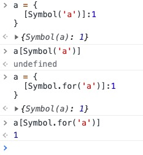

**创建Symbol实例**
`let s1 = Symbol()`
`let s2 = Symbol('another symbol')`

**判断类型**
`typeof s1 // 'symbol'`

**Symbol函数前不能使用new命令，否则会报错（TypeError）。这是因为生成的 Symbol 是一个原始类型的值，不是对象，也不能添加属性。**

**每个Symbol实例都是唯一的**
```
let s1 = Symbol();
let s2 = Symbol('test');
let s3 = Symbol('test');

s1 === s2; // false
s2 === s3; // false

s2.toString() // "Symbol(test)"
```

**如果 Symbol 的参数是一个对象，就会调用该对象的toString方法，将其转为字符串，然后才生成一个 Symbol 值。**
```
const obj = {
  toString() {
    return 'abc';
  }
};
const sym = Symbol(obj);
sym // Symbol(abc)
```

**Symbol 值不能与其他类型的值进行运算，会报错。但是，Symbol 值可以显式转为字符串。另外，Symbol 值也可以转为布尔值，但是不能转为数值。**
```
let sym = Symbol('My symbol');

"your symbol is " + sym // TypeError: can't convert symbol to string

String(sym) // 'Symbol(My symbol)'
sym.toString() // 'Symbol(My symbol)'
sym.description // ES2019 "My symbol"

Boolean(sym) // true
!sym  // false

Number(sym) // TypeError
sym + 2 // TypeError
```

**注册和获取全局Symbol
`Symbol.for()`的这个全局登记特性，可以用在不同的 iframe 或 service worker 中取到同一个值。
`Symbol.keyFor()`方法返回一个已登记的 Symbol 类型值的key。**
```
let s1 = Symbol('global');
let s2 = Symbol.for('global');
let s3 = Symbol.for('global');

s1 === s2; // false
s2 === s3; // true

Symbol.keyFor(s1); // "undefined"
Symbol.keyFor(s2); // "global"
```



应用场景一：
```
const peopleName = Symbol('peopleName');
const peopleAge = Symbol('peopleAge');

const people = {
  [peopleName]: 'hy',
};
obj[peopleAge] = 18;

obj[peopleName]; // 'hy'
obj[peopleAge]; // 18
```
**需要注意：使用Symbol作为对象的属性key后，一般的枚举方法（例如 for...in）会将其排除。**
```
const obj = {
  [Symbol('name')]: 'hy',
  age: 18,
  job: 'FE',
};
Object.keys(obj); // ['age', 'job']
for (let p in obj)
  console.log(p); // 'age', 'job'
Object.getOwnPropertyNames(obj); // ['age', 'job']
```
**也正因为这样一个特性，当使用`JSON.stringify()`把对象转换成JSON字符串时，Symbol属性也会被排除在外`**
```
JSON.stringify(obj); // {"age":18,"job":"FE"}
```
可以利用这一特性来更好地设计我们的数据对象，让“对内操作”和“对外选择性输出”变得更加优雅。

还有一些专门处理Symbol属性的API：
```
Object.getOwnPropertySymbols(obj); // [Symbol(name)]
Reflect.ownKeys(obj); // ["age", "job", Symbol(name)]
```

应用场景二：
**利用`模块化机制`以及`Symbol`，实现类的私有属性和方法。**
```
// a.js
const pwd = Symbol('password');
class Login {
  constructor(user, pwd) {
    this.user = user;
    this[pwd] = pwd;
  }

  checkPwd(pwd) {
    return this[pwd] === pwd;
  }
}
export default Login;

// b.js
import Login from './a';

const login = new Login('admin', '12345');
login.checkPwd('12345'); // true

// 以下都不能获取login对象的私有属性pwd
login.pwd; 
login[pwd];
login['pwd']; 
```

**实例：模块的 Singleton 模式**
```
function A() {
  this.foo = 'hello';
}

if (!global._foo) {
  global._foo = new A();
}

module.exports = global._foo;
```
通过Symbol改良
```
const FOO_KEY = Symbol.for('foo');

function A() {
  this.foo = 'hello';
}

if (!global[FOO_KEY]) {
  global[FOO_KEY] = new A();
}

module.exports = global[FOO_KEY];
```

[http://es6.ruanyifeng.com/#docs/symbol](http://es6.ruanyifeng.com/#docs/symbol)
[https://www.jianshu.com/p/f40a77bbd74e](https://www.jianshu.com/p/f40a77bbd74e)

