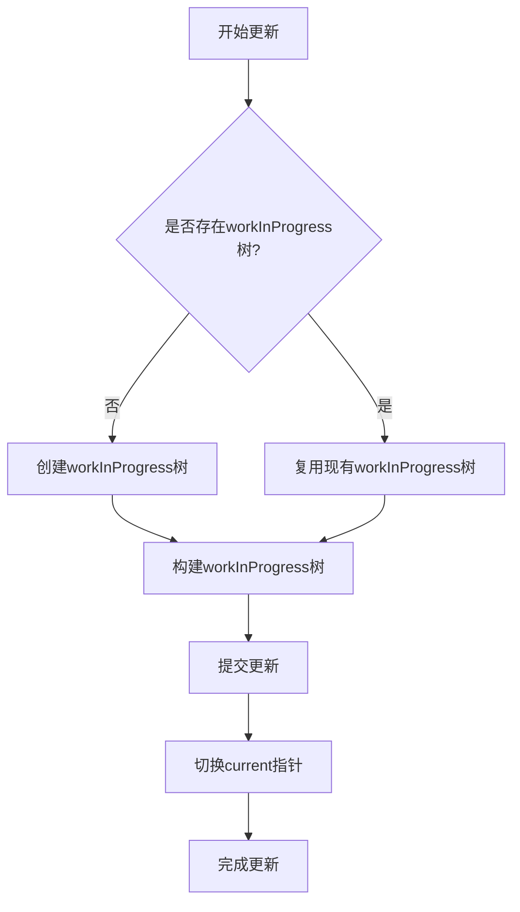
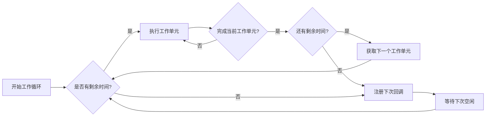
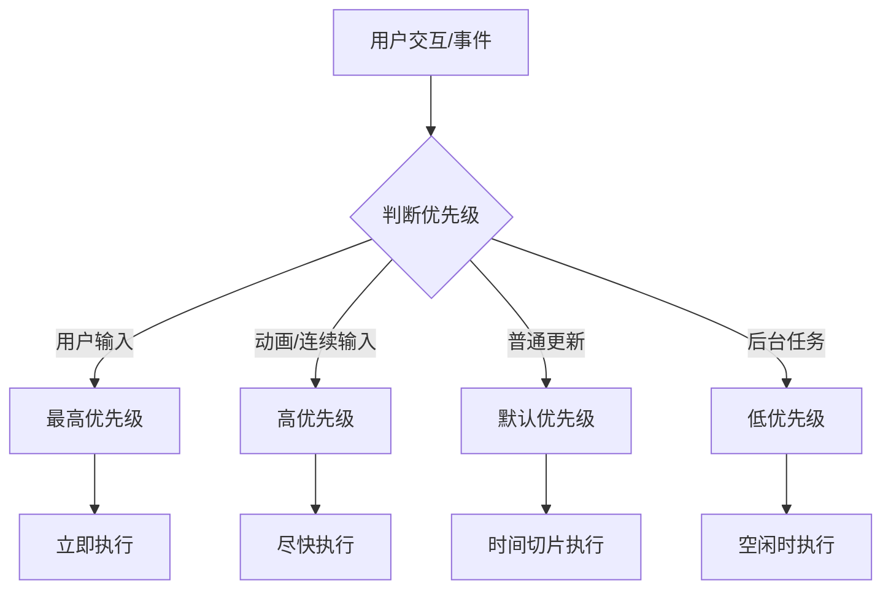

# React Fiber 架构详解

## 一、设计动机

### 1. 传统递归渲染的问题
- 同步更新过程无法中断，容易阻塞主线程
- 实现增量渲染：无法合理分配优先级，紧急任务无法插队
- 难以实现并发渲染等新特性

## 二、Fiber 节点结构

### 1. 数据结构
```javascript
type Fiber = {
  // 静态数据结构
  tag: WorkTag,                 // 标记不同组件类型
  key: null | string,           // key属性
  elementType: any,             // 元素类型
  type: any,                    // 组件类型
  stateNode: any,               // 真实DOM节点

  // 用于连接其他Fiber节点形成树结构
  return: Fiber | null,         // 指向父节点
  child: Fiber | null,          // 指向第一个子节点
  sibling: Fiber | null,        // 指向下一个兄弟节点
  index: number,                // 索引号

  // 用于状态更新
  pendingProps: any,            // 新的props
  memoizedProps: any,           // 旧的props
  memoizedState: any,           // 旧的state
  updateQueue: UpdateQueue<any>, // 更新队列

  // 副作用
  flags: Flags,                 // 标记需要执行的副作用
  subtreeFlags: Flags,          // 子树中的副作用标记
  deletions: Array<Fiber>,      // 需要删除的子节点
  
  // 调度优先级相关
  lanes: Lanes,                 // 优先级
  childLanes: Lanes,            // 子节点优先级
}
```

### 2. 双缓存机制

双缓存机制是React实现无闪烁更新的关键技术，通过维护两棵Fiber树实现：
- **current树**：当前渲染到屏幕上的Fiber树，保存着当前UI状态
- **workInProgress树**：正在内存中构建的新Fiber树，保存着即将更新的UI状态
- **alternate属性**：两棵树的对应节点相互引用，实现快速切换
- **指针切换**：构建完成后只需修改root.current指针即可完成更新，实现无闪烁UI更新

#### 双缓存工作流程


#### 核心优势
1. **无闪烁更新**：所有DOM操作在内存中完成后再一次性提交
2. **高效复用**：复用未变化的Fiber节点减少内存分配
3. **快速回滚**：如果更新中断，可以直接丢弃workInProgress树
4. **并发安全**：保证current树始终完整可用

#### 详细说明

```javascript
// Fiber节点中的alternate属性实现双缓存
const alternate = current.alternate;
if (alternate === null) {
  // 首次渲染时创建workInProgress树
  const created = createFiber(
    current.tag,
    current.pendingProps,
    current.key,
    current.mode
  );
  created.alternate = current;
  current.alternate = created;
} else {
  // 复用已有Fiber节点
  alternate.pendingProps = current.pendingProps;
  alternate.effectTag = NoEffect;
  alternate.nextEffect = null;
  // ...其他属性重置
}
```


## 三、工作原理

### 1. 工作循环


```javascript
/**
 * 主工作循环 - 实现时间切片的关键
 * 1. 使用requestIdleCallback实现时间切片
 * 2. 每次执行一个工作单元(performUnitOfWork)
 * 3. 检查剩余时间决定是否继续执行
 * 
 * 工作单元处理流程:
 *   a. beginWork: 处理组件更新
 *   b. completeWork: 完成节点处理
 *   c. 形成副作用链表
 */
function workLoop(deadline) {
  // 当前是否有工作且剩余时间足够
  while (workInProgress && deadline.timeRemaining() > 0) {
    // 执行当前工作单元并返回下一个工作单元
    workInProgress = performUnitOfWork(workInProgress);
  }
  
  if (workInProgress) {
    // 时间片用完，注册下一次回调
    requestIdleCallback(workLoop);
  } else {
    // 所有工作完成，进入提交阶段
    commitRoot();
  }
}
```

### 1.1 performUnitOfWork 实现
```javascript
function performUnitOfWork(fiber) {
  // beginWork阶段：处理当前Fiber节点
  const next = beginWork(fiber);
  fiber.memoizedProps = fiber.pendingProps;

  if (next === null) {
    // 如果没有子节点，进入completeWork阶段
    completeUnitOfWork(fiber);
  } else {
    // 返回子节点作为下一个工作单元
    return next;
  }
}

function completeUnitOfWork(fiber) {
  let current = fiber;
  
  while (current !== null) {
    // completeWork阶段：完成当前节点处理
    completeWork(current);
    
    // 如果有兄弟节点，处理兄弟节点
    if (current.sibling !== null) {
      return current.sibling;
    }
    
    // 否则返回父节点继续完成
    current = current.return;
  }
}
```

### 2. 可中断的更新过程
#### 2.1 render阶段（可中断）
```javascript
// beginWork核心逻辑
function beginWork(fiber) {
  // 根据fiber.tag调用不同的更新函数
  switch (fiber.tag) {
    case FunctionComponent:
      return updateFunctionComponent(fiber);
    case ClassComponent:
      return updateClassComponent(fiber);
    case HostComponent:
      return updateHostComponent(fiber);
    // ...其他类型处理
  }
}

// completeWork核心逻辑
function completeWork(fiber) {
  // 根据fiber.tag处理不同类型的节点
  switch (fiber.tag) {
    case HostComponent:
      // 处理DOM节点
      if (fiber.stateNode != null) {
        // 更新现有DOM节点
        updateHostComponent(fiber);
      } else {
        // 创建新DOM节点
        createInstance(fiber);
      }
      // 收集副作用
      bubbleProperties(fiber);
      break;
    // ...其他类型处理
  }
}

// 副作用冒泡处理
function bubbleProperties(fiber) {
  let subtreeFlags = NoFlags;
  let child = fiber.child;
  
  while (child !== null) {
    // 合并子节点的副作用
    subtreeFlags |= child.subtreeFlags;
    subtreeFlags |= child.flags;
    child = child.sibling;
  }
  
  fiber.subtreeFlags = subtreeFlags;
}
```

#### 2.2 commit阶段（不可中断）
```javascript
function commitRoot() {
  // 1. DOM变更前阶段
  commitBeforeMutationEffects(root);
  
  // 2. DOM变更阶段
  commitMutationEffects(root);
  
  // 3. DOM变更后阶段
  commitLayoutEffects(root);
  
  // 切换current指针
  root.current = finishedWork;
}

// commitMutationEffects示例
function commitMutationEffects(finishedWork) {
  // 遍历副作用链表
  let effect = finishedWork.firstEffect;
  while (effect !== null) {
    const primaryFlags = effect.flags;
    
    if (primaryFlags & Placement) {
      // 处理节点插入
      commitPlacement(effect);
    } else if (primaryFlags & Update) {
      // 处理节点更新
      commitWork(effect);
    } else if (primaryFlags & Deletion) {
      // 处理节点删除
      commitDeletion(effect);
    }
    
    effect = effect.nextEffect;
  }
}
```

### 3. 优先级调度


#### 3.1 优先级定义
```javascript
/**
 * 优先级定义 - 采用31位二进制位表示
 * 位位置越低表示优先级越高
 * 同一时间可以存在多个优先级
 */
const SyncLane = 0b0000000000000000000000000000001; // 同步优先级(最高)
const InputContinuousLane = 0b0000000000000000000000000000100; // 连续输入优先级
const DefaultLane = 0b0000000000000000000000000010000; // 默认优先级
const IdleLane = 0b0100000000000000000000000000000; // 空闲优先级(最低)

/**
 * 根据事件类型获取优先级
 * React会根据事件来源自动设置优先级
 * 例如: 点击事件 > 滚动事件 > 普通setState
 */
function getCurrentPriorityLevel() {
  switch (currentEventPriority) {
    case DiscreteEventPriority: // 离散事件(如点击)
      return SyncLane;
    case ContinuousEventPriority: // 连续事件(如滚动)
      return InputContinuousLane;
    case DefaultEventPriority: // 默认更新
      return DefaultLane;
    case IdleEventPriority: // 后台任务
      return IdleLane;
    default:
      return DefaultLane;
  }
}
```

#### 3.2 调度实现
```javascript
// 调度入口函数
function scheduleUpdateOnFiber(fiber, lane) {
  // 标记更新优先级
  fiber.lanes = mergeLanes(fiber.lanes, lane);
  
  // 向上标记优先级到根节点
  markUpdateLaneFromFiberToRoot(fiber, lane);
  
  // 根据优先级调度更新
  if (lane === SyncLane) {
    // 同步优先级立即执行
    performSyncWorkOnRoot(root);
  } else {
    // 其他优先级进入调度
    ensureRootIsScheduled(root);
  }
}

// 确保根节点被调度
function ensureRootIsScheduled(root) {
  // 获取最高优先级
  const nextLanes = getHighestPriorityLanes(root.pendingLanes);
  
  // 根据优先级选择调度方式
  if (nextLanes === SyncLane) {
    // 同步更新
    scheduleSyncCallback(performSyncWorkOnRoot.bind(null, root));
  } else {
    // 并发更新
    scheduleCallback(
      schedulerPriorityLevel,
      performConcurrentWorkOnRoot.bind(null, root)
    );
  }
}

// 处理饥饿问题
function markStarvedLanesAsExpired(root, currentTime) {
  const pendingLanes = root.pendingLanes;
  
  // 遍历所有待处理优先级
  let lanes = pendingLanes;
  while (lanes > 0) {
    const lane = lanes & -lanes;
    const expirationTime = root.expirationTimes[lane];
    
    if (expirationTime === NoTimestamp) {
      // 新优先级，设置过期时间
      root.expirationTimes[lane] = currentTime + 5000; // 5秒超时
    } else if (currentTime >= expirationTime) {
      // 超时优先级提升为同步
      root.pendingLanes |= SyncLane;
    }
    
    lanes &= ~lane;
  }
}
```

## 四、副作用处理

### 1. 副作用标记
- Placement：插入/移动节点
- Update：更新节点
- Deletion：删除节点
- LayoutEffect：DOM变更后同步执行
- PassiveEffect：异步执行（如useEffect）

### 2. 收集过程
- 在completeWork阶段收集
- 通过subtreeFlags向上冒泡
- 形成完整副作用链表

### 3. 提交过程
- 按照不同阶段分批处理副作用
- 保证副作用执行顺序
- 处理特定生命周期和Hook

## 五、并发特性

### 1. 时间切片
- 把长任务拆分成小片
- 通过调度器控制执行节奏
- 保证重要任务的响应性

### 2. 并发模式
- 支持多个版本同时构建
- 支持更新的中断和恢复
- 支持高优先级任务插队

### 3. 自动批处理
- 合并同一优先级的多次更新
- 减少不必要的重渲染
- 提高整体性能表现