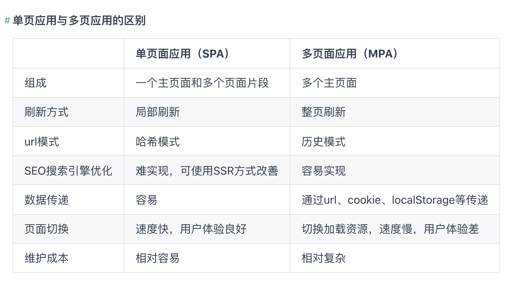
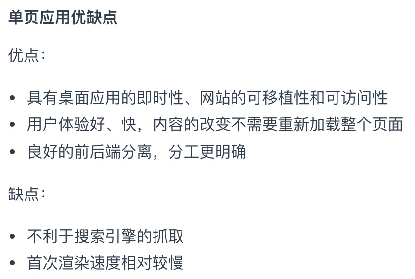

## SPA - 单页应用




单页面应用所谓路由跳转：
* 浏览器的url地址发生变化，但是其实并没有发送请求，也没有刷新整个页面。
* 根据我们配置的路由信息，每次点击切换路由，会切换到不同的组件显示，类似于选项卡功能的实现。

实现需要考虑两个点：
1. 改变URL，却不会引起页面的刷新
2. 如何检测URL变化

### 原理
#### hash 模式
`window.location.hash`：可读可写。
* 写入时，在不重载网页前提下，会创建一条访问历史记录。
* 可通过 `hashchange` 事件监听 `hash` 变化。

改变 `hash` 值有三种方式：
* `浏览器前进后退` 改变URL
* 通过 `a` 标签改变URL
* 通过 `window.location.hash` 改变URL

**以上三种方式均可以触发hashchang事件**

``` js
class Router {
  constructor() {
    this.routes = {};
    this.currentUrl = '';

    this.init()
  }
  route(path, callback) {
    this.routes[path] = callback || function() {};
  }
  updateView() {
    this.currentUrl = location.hash.slice(1) || '/';
    this.routes[this.currentUrl] && this.routes[this.currentUrl]();
  }
  init() {
    window.addEventListener('load', this.updateView.bind(this), false);
    window.addEventListener('hashchange', this.updateView.bind(this), false);
  }
}
```

#### history 模式
`history` 是 `HTML5` 新增的，提供了两个方法用来修改浏览器的历史记录，且都不会引起页面的刷新:
* `history.pushState` 向浏览器中新增一条历史记录，同时修改地址栏。不会触发 `hashchange`
* `history.replaceState` 替换浏览器中当前的历史记录，同时修改地址栏

`history` 提供了 `popstate` 监听事件，但是只有以下两种情况会触发该事件:
* 点击浏览器前进后退的按钮
* 显示调用history的back、go、forward方法

所以需要处理额外的一些改变浏览器url的行为：
* `a` 标签
* js手动调用 `history.pushState`

``` js
class Router {
  constructor() {
    this.routes = {};
    this.currentUrl = '';

    this.init()
  }
  route(path, callback) {
    this.routes[path] = callback || function() {};
  }
  updateView(url) {
    this.currentUrl = url;
    this.routes[this.currentUrl] && this.routes[this.currentUrl]();
  }
  bindLink() {
    // 用 data-href 来表示要实现软路由的链接标签
    const allLink = document.querySelectorAll('a[data-href]');
    for (let i = 0, len = allLink.length; i < len; i++) {
      const current = allLink[i];
      current.addEventListener(
        'click',
        e => {
          e.preventDefault();
          const url = current.getAttribute('data-href');
          // 这里需要注册路由，并调 updateView 方法更新视图
          history.pushState({}, null, url);
          this.updateView(url);
        },
        false
      );
    }
  }
  init() {
    this.bindLink();
    window.addEventListener('popstate', e => {
      this.updateView(window.location.pathname);
    });
    window.addEventListener('load', () => this.updateView('/'), false);
  }
}
```

`Router` 跟之前 `Hash` 路由很像，不同的地方在于：
* `init` 初始化函数，首先需要获取所有特殊的 `a` 标签，然后监听点击事件，并阻止其默认事件，触发 `history.pushState` 以及更新相应的视图。
* 另外绑定 `popstate` 事件，`当用户点击前进或者后退的按钮时候`，能够及时更新视图，另外当刚进去页面时也要触发一次视图更新。


### SEO
1. SSR 服务端渲染，例如 `Vue - nuxt.js`
   将组件或页面通过服务器生成html，再返回给浏览器
2. 静态化
   
3. 使用 `Phantomjs` 针对爬虫处理
   原理是通过 `Nginx` 配置，判断访问来源是否为爬虫，如果是则搜索引擎的爬虫请求会转发到一个 `node server`，再通过 `PhantomJS` 来解析完整的 `HTML`，返回给爬虫。