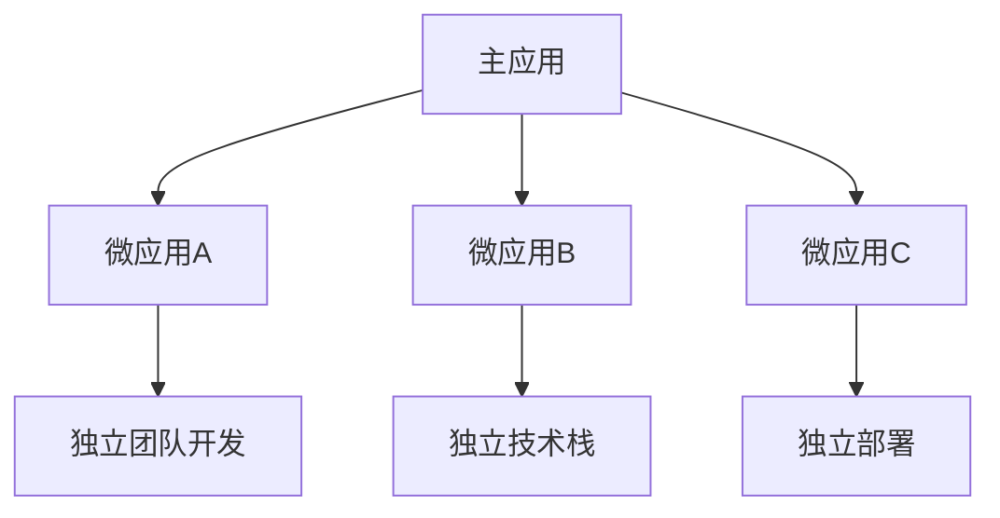

# 微前端原理与实践

## 1. 微前端核心概念
微前端(Micro Frontends)是一种将前端应用分解为独立模块的架构风格，每个模块可以独立开发、测试和部署。



## 2. 核心原理

### 2.1 应用隔离

#### 2.1.1 JS沙箱隔离
微前端中的JS隔离主要通过沙箱机制实现，常见的沙箱实现方案包括：

##### 快照沙箱
适用于单实例场景，通过记录和恢复window对象状态实现隔离：

```javascript
class SnapshotSandbox {
  constructor() {
    this.windowSnapshot = {};
    this.modifyPropsMap = {};
  }

  // 激活沙箱
  active() {
    // 记录window对象快照
    for (const prop in window) {
      this.windowSnapshot[prop] = window[prop];
    }

    // 恢复上次修改
    Object.keys(this.modifyPropsMap).forEach(prop => {
      window[prop] = this.modifyPropsMap[prop];
    });
  }

  // 退出沙箱
  inactive() {
    for (const prop in window) {
      if (window[prop] !== this.windowSnapshot[prop]) {
        // 记录变更
        this.modifyPropsMap[prop] = window[prop];
        // 恢复原值
        window[prop] = this.windowSnapshot[prop];
      }
    }
  }
}
```

##### Proxy 代理沙箱
基于ES6 Proxy实现多实例场景下的隔离：

```javascript
class ProxySandbox {
  constructor() {
    const rawWindow = window;
    const fakeWindow = {};
    const proxy = new Proxy(fakeWindow, {
      get(target, prop) {
        // 优先从自己的环境中取值
        if (target.hasOwnProperty(prop)) {
          return target[prop];
        }
        // 否则兜底到window对象
        return rawWindow[prop];
      },
      set(target, prop, value) {
        target[prop] = value;
        return true;
      }
    });
    this.proxy = proxy;
  }

  active() {
    // 将代理对象作为微应用的window对象
    window.__PROXY_SANDBOX__ = this.proxy;
  }

  inactive() {
    window.__PROXY_SANDBOX__ = undefined;
  }
}
```

#### 2.1.2 CSS隔离
- **Shadow DOM方案**：提供完全隔离的样式环境
```javascript
class ShadowDOMIsolation {
  constructor(el) {
    this.host = el;
    this.shadow = el.attachShadow({ mode: 'closed' });
  }

  mount(html, styles) {
    // 注入样式
    const styleSheet = document.createElement('style');
    styleSheet.textContent = styles;
    this.shadow.appendChild(styleSheet);

    // 注入HTML
    const container = document.createElement('div');
    container.innerHTML = html;
    this.shadow.appendChild(container);
  }
}
```

- **动态前缀方案 (css 命名空间)**：运行时为所有样式添加特定前缀
```javascript
class PrefixIsolation {
  constructor(prefix) {
    this.prefix = prefix;
  }

  process(styleText) {
    return styleText.replace(/([^}{]*){/g, (m, g1) => {
      return g1.split(',').map(selector => {
        return `${this.prefix} ${selector.trim()}`;
      }).join(',') + '{';
    });
  }
}
```

#### 2.1.3 DOM隔离
通过严格的DOM操作范围限制，确保微应用只能操作自己的DOM：

```javascript
class DOMIsolation {
  constructor(container) {
    this.container = container;
  }

  // 检查DOM操作是否在允许范围内
  checkOperation(el) {
    return el === this.container || this.container.contains(el);
  }

  // 重写DOM API
  patchDocument() {
    const rawQuerySelector = document.querySelector;
    document.querySelector = (...args) => {
      const el = rawQuerySelector.apply(document, args);
      if (el && !this.checkOperation(el)) {
        return null;
      }
      return el;
    };
  }
}
```

### 2.2 通信机制

#### 2.2.1 事件总线
基于发布订阅模式实现跨应用通信：

```javascript
class EventBus {
  constructor() {
    this.events = {};
  }

  on(event, callback) {
    if (!this.events[event]) {
      this.events[event] = [];
    }
    this.events[event].push(callback);
    return () => this.off(event, callback);
  }

  off(event, callback) {
    if (!this.events[event]) return;
    this.events[event] = this.events[event].filter(cb => cb !== callback);
  }

  emit(event, data) {
    if (!this.events[event]) return;
    this.events[event].forEach(callback => callback(data));
  }
}

// 全局共享事件总线实例
const globalBus = window.__MICRO_APP_EVENT_BUS__ = new EventBus();

// 主应用发送消息
globalBus.emit('userLogin', { userId: '123' });

// 微应用监听消息
const unsubscribe = globalBus.on('userLogin', (data) => {
  console.log('用户登录:', data);
});
```

#### 2.2.2 状态共享
使用全局状态管理实现数据共享：

```javascript
class Store {
  constructor() {
    this.state = {};
    this.observers = [];
  }

  getState() {
    return this.state;
  }

  setState(partial) {
    this.state = { ...this.state, ...partial };
    this.notify();
  }

  subscribe(callback) {
    this.observers.push(callback);
    return () => {
      this.observers = this.observers.filter(cb => cb !== callback);
    };
  }

  notify() {
    this.observers.forEach(callback => callback(this.state));
  }
}

// 全局共享状态实例
const globalStore = window.__MICRO_APP_STORE__ = new Store();

// 主应用更新状态
globalStore.setState({ theme: 'dark' });

// 微应用监听状态变化
globalStore.subscribe((state) => {
  console.log('主题更新:', state.theme);
});
```

#### 2.2.3 Props传递
通过生命周期钩子函数传递数据：

```javascript
// 主应用注册微应用时传递props
registerMicroApp({
  name: 'app1',
  entry: '//localhost:3001',
  container: '#container',
  props: {
    shared: sharedUtils,
    globalState: globalStore.getState(),
    onMessage: (data) => console.log('收到消息:', data)
  }
});

// 微应用在生命周期中接收props
export async function mount(props) {
  const { shared, globalState, onMessage } = props;
  // 使用props中的数据和方法
  shared.someUtil();
  onMessage({ type: 'mounted' });
}
```

## 3. 主流实现方案

### 3.1 模块联邦(Webpack Module Federation)
```javascript
// webpack.config.js (主应用)
new ModuleFederationPlugin({
  name: 'host',
  remotes: {
    app1: 'app1@http://localhost:3001/remoteEntry.js'
  }
});

// webpack.config.js (微应用)
new ModuleFederationPlugin({
  name: 'app1',
  filename: 'remoteEntry.js',
  exposes: {
    './Button': './src/Button'
  }
});
```

### 3.2 单SPA(Single-SPA)
```javascript
// 注册微应用
singleSpa.registerApplication({
  name: 'app1',
  app: () => System.import('app1'),
  activeWhen: '/app1'
});

// 启动
singleSpa.start();
```

### 3.3 Qiankun(基于Single-SPA)
```javascript
// 主应用注册微应用
import { registerMicroApps, start } from 'qiankun';

registerMicroApps([
  {
    name: 'vueApp',
    entry: '//localhost:7100',
    container: '#container',
    activeRule: '/vue'
  }
]);

start();
```

## 4. 关键技术实现

### 4.1 资源加载

#### 4.1.1 HTML Entry加载方案
```javascript
class HTMLLoader {
  async loadApp(entry) {
    const html = await fetch(entry).then(res => res.text());
    const parser = new DOMParser();
    const doc = parser.parseFromString(html, 'text/html');

    // 提取外部样式
    const styles = Array.from(doc.querySelectorAll('link[rel="stylesheet"]'))
      .map(style => style.href);

    // 提取内联样式
    const inlineStyles = Array.from(doc.querySelectorAll('style'))
      .map(style => style.textContent);

    // 提取脚本
    const scripts = Array.from(doc.querySelectorAll('script'))
      .map(script => ({
        src: script.src,
        content: script.textContent
      }));

    // 提取模板内容
    const template = doc.querySelector('#app').innerHTML;

    return {
      template,
      styles,
      inlineStyles,
      scripts
    };
  }

  async loadStyles(styles) {
    const tasks = styles.map(async (url) => {
      const style = document.createElement('link');
      style.rel = 'stylesheet';
      style.href = url;
      document.head.appendChild(style);
      return new Promise((resolve, reject) => {
        style.onload = resolve;
        style.onerror = reject;
      });
    });
    return Promise.all(tasks);
  }

  async loadScripts(scripts) {
    for (const script of scripts) {
      if (script.src) {
        await this.loadExternalScript(script.src);
      } else {
        this.executeScript(script.content);
      }
    }
  }

  loadExternalScript(url) {
    return new Promise((resolve, reject) => {
      const script = document.createElement('script');
      script.src = url;
      script.onload = resolve;
      script.onerror = reject;
      document.head.appendChild(script);
    });
  }

  executeScript(content) {
    try {
      new Function(content)();
    } catch (error) {
      console.error('执行脚本错误:', error);
      throw error;
    }
  }
}
```

#### 4.1.2 资源预加载
```javascript
class PreloadStrategy {
  constructor() {
    this.loadedResources = new Set();
  }

  async preloadApp(entry, manifest) {
    // 预加载入口文件
    this.preloadEntry(entry);

    // 预加载清单中的关键资源
    if (manifest?.assets) {
      await this.preloadAssets(manifest.assets);
    }
  }

  preloadEntry(url) {
    const link = document.createElement('link');
    link.rel = 'preload';
    link.as = 'fetch';
    link.href = url;
    document.head.appendChild(link);
  }

  async preloadAssets(assets) {
    const tasks = assets
      .filter(url => !this.loadedResources.has(url))
      .map(url => {
        this.loadedResources.add(url);
        return this.preloadResource(url);
      });
    return Promise.all(tasks);
  }

  preloadResource(url) {
    const link = document.createElement('link');
    link.rel = 'preload';
    link.href = url;
    
    // 根据资源类型设置as属性
    if (url.endsWith('.js')) link.as = 'script';
    else if (url.endsWith('.css')) link.as = 'style';
    else if (/\.(png|jpg|jpeg|gif|webp)$/.test(url)) link.as = 'image';
    
    document.head.appendChild(link);
    return new Promise((resolve) => {
      link.onload = resolve;
      link.onerror = resolve; // 预加载失败不阻塞
    });
  }
}
```

### 4.2 生命周期管理
```javascript
class LifecycleManager {
  constructor() {
    this.apps = new Map();
    this.activeApp = null;
  }

  // 注册微应用
  registerApp(appConfig) {
    const { name, entry, container, props } = appConfig;
    
    if (this.apps.has(name)) {
      throw new Error(`应用${name}已注册`);
    }

    this.apps.set(name, {
      name,
      entry,
      container,
      props,
      status: 'NOT_LOADED'
    });
  }

  // 加载微应用
  async loadApp(name) {
    const app = this.apps.get(name);
    if (!app) return;

    try {
      // 加载资源
      const loader = new HTMLLoader();
      const resources = await loader.loadApp(app.entry);
      
      // 保存应用实例
      app.resources = resources;
      app.status = 'LOADED';
      
      // 初始化生命周期
      await this.bootstrap(app);
    } catch (error) {
      app.status = 'LOAD_ERROR';
      throw error;
    }
  }

  // 启动微应用
  async bootstrap(app) {
    if (app.status !== 'LOADED') return;
    
    try {
      // 执行bootstrap生命周期
      if (app.bootstrap) {
        await app.bootstrap(app.props);
      }
      app.status = 'BOOTSTRAPPED';
    } catch (error) {
      app.status = 'BOOTSTRAP_ERROR';
      throw error;
    }
  }

  // 挂载微应用
  async mount(name) {
    const app = this.apps.get(name);
    if (!app || app.status !== 'BOOTSTRAPPED') return;

    try {
      // 卸载当前应用
      if (this.activeApp) {
        await this.unmount(this.activeApp.name);
      }

      // 渲染应用
      const container = document.querySelector(app.container);
      container.innerHTML = app.resources.template;

      // 加载资源
      await Promise.all([
        app.resources.loadStyles(),
        app.resources.loadScripts()
      ]);

      // 执行mount生命周期
      if (app.mount) {
        await app.mount(app.props);
      }

      app.status = 'MOUNTED';
      this.activeApp = app;
    } catch (error) {
      app.status = 'MOUNT_ERROR';
      throw error;
    }
  }

  // 卸载微应用
  async unmount(name) {
    const app = this.apps.get(name);
    if (!app || app.status !== 'MOUNTED') return;

    try {
      // 执行unmount生命周期
      if (app.unmount) {
        await app.unmount();
      }

      // 清理容器
      const container = document.querySelector(app.container);
      container.innerHTML = '';

      app.status = 'UNMOUNTED';
      if (this.activeApp === app) {
        this.activeApp = null;
      }
    } catch (error) {
      app.status = 'UNMOUNT_ERROR';
      throw error;
    }
  }

  // 获取应用状态
  getAppStatus(name) {
    const app = this.apps.get(name);
    return app ? app.status : 'NOT_FOUND';
  }
}
```

## 5. 错误处理与容错

### 5.1 全局错误处理
```javascript
class ErrorHandler {
  constructor() {
    this.errorListeners = new Set();
    this.setupGlobalHandlers();
  }

  setupGlobalHandlers() {
    // 捕获JS运行时错误
    window.addEventListener('error', (event) => {
      this.handleError({
        type: 'runtime',
        error: event.error,
        source: event.filename,
        line: event.lineno,
        column: event.colno
      });
    });

    // 捕获Promise未处理的rejection
    window.addEventListener('unhandledrejection', (event) => {
      this.handleError({
        type: 'promise',
        error: event.reason,
        source: 'Promise'
      });
    });

    // 捕获资源加载错误
    window.addEventListener('error', (event) => {
      if (event.target && (event.target.tagName === 'SCRIPT' || event.target.tagName === 'LINK')) {
        this.handleError({
          type: 'resource',
          source: event.target.src || event.target.href,
          tagName: event.target.tagName
        });
      }
    }, true);
  }

  handleError(error) {
    // 通知所有监听器
    this.errorListeners.forEach(listener => listener(error));

    // 错误上报
    this.reportError(error);

    // 错误恢复
    this.recoverFromError(error);
  }

  addListener(listener) {
    this.errorListeners.add(listener);
    return () => this.errorListeners.delete(listener);
  }

  reportError(error) {
    // 上报到监控平台
    const errorInfo = {
      ...error,
      timestamp: Date.now(),
      url: window.location.href,
      userAgent: navigator.userAgent
    };
    // 实际项目中替换为真实的上报接口
    console.error('错误上报:', errorInfo);
  }

  recoverFromError(error) {
    if (error.type === 'resource') {
      // 资源加载失败时的重试机制
      this.retryLoadResource(error.source);
    } else if (error.type === 'runtime') {
      // 运行时错误的降级处理
      this.handleRuntimeError(error);
    }
  }

  retryLoadResource(url, maxRetries = 3) {
    let retryCount = 0;
    const loadResource = () => {
      if (retryCount >= maxRetries) {
        console.error(`资源 ${url} 加载失败，已重试 ${maxRetries} 次`);
        return;
      }
      retryCount++;
      const element = url.endsWith('.css') ? 
        this.createStyleLink(url) : 
        this.createScript(url);
      element.onload = () => console.log(`资源 ${url} 重试成功`);
      element.onerror = () => {
        console.warn(`资源 ${url} 第 ${retryCount} 次重试失败`);
        setTimeout(loadResource, 1000 * retryCount);
      };
      document.head.appendChild(element);
    };
    loadResource();
  }

  createScript(src) {
    const script = document.createElement('script');
    script.src = src;
    return script;
  }

  createStyleLink(href) {
    const link = document.createElement('link');
    link.rel = 'stylesheet';
    link.href = href;
    return link;
  }

  handleRuntimeError(error) {
    // 实现优雅降级
    const appContainer = document.querySelector('#app-container');
    if (appContainer) {
      appContainer.innerHTML = `
        <div class="error-fallback">
          <h2>应用加载失败</h2>
          <p>请刷新页面重试</p>
        </div>
      `;
    }
  }
}
```

## 6. 性能优化最佳实践

### 6.1 资源优化
```javascript
class ResourceOptimizer {
  constructor() {
    this.cache = new Map();
    this.prefetchQueue = new Set();
  }

  // 资源分包策略
  async optimizeChunks(manifest) {
    const chunks = manifest.chunks || [];
    
    // 按优先级对资源进行分类
    const criticalChunks = chunks.filter(chunk => chunk.critical);
    const asyncChunks = chunks.filter(chunk => !chunk.critical);

    // 立即加载关键资源
    await Promise.all(criticalChunks.map(chunk => this.loadChunk(chunk)));

    // 空闲时预加载其他资源
    if ('requestIdleCallback' in window) {
      requestIdleCallback(() => {
        asyncChunks.forEach(chunk => this.prefetchChunk(chunk));
      });
    }
  }

  // 缓存策略
  async loadChunk(chunk) {
    const cacheKey = `chunk:${chunk.name}`;
    
    // 检查内存缓存
    if (this.cache.has(cacheKey)) {
      return this.cache.get(cacheKey);
    }

    // 检查ServiceWorker缓存
    if ('caches' in window) {
      const cache = await caches.open('micro-frontend');
      const response = await cache.match(chunk.url);
      if (response) {
        const content = await response.text();
        this.cache.set(cacheKey, content);
        return content;
      }
    }

    // 加载并缓存
    const content = await fetch(chunk.url).then(res => res.text());
    this.cache.set(cacheKey, content);
    
    // 存入ServiceWorker缓存
    if ('caches' in window) {
      const cache = await caches.open('micro-frontend');
      await cache.put(chunk.url, new Response(content));
    }

    return content;
  }

  prefetchChunk(chunk) {
    if (this.prefetchQueue.has(chunk.url)) return;
    this.prefetchQueue.add(chunk.url);

    const link = document.createElement('link');
    link.rel = 'prefetch';
    link.href = chunk.url;
    document.head.appendChild(link);
  }

  // 共享依赖优化
  optimizeDependencies(apps) {
    const dependencies = new Map();
    
    // 收集所有应用的依赖
    apps.forEach(app => {
      Object.entries(app.dependencies).forEach(([name, version]) => {
        if (!dependencies.has(name)) {
          dependencies.set(name, new Set());
        }
        dependencies.get(name).add(version);
      });
    });

    // 分析冲突并生成优化建议
    const suggestions = new Map();
    dependencies.forEach((versions, name) => {
      if (versions.size > 1) {
        suggestions.set(name, {
          current: Array.from(versions),
          suggested: this.suggestVersion(Array.from(versions))
        });
      }
    });

    return suggestions;
  }

  suggestVersion(versions) {
    // 简单的版本选择策略，实际项目中可能需要更复杂的算法
    return versions.sort((a, b) => {
      const [aMajor, aMinor] = a.split('.');
      const [bMajor, bMinor] = b.split('.');
      return bMajor - aMajor || bMinor - aMinor;
    })[0];
  }
}
```

### 6.2 性能监控
```javascript
class PerformanceMonitor {
  constructor() {
    this.metrics = new Map();
    this.setupObservers();
  }

  setupObservers() {
    // 监控资源加载性能
    if ('PerformanceObserver' in window) {
      const observer = new PerformanceObserver((list) => {
        list.getEntries().forEach(entry => {
          this.recordMetric('resource', {
            name: entry.name,
            duration: entry.duration,
            size: entry.transferSize,
            type: entry.initiatorType
          });
        });
      });
      observer.observe({ entryTypes: ['resource'] });
    }

    // 监控长任务
    if ('PerformanceObserver' in window) {
      const observer = new PerformanceObserver((list) => {
        list.getEntries().forEach(entry => {
          this.recordMetric('longTask', {
            duration: entry.duration,
            startTime: entry.startTime
          });
        });
      });
      observer.observe({ entryTypes: ['longtask'] });
    }

    // 记录首次内容绘制时间
    if ('PerformanceObserver' in window) {
      const observer = new PerformanceObserver((list) => {
        const fcp = list.getEntries()[0];
        this.recordMetric('fcp', {
          value: fcp.startTime
        });
      });
      observer.observe({ entryTypes: ['paint'] });
    }
  }

  recordMetric(type, data) {
    if (!this.metrics.has(type)) {
      this.metrics.set(type, []);
    }
    this.metrics.get(type).push({
      ...data,
      timestamp: Date.now()
    });

    // 定期上报
    this.scheduleReport();
  }

  scheduleReport() {
    if (this.reportTimeout) return;
    this.reportTimeout = setTimeout(() => {
      this.reportMetrics();
      this.reportTimeout = null;
    }, 5000);
  }

  reportMetrics() {
    const report = {};
    this.metrics.forEach((data, type) => {
      report[type] = data;
    });
    
    // 清空已上报的指标
    this.metrics.clear();

    // 实际项目中替换为真实的上报接口
    console.log('性能指标上报:', report);
  }

  getMetricsSummary() {
    const summary = {};
    
    // 资源加载统计
    const resources = this.metrics.get('resource') || [];
    summary.resources = {
      total: resources.length,
      totalSize: resources.reduce((sum, r) => sum + (r.size || 0), 0),
      avgDuration: resources.reduce((sum, r) => sum + r.duration, 0) / resources.length
    };

    // 长任务统计
    const longTasks = this.metrics.get('longTask') || [];
    summary.longTasks = {
      count: longTasks.length,
      totalDuration: longTasks.reduce((sum, t) => sum + t.duration, 0)
    };

    return summary;
  }
}
```

## 7. 实际项目最佳实践

### 7.1 开发规范
- 统一的开发规范和工程化配置
- 微应用间依赖版本管理
- 统一的发布流程和环境管理

### 7.2 部署策略
- 使用CDN分发静态资源
- 合理的缓存策略
- 灰度发布机制

### 7.3 监控告警
- 完善的日志系统
- 性能监控和报警机制
- 用户行为追踪

### 7.4 安全考虑
- CSP策略配置
- 跨域安全处理
- 敏感信息保护

## 8. 未来趋势
- Web Components标准化
- 更轻量的沙箱方案
- 更好的开发者工具支持
- 跨平台的微前端解决方案

## 7. 未来趋势
- Web Components集成
- 更轻量的沙箱方案
- 更好的开发者工具支持
