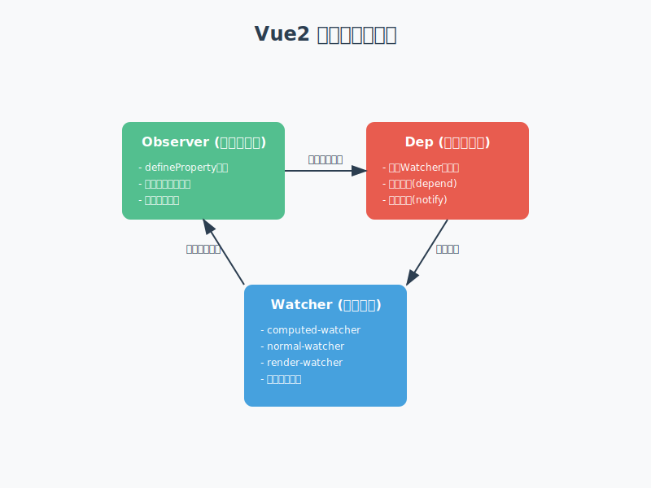
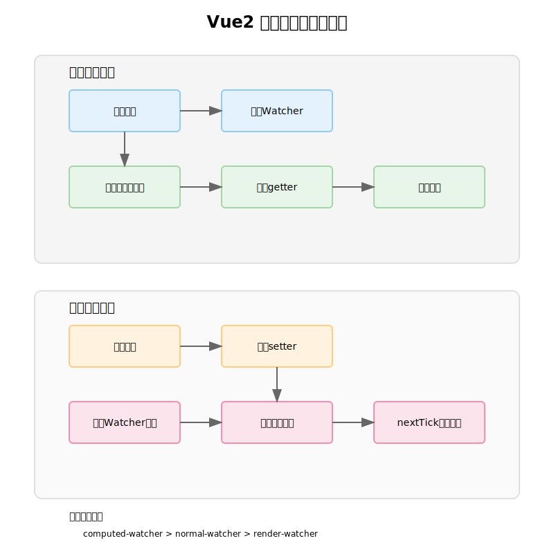

## Vue2 响应式原理
**Vue 的双向绑定基于数据劫持+观察者模式实现。**

### 响应式系统架构


Vue2的响应式系统由三个核心部分组成，它们之间相互配合，形成了一个完整的数据响应式闭环：

1. **数据劫持层（Observer）**：
   - 通过递归遍历，使用`Object.defineProperty`将普通对象的属性转换为getter/setter。
   - 在getter中进行依赖收集，在setter中通知依赖更新。
   - 处理数组方法，通过原型链劫持实现数组响应式。

2. **依赖管理层（Dep）**：
   - 每个响应式属性都对应一个Dep实例。
   - 维护一个Watcher订阅者列表（subs数组）。
   - 提供依赖收集（depend）和派发更新（notify）的能力。

3. **订阅者层（Watcher）**：
   - 负责订阅数据变化并执行相应的更新函数。
   - 根据不同用途分为三种类型，具有不同的执行优先级。
   - 实现脏值检查和异步更新队列，优化性能。

### 核心概念
* `Observer`：观察者类，通过递归的方式把一个对象的所有属性都转化成可观测对象。内部使用 `Object.defineProperty` 对属性的读写进行劫持，在数据变化时通知订阅者。

* `Dep`：依赖收集类，用来收集和管理当前响应式数据的所有依赖（Watcher）。每个响应式属性都会对应一个 Dep 实例，当数据发生变化时，会通知其内部收集的所有 Watcher 进行更新。

* `Watcher`：订阅者类，观察属性的变化并提供回调函数。Watcher 分为三种类型：
  - `computed-watcher`：用于计算属性。具有 lazy（懒计算）特性，只有当其他地方需要读取计算属性时才会真正计算。
  - `normal-watcher`：用于监听器。当监听的属性发生变化时，会立即触发回调函数。
  - `render-watcher`：用于渲染更新。每个组件实例都有一个对应的 render-watcher，当组件的数据发生变化时，会触发组件的重新渲染。

### 核心类实现

#### Observer 类实现
```javascript
class Observer {
  constructor(value) {
    // 被观测的值
    this.value = value
    // 为当前对象创建一个依赖收集器，用于收集数组依赖或对象依赖
    this.dep = new Dep()
    // 为value添加__ob__属性，值为该Observer实例
    // 这样可以通过数据本身获取到Observer实例，方便数组方法中使用
    def(value, '__ob__', this)
    
    if (Array.isArray(value)) {
      // 如果是数组，重写数组方法并观测数组元素
      // 通过原型链继承的方式，重写会改变数组的七个方法
      protoAugment(value, arrayMethods)
      // 递归观测数组的每个元素
      this.observeArray(value)
    } else {
      // 遍历对象的每个属性，转换为响应式的getter/setter
      this.walk(value)
    }
  }

  // walk方法用于遍历对象的每个属性，将其转换为响应式的getter/setter
  // 这是实现对象响应式的核心方法，只有在值为对象时才会调用
  walk(obj) {
    const keys = Object.keys(obj)
    for (let i = 0; i < keys.length; i++) {
      // 遍历对象的每个属性，调用defineReactive将其转换为响应式属性
      defineReactive(obj, keys[i])
    }
  }

  // observeArray方法用于递归观测数组的每个元素
  // 这样当数组元素为对象时，对象的属性也会被转换为响应式的
  observeArray(items) {
    for (let i = 0, l = items.length; i < l; i++) {
      // 对数组的每个元素调用observe方法进行观测
      // 如果元素是对象或数组，会返回一个Observer实例
      observe(items[i])
    }
  }
}

// defineReactive函数用于将对象的属性转换为响应式的
// 通过Object.defineProperty为属性定义getter/setter，实现依赖收集和派发更新
function defineReactive(obj, key, val) {
  // 为每个属性创建一个Dep实例，用于收集这个属性的所有依赖
  // 当属性值发生变化时，通知所有依赖进行更新
  const dep = new Dep()
  
  // 获取属性描述符，如果属性不可配置，则直接返回
  const property = Object.getOwnPropertyDescriptor(obj, key)
  if (property && property.configurable === false) {
    return
  }

  // 获取用户可能已定义的getter/setter
  // 这样可以保留原有的getter/setter逻辑
  const getter = property && property.get
  const setter = property && property.set
  
  // 对属性值进行递归观测
  // 如果值是对象或数组，会返回一个Observer实例
  let childOb = observe(val)

  Object.defineProperty(obj, key, {
    enumerable: true,
    configurable: true,
    get: function reactiveGetter() {
      // 先调用原有的getter获取值
      const value = getter ? getter.call(obj) : val
      // 如果当前有正在评估的watcher实例（即Dep.target存在）
      // 说明这个属性被模板或用户代码访问，需要收集依赖
      if (Dep.target) {
        // 收集这个属性的依赖
        dep.depend()
        // 如果属性值也是响应式对象/数组
        // 那么同时收集子对象的依赖，用于数组方法或$set修改时触发更新
        if (childOb) {
          childOb.dep.depend()
        }
      }
      return value
    },
    set: function reactiveSetter(newVal) {
      // 获取旧值
      const value = getter ? getter.call(obj) : val
      // 如果新值等于旧值，不需要处理
      if (newVal === value) {
        return
      }
      // 如果有原有的setter，调用原有的setter
      if (setter) {
        setter.call(obj, newVal)
      } else {
        // 否则直接更新值
        val = newVal
      }
      // 对新值进行观测，如果新值是对象，会返回一个新的Observer实例
      childOb = observe(newVal)
      // 通知所有依赖进行更新
      // 这会触发组件的重新渲染、计算属性的重新计算等
      dep.notify()
    }
  })
}
```

#### Dep 类实现
```javascript
class Dep {
  // 当前正在评估的watcher实例
  // 同一时间只能有一个watcher在评估中
  // 这是一个全局唯一的watcher指针
  static target = null
  
  constructor() {
    // 每个Dep实例都有一个唯一的id
    // 用于在Watcher中进行依赖去重
    this.id = uid++
    // 存储所有订阅了这个依赖的watcher实例
    // 当数据变化时，会通知数组中的所有watcher进行更新
    this.subs = []

  // 添加一个watcher订阅者到订阅列表中
  // 这个方法由Watcher类调用
  addSub(sub) {
    this.subs.push(sub)
  }

  // 从订阅列表中移除一个watcher订阅者
  // 这个方法在Watcher销毁时调用
  removeSub(sub) {
    remove(this.subs, sub)
  }

  // 收集当前正在评估的watcher作为依赖
  // 这个方法在getter中调用
  depend() {
    if (Dep.target) {
      // 调用watcher的addDep方法建立双向关系
      // watcher记录自己订阅了这个Dep实例
      // Dep实例也记录这个watcher订阅了自己
      Dep.target.addDep(this)
    }
  }

  // 通知所有订阅者进行更新
  // 这个方法在setter中调用
  notify() {
    // 复制订阅者列表，避免通知期间列表发生变化
    const subs = this.subs.slice()
    // 按照watcher的创建顺序排序
    // 确保父组件的watcher先于子组件的watcher触发
    subs.sort((a, b) => a.id - b.id)
    // 遍历通知所有订阅者进行更新
    // 这会触发组件的重新渲染、计算属性的重新计算等
    for (let i = 0, l = subs.length; i < l; i++) {
      subs[i].update()
    }
  }
}

// 用于管理watcher嵌套时的Dep.target栈
// 因为组件可以嵌套，watcher也可以嵌套，需要栈来保存上层的watcher
const targetStack = []

// 将当前watcher实例设置为Dep.target
// 并将其压入targetStack栈中
function pushTarget(target) {
  targetStack.push(target)
  Dep.target = target
}

// 将当前watcher实例从targetStack栈中弹出
// 并将Dep.target恢复为上一个watcher实例
// 这样可以恢复到上层watcher的依赖收集过程
function popTarget() {
  targetStack.pop()
  Dep.target = targetStack[targetStack.length - 1]
}
```

#### Watcher 类实现
```javascript
class Watcher {
  constructor(vm, expOrFn, cb, options = {}) {
    this.vm = vm           // Vue实例引用
    this.cb = cb           // 状态发生变化时的回调函数
    this.id = ++uid        // 唯一标识，用于排序，确保更新的顺序
    this.active = true     // 标记watcher是否处于激活状态
    this.lazy = !!options.lazy  // 标记是否为懒执行，用于计算属性
    this.dirty = this.lazy // 标记是否需要重新计算，用于计算属性缓存
    this.deps = []         // 上一轮的依赖集合
    this.newDeps = []      // 本轮的依赖集合
    this.depIds = new Set()    // 上一轮依赖的id集合，用于去重
    this.newDepIds = new Set() // 本轮依赖的id集合，用于去重

    // 解析表达式或函数，设置getter函数
    // expOrFn可以是函数（渲染watcher和computed），也可以是字符串（user watcher）
    if (typeof expOrFn === 'function') {
      // 如果是函数，直接作为getter
      // 对于渲染watcher来说，这个函数就是组件的_update方法
      // 对于computed来说，这个函数就是计算属性的计算函数
      this.getter = expOrFn
    } else {
      // 如果是字符串，创建一个取值函数
      // 如watch: { 'a.b': handler }，会创建一个获取a.b的函数
      this.getter = parsePath(expOrFn)
    }

    // 如果是计算属性，不会立即求值
    // 其他情况会立即调用get方法求值，收集依赖
    this.value = this.lazy ? undefined : this.get()
  }

  // 获取值，并触发依赖收集
  // 这个方法会在以下情况被调用：
  // 1. watcher初始化时（除了computed watcher）
  // 2. 显式调用watcher.evaluate()
  // 3. 数据变化时，调用watcher.run()
  get() {
    // 将当前watcher设置为Dep.target
    pushTarget(this)
    let value
    try {
      // 调用getter函数获取值
      // 这个过程中会访问响应式属性，从而触发依赖收集
      value = this.getter.call(this.vm, this.vm)
    } catch (e) {
      throw e
    } finally {
      // 恢复上一个watcher为Dep.target
      popTarget()
      // 清理本轮不需要的依赖
      this.cleanupDeps()
    }
    return value
  }

  // 添加依赖
  // 这个方法由Dep.depend()调用
  // 用于建立watcher和dep的双向关系
  addDep(dep) {
    const id = dep.id
    // 如果这个dep在本轮还没有被收集过
    if (!this.newDepIds.has(id)) {
      // 记录新的依赖
      this.newDepIds.add(id)
      this.newDeps.push(dep)
      // 如果上一轮也没有收集过这个依赖
      // 则将当前watcher添加到dep的订阅列表中
      if (!this.depIds.has(id)) {
        dep.addSub(this)
      }
    }
  }

  // 清理依赖收集
  // 这个方法在每次获取值之后调用
  // 用于清理已经不需要的依赖
  cleanupDeps() {
    // 遍历上一轮的依赖
    let i = this.deps.length
    while (i--) {
      const dep = this.deps[i]
      // 如果某个依赖不在新的依赖中
      // 说明这轮计算没有访问这个属性
      // 需要将watcher从这个dep的订阅列表中移除
      if (!this.newDepIds.has(dep.id)) {
        dep.removeSub(this)
      }
    }
    // 交换新旧依赖集合
    let tmp = this.depIds
    this.depIds = this.newDepIds
    this.newDepIds = tmp
    this.newDepIds.clear()
    tmp = this.deps
    this.deps = this.newDeps
    this.newDeps = tmp
    this.newDeps.length = 0
  }

  // 更新方法，由dep.notify()调用
  // 会将watcher推入异步更新队列
  update() {
    if (this.lazy) {
      // 如果是计算属性watcher
      // 只将dirty标记为true，不会立即求值
      // 等到下次访问计算属性时才会重新计算
      this.dirty = true
    } else {
      // 将watcher推入异步更新队列
      // 避免同一个watcher被多次触发更新
      queueWatcher(this)
    }
  }

  // 执行watcher的更新操作
  // 由异步更新队列调用
  run() {
    if (this.active) {
      // 重新获取值，这会触发getter进行依赖收集
      const value = this.get()
      // 如果值发生变化，或者值是对象（可能内部属性发生变化）
      if (value !== this.value || isObject(value)) {
        const oldValue = this.value
        this.value = value
        // 调用回调函数，传入新值和旧值
        // 对于渲染watcher，这里会触发组件的重新渲染
        this.cb.call(this.vm, value, oldValue)
      }
    }
  }

  // 计算属性的求值方法
  // 由计算属性的getter调用
  evaluate() {
    // 获取计算属性的值
    this.value = this.get()
    // 将dirty设置为false，表示已经计算过了
    // 如果依赖的数据没有变化，下次访问计算属性会直接返回缓存的值
    this.dirty = false
  }

  // 收集该watcher的所有deps
  depend() {
    let i = this.deps.length
    while (i--) {
      this.deps[i].depend()
    }
  }

  // 销毁watcher
  teardown() {
    if (this.active) {
      if (!this.vm._isBeingDestroyed) {
        remove(this.vm._watchers, this)
      }
      let i = this.deps.length
      while (i--) {
        this.deps[i].removeSub(this)
      }
      this.active = false
    }
  }
}
```

### 响应式系统工作流程



#### 1. 初始化阶段
- Vue 在初始化时会对 data 对象的属性使用 `Object.defineProperty` 进行劫持。
- 每个属性都会创建一个对应的 Dep 实例用于依赖收集。
- 对于嵌套对象，会递归进行观测，确保深层属性也能响应式。

#### 2. 依赖收集阶段
- **触发时机**：当组件渲染过程中访问响应式数据时（如模板中使用 `v-model` 或 `{{}}` 语法）。
- **收集过程**：
  1. 渲染时创建渲染Watcher，并将其设置为Dep.target。
  2. 访问响应式数据触发getter。
  3. getter中执行dep.depend()进行依赖收集。
  4. Watcher被添加到该属性的依赖列表中。
  5. Watcher同时记录对该数据的依赖关系。

#### 3. 派发更新阶段
- **触发时机**：响应式数据发生变化（用户输入、直接赋值等）。
- **更新过程**：
  1. 触发setter。
  2. setter中执行dep.notify()。
  3. 通知所有相关Watcher进行更新。
  4. Watcher将更新操作放入异步更新队列。
  5. 按照优先级依次执行更新：
     - computed-watcher：用于计算属性更新
     - normal-watcher：用于用户定义的watch回调
     - render-watcher：用于组件重新渲染

#### 4. 性能优化策略
- **异步更新队列**：
  - 将Watcher的更新操作统一收集到队列中。
  - 利用nextTick在下一个tick中批量执行更新。
  - 避免同一个Watcher被多次触发。

- **依赖收集优化**：
  - 使用Set数据结构去重。
  - 实现依赖清理，移除废弃的观察者。
  - 避免重复收集依赖。

- **对象层级优化**：
  - 只对会发生变化的数据进行观测。
  - 对于不会变化的数据使用Object.freeze()处理。
  - 合理设置对象层级，避免过深的嵌套。

### 数组响应式处理
```javascript
// 数组方法拦截器
const arrayMethods = Object.create(Array.prototype)

// 需要被拦截的数组方法
const methodsToPatch = [
  'push',
  'pop',
  'shift',
  'unshift',
  'splice',
  'sort',
  'reverse'
]

// 拦截数组方法
methodsToPatch.forEach(function (method) {
  const original = arrayMethods[method]
  def(arrayMethods, method, function mutator (...args) {
    // 先执行原始方法
    const result = original.apply(this, args)
    // 获取数组对应的Observer实例
    const ob = this.__ob__
    let inserted
    
    // 对新增的元素进行观测
    switch (method) {
      case 'push':
      case 'unshift':
        inserted = args
        break
      case 'splice':
        inserted = args.slice(2)
        break
    }
    if (inserted) ob.observeArray(inserted)
    
    // 通知更新
    ob.dep.notify()
    return result
  })
})

// 工具函数：定义对象属性
function def (obj, key, val, enumerable) {
  Object.defineProperty(obj, key, {
    value: val,
    enumerable: !!enumerable,
    writable: true,
    configurable: true
  })
}
```

### Vue.set 实现
```javascript
function set (target, key, val) {
  // 处理数组
  if (Array.isArray(target) && isValidArrayIndex(key)) {
    target.length = Math.max(target.length, key)
    target.splice(key, 1, val)
    return val
  }
  
  // 如果key已经存在，直接赋值
  if (key in target && !(key in Object.prototype)) {
    target[key] = val
    return val
  }
  
  const ob = target.__ob__
  // 如果目标对象不是响应式，直接赋值
  if (!ob) {
    target[key] = val
    return val
  }
  
  // 将新属性转换为响应式
  defineReactive(ob.value, key, val)
  ob.dep.notify()
  return val
}
```

### Computed 和 Watch 实现原理

#### Computed 实现
```javascript
function initComputed (vm, computed) {
  const watchers = vm._computedWatchers = Object.create(null)
  
  for (const key in computed) {
    const userDef = computed[key]
    // 获取getter函数
    const getter = typeof userDef === 'function' ? userDef : userDef.get
    
    // 创建computed watcher
    watchers[key] = new Watcher(
      vm,
      getter || noop,
      noop,
      { lazy: true } // 标记为lazy watcher
    )
    
    // 定义计算属性
    defineComputed(vm, key, userDef)
  }
}

function defineComputed (target, key, userDef) {
  const shouldCache = true // 在服务端渲染时为false
  
  if (typeof userDef === 'function') {
    sharedPropertyDefinition.get = shouldCache
      ? createComputedGetter(key)
      : createGetterInvoker(userDef)
    sharedPropertyDefinition.set = noop
  } else {
    sharedPropertyDefinition.get = userDef.get
      ? shouldCache && userDef.cache !== false
        ? createComputedGetter(key)
        : createGetterInvoker(userDef.get)
      : noop
    sharedPropertyDefinition.set = userDef.set || noop
  }
  
  Object.defineProperty(target, key, sharedPropertyDefinition)
}

// 创建计算属性的getter
function createComputedGetter (key) {
  return function computedGetter () {
    const watcher = this._computedWatchers && this._computedWatchers[key]
    if (watcher) {
      // 脏值检查，决定是否需要重新计算
      if (watcher.dirty) {
        watcher.evaluate()
      }
      // 收集依赖
      if (Dep.target) {
        watcher.depend()
      }
      return watcher.value
    }
  }
}
```

#### Watch 实现
```javascript
function initWatch (vm, watch) {
  for (const key in watch) {
    const handler = watch[key]
    if (Array.isArray(handler)) {
      for (let i = 0; i < handler.length; i++) {
        createWatcher(vm, key, handler[i])
      }
    } else {
      createWatcher(vm, key, handler)
    }
  }
}

function createWatcher (
  vm,
  expOrFn,
  handler,
  options
) {
  if (isPlainObject(handler)) {
    options = handler
    handler = handler.handler
  }
  if (typeof handler === 'string') {
    handler = vm[handler]
  }
  return vm.$watch(expOrFn, handler, options)
}

Vue.prototype.$watch = function (
  expOrFn,
  cb,
  options
) {
  const vm = this
  if (isPlainObject(cb)) {
    return createWatcher(vm, expOrFn, cb, options)
  }
  options = options || {}
  options.user = true // 标记为用户watcher
  
  // 创建用户watcher
  const watcher = new Watcher(vm, expOrFn, cb, options)
  
  // 立即执行回调
  if (options.immediate) {
    try {
      cb.call(vm, watcher.value)
    } catch (error) {
      handleError(error, vm, `callback for immediate watcher "${watcher.expression}"`)
    }
  }
  
  // 返回取消观察函数
  return function unwatchFn () {
    watcher.teardown()
  }
}
```

### Vue2 响应式系统的局限性
1. **对象限制**：
   - 只能监听对象已经存在的属性，新增属性需要使用 `Vue.set()` 或 `this.$set()`。
   - 删除属性需要使用 `Vue.delete()` 或 `this.$delete()`。

2. **数组限制**：
   - 不能监听数组的长度变化。
   - 不能监听数组索引的变化，需要使用数组变异方法（如 push、pop 等）或 `Vue.set()`。

3. **性能限制**：
   - `Object.defineProperty` 需要对每个属性进行遍历，当对象层级较深时，性能开销较大。
   - 不能监听 ES6 的新数据结构，如 Map、Set 等。