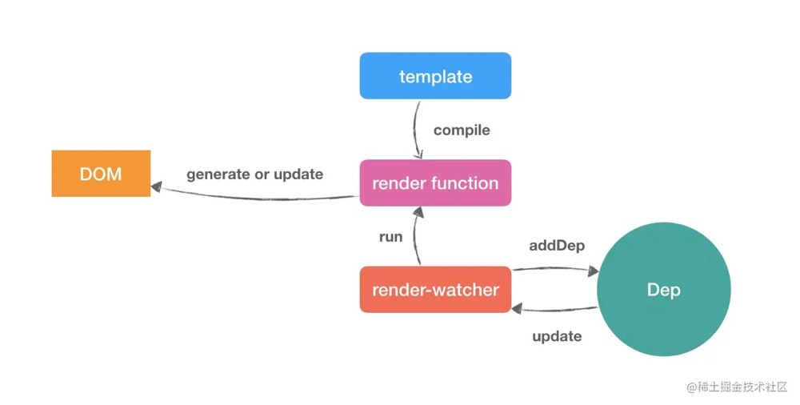

## Vue2 渲染更新

* 初始化调用：`this._init(options) => vm.$mount(vm.$options.el) => mountComponent(this, el, hydrating) => new Watcher() => watcher.get() => updateComponent() => vm._update(vm._render(), hydrating) => vm.__patch__(vm.$el, vnode, hydrating, false)`

* 更新时调用：`observe.set() => dep.notify() => watcher.update() => nextTick() => watcher.run() => watcher.get() => updateComponent() => vm._update(vm._render(), hydrating) => vm.__patch__(prevVnode, vnode)`

`Vue` 初始化分为以下几个阶段
* 初始化时执行 `Vue._init()`，初始化组件的各种属性和事件并触发 `beforeCreate` 钩子函数，之后初始化响应式数据并最后触发 `created` 钩子函数
* 执行 `vm.$mount()`，调用 `mountComponent()`，初始化 `render` 函数和组件的框架调用 `beforeMount` 钩子函数，初始化 `dep.target`。
* 创建当前组件的 `Watcher` 实例，执行 `watcher.get()` 方法获取当前 `watcher` 上的数据。
执行 `updateComponent()` 回调来执行 `vm.update()` 方法，因初始化渲染，故直接调用 `vm.__patch__` 创建空元素。生成 `vnode` 虚拟节点。
* 执行 `proxy` 对数据进行响应式处理，执行 `dep.depend()` 收集对应响应式数据上所有 `watcher` 的依赖，`watcher` 也收集 `dep` 的依赖实现双向绑定。
* 开始调用 `render` 渲染函数（关键是 `_createElement()`）根据 `vnode` 递归遍历实现整个真实页面。

Vue 更新分为以下几个阶段
* 当数据更新时，进入数据对应的监听者 `observe.set()` 方法中调用 `dep.notify()` 发布通知所有 `watcher` 执行 `update()` 方法。
* 接来就是异步更新内容，封装各种 `watcher` 队列和刷新函数队列，进入 `nextTick()` 中执行 `timerFunc()` 利用浏览器异步任务队列来实现异步更新。
* 等到浏览器异步任务队列开始执行 `flushCallbacks()`，便调用 `callbacks` 中每个 `flushSchedulerQueue()` 执行回调 `watcher.run()`
* `watcher` 通过 `get()` 调用 `updateComponent()` 中的 `vm.__patch__(prevVnode, vnode)` 开始进入递归遍历节点的 `patch` 阶段。
* `patch` 阶段通过判断新老子节点的情况，调用 `updateChildren()` 开始 `diff` 算法假设和优化，最终形成 `vnode` 虚拟节点。
* 开始调用 `render` 渲染函数，根据 `vnode` 递归遍历实现整个真实页面。

`Vue patch` 阶段做了什么？
1. `vnode` 不存在，则摧毁 `oldVnode`
2. `vnode` 存在且 `oldVnode` 不存在，表示组件初次渲染，添加标示且创建根节点
3. `vnode` 和 `oldVnode` 都存在时
   * `oldVnode` 不是真实节点表示更新阶段（都是虚拟节点），执行 `patchVnode`，生成 `vnode`
   * `oldVnode` 是真实元素，表示初始化渲染，执行 `createElm` 基于 `vnode` 创建整棵 `DOM` 树并插入到 `body` 元素下，递归更新父占位符节点元素，完成更新后移除 `oldnode`。
4. 最后 `vnode` 插入队列并生成返回 `vnode`。

`patch` 方法 参数
`patch(oldVnode, vnode, hydrating, removeOnly)`，`patch` 方法共有四个参数，最后两个参数为 `hydrating` 和 `removeOnly`。它们的作用分别为：
* `hydrating` 判断是否服务器渲染执行。在 `patch` 阶段时，`oldVnode` 是真实元素，初始化渲染时，若 `oldVnode` 是元素节点且有服务器渲染的属性，则设置 `hydrating` 为 `true`，表示服务端渲染。
* `removeOnly` 判断节点是否被 `<transition-group>` 包裹着。在 `updateChildren` 中判断插入执行 `nodeOps.insertBefore()`，如轮播图等案例。

## snabbdom
在 `Vue` 中，`template` 被编译成浏览器可执行的 `render function`，然后配合响应式系统，将 `render function` 挂载在 `render-watcher` 中，当有数据更改的时候，调度中心 `Dep` 通知该 `render-watcher` 执行 `render function`，完成视图的渲染与更新。

整个流程看似通顺，但是当执行 `render function` 时，如果每次都全量删除并重建 DOM，这对执行性能来说，无疑是一种巨大的损耗，因为我们知道，浏览器的DOM很“昂贵”的，当我们频繁的更新 DOM，会产生一定的性能问题。
为了解决这个问题，Vue 使用 JS 对象将浏览器的 DOM 进行的抽象，这个抽象被称为 `Virtual DOM`。`Virtual DOM` 的每个节点被定义为 `VNode`，当每次执行 `render function` 时，Vue 对更新前后的 `VNode` 进行 `Diff` 对比，找出尽可能少的我们需要更新的真实 DOM 节点，然后只更新需要更新的节点，从而解决频繁更新 DOM 产生的性能问题。

参见 [解析 snabbdom](https://github.com/creeperyang/blog/issues/33)