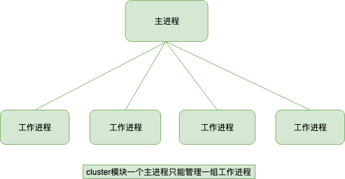

## NodeJS
> [Node.js 学习指南](https://github.com/chyingp/nodejs-learning-guide/blob/master/README.md)

`Node.js` 是 JS 在服务端的运行环境，构建在 `chrome` 的 `V8` 引擎之上，基于 `事件驱动`、`非阻塞I/O模型`，充分利用操作系统提供的 `异步 I/O` 进行多任务的执行，适合于 `I/O 密集型` 的应用场景，因为异步，程序无需阻塞等待结果返回，而是基于回调通知的机制，原本同步模式等待的时间，则可以用来处理其它任务。

> 科普：在 `Web服务器` 方面，著名的 `Nginx` 也是采用此模式（事件驱动），避免了多线程的线程创建、线程上下文切换的开销，`Nginx` 采用 `C语言` 进行编写，主要用来做高性能的 Web 服务器，不适合做业务。

在 `单核CPU` 系统之上我们采用 `单进程 + 单线程` 的模式来开发。在 `多核CPU` 系统之上，可以通过 `child_process.fork` 开启多个进程（Node.js 在 v0.8 版本之后新增了 `Cluster` 来实现多进程架构） ，即 `多进程 + 单线程` 模式。注意：开启多进程不是为了解决高并发，主要是解决了单进程模式下 `Node.js CPU` 利用率不足的情况，充分利用 `多核CPU` 的性能。

---

### NodeJS 进程
#### child_process
* `child_process.spawn() shell`：适用于返回大量数据，例如图像处理，二进制数据处理。
* `child_process.exec() shell`：适用于小量数据，maxBuffer 默认值为 200 * 1024 超出这个默认值将会导致程序崩溃，数据量过大可采用 spawn。
* `child_process.execFile() 可执行文件`：类似 child_process.exec()，区别是不能通过 shell 来执行，不支持像 I/O 重定向和文件查找这样的行为
* `child_process.fork() js文件`： 衍生新的进程，进程之间是相互独立的，每个进程都有自己的 V8 实例、内存，系统资源是有限的，不建议衍生太多的子进程出来，通长根据系统 CPU 核心数设置。

上面方法都遵循其他 Node.js API 典型的惯用异步编程模式。每个方法都返回 `ChildProcess` 实例。 这些对象实现了 `Node.js` `EventEmitter API`，允许父进程注册在子进程的生命周期中发生某些事件时调用的监听器函数。

> CPU 核心数这里特别说明下，fork 确实可以开启多个进程，但是并不建议衍生出来太多的进程，cpu核心数的获取方式const cpus = require('os').cpus();,这里 cpus 返回一个对象数组，包含所安装的每个 CPU/内核的信息，二者总和的数组哦。假设主机装有两个cpu，每个cpu有4个核，那么总核数就是8。

##### child_process.fork
`child_process.fork()` 方法是 `child_process.spawn()` 的特例，专门用于衍生新的 `Node.js` 进程。 与 `child_process.spawn()` 一样，返回 `ChildProcess` 对象。 返回的 `ChildProcess` 将有额外的内置**通信通道**，允许消息在父进程和子进程之间来回传递。 
详见 `subprocess.send()`，可以通过 `message` 事件接收这些消息。消息经过序列化和解析。结果消息可能与最初发送的消息不同。
请记住，衍生的 `Node.js` 子进程独立于父进程，除了两者之间建立的 `IPC` 通信通道。 每个进程都有自己的内存，具有自己的 `V8` 实例。 由于需要额外的资源分配，不建议衍生大量子 `Node.js` 进程。

**高级序列化**
子进程支持 `IPC` 的序列化机制，该机制基于 `v8 模块的序列化 API`，基于 `HTML 结构化克隆算法`。 这通常功能更强大，支持更多内置的 `JavaScript` 对象类型，例如 `BigInt`、`Map` 和 `Set`、`ArrayBuffer` 和 `TypedArray`、`Buffer`、`Error`、`RegExp` 等。

但是，这种格式不是 `JSON` 的完整超集，例如 在此类内置类型的对象上设置的属性不会通过序列化步骤传递。 此外，性能可能不等同于 `JSON`，具体取决于传递数据的结构。 因此，此功能需要在调用 `child_process.spawn()` 或 `child_process.fork()` 时通过将 `serialization` 选项设置为 `advanced` 来选择加入。


例子（感觉跟 worker 使用差不多，但 worker 是线程，fork 是进程）
``` js
// app.js
const http = require('http');
const fork = require('child_process').fork;

const server = http.createServer((req, res) => {
  if(req.url == '/compute'){
    const compute = fork('./fork_compute.js');
    compute.send('开启一个新的子进程');

    // 当一个子进程使用 process.send() 发送消息时会触发 'message' 事件
    compute.on('message', sum => {
      res.end(`Sum is ${sum}`);
      compute.kill();
    });

    // 子进程监听到一些错误消息退出
    compute.on('close', (code, signal) => {
      console.log(`收到close事件，子进程收到信号 ${signal} 而终止，退出码 ${code}`);
      compute.kill();
    })
  }else{
    res.end(`ok`);
  }
});
server.listen(3000, 127.0.0.1, () => {
  console.log(`server started at http://${127.0.0.1}:${3000}`);
});
```

``` js
// fork_compute.js
const computation = () => {
  let sum = 0;
  console.info('计算开始');
  console.time('计算耗时');

  for (let i = 0; i < 1e10; i++) {
    sum += i
  };

  console.info('计算结束');
  console.timeEnd('计算耗时');
  return sum;
};

process.on('message', msg => {
  console.log(msg, 'process.pid', process.pid); // 子进程id
  const sum = computation();

  // 如果Node.js进程是通过进程间通信产生的，那么，process.send()方法可以用来给父进程发送消息
  process.send(sum);
})
```
---

#### cluster
``` js
const http = require('http');
const numCPUs = require('os').cpus().length;
const cluster = require('cluster');
if(cluster.isMaster){
  console.log('Master proces id is',process.pid);
  // fork workers
  for(let i= 0;i<numCPUs;i++){
    cluster.fork();
  }
  cluster.on('exit',function(worker,code,signal){
    console.log('worker process died,id',worker.process.pid)
  })
}else{
  // Worker可以共享同一个TCP连接
  // 这里是一个http服务器
  http.createServer(function(req,res){
    res.writeHead(200);
    res.end('hello word');
  }).listen(8000);
}
```


`cluster模块` 调用 `fork` 方法来创建子进程，该方法与 `child_process.fork`是同一个方法。
`cluster模块` 采用的是经典的**主从模型**，`Cluster` 会创建一个 `master`，然后根据你指定的数量复制出多个子进程，可以使用 `cluster.isMaster` 属性判断当前进程是 `master` 还是 `worker(工作进程)`。由 `master` 进程来管理所有的子进程，**主进程不负责具体的任务处理，主要工作是负责调度和管理**。

`cluster模块` 使用内置的**负载均衡**来更好地处理线程之间的压力，该负载均衡使用了 `Round-robin` 算法（也被称之为`循环算法`）。当使用 `Round-robin` 调度策略时，`master` `accepts()` 所有传入的连接请求，然后将相应的TCP请求处理发送给选中的工作进程（该方式仍然通过`IPC`来进行通信）。

``` js
/**
 * Determines how slaves are selected:
 * RR: Select one alternately (Round-Robin).
 * RANDOM: Select the node by random function.
 * ORDER: Select the first node available unconditionally.
 */
readonly selector?: "RR" | "RANDOM" | "ORDER";
```

开启多进程时候端口疑问讲解：如果多个 `Node进程` 监听同一个端口时会出现  `Error:listen EADDRIUNS` 的错误，而 `cluster模块` 为什么可以让**多个子进程监听同一个端口**呢?
原因是 `master进程` 内部启动了一个 `TCP服务器`，而真正监听端口的只有这个服务器，当来自前端的请求触发服务器的 `connection` 事件后，`master` 会将对应的 `socket` 具柄发送给子进程。(类似 ShareWorker ？可以看作是 master 拦截然后事件分发)

---

#### child_process & cluster
无论是 `child_process模块` 还是 `cluster模块`，为了解决 `Node.js实例` **单线程运行无法利用多核 CPU 的问题**而出现的。核心就是父进程（即 master 进程）负责监听端口，接收到新的请求后将其分发给下面的 worker 进程。

cluster内部隐式的构建TCP服务器的方式来说对使用者确实简单和透明了很多，但是这种方式无法像使用child_process那样灵活，因为一直主进程只能管理一组相同的工作进程，而自行通过child_process来创建工作进程，一个主进程可以控制多组进程。原因是child_process操作子进程时，可以隐式的创建多个TCP服务器。（cluster 只有一个 TCP 服务器，child_process 可以创建多个）

#### 进程守护
* pm2
* forever

#### Node.js关于单线程的误区
`Node` 中最核心的是 `v8` 引擎，在 Node 启动后，会创建 `v8` 的实例，这个实例是多线程的。
* 主线程：编译、执行代码。
* 编译/优化线程：在主线程执行的时候，可以优化代码。
* 分析器线程：记录分析代码运行时间，为 Crankshaft 优化代码执行提供依据。
* 垃圾回收的几个线程。
所以大家常说的 `Node` 是单线程的指的是 `JavaScript` 的执行是单线程的(开发者编写的代码运行在单线程环境中)，但 `Javascript` 的宿主环境，无论是 `Node` 还是`浏览器`都是多线程的因为 `libuv` 中有线程池的概念存在的，`libuv` 会通过类似线程池的实现来模拟不同操作系统的异步调用，这对开发者来说是不可见的。


### Process
* `process.env`：环境变量，例如通过 `process.env.NODE_ENV` 获取不同环境项目配置信息
* `process.nextTick`：这个在谈及 `Event Loop` 时经常为会提到
* `process.pid`：获取当前进程id
* `process.ppid`：当前进程对应的父进程
* `process.cwd()`：获取当前进程工作目录，
* `process.platform`：获取当前进程运行的操作系统平台
* `process.uptime()`：当前进程已运行时间，例如：pm2 守护进程的 uptime 值
* 进程事件：`process.on('uncaughtException', cb)` 捕获异常信息、`process.on('exit', cb）`进程推出监听
* 三个标准流：`process.stdout 标准输出`、`process.stdin 标准输入`、`process.stderr 标准错误输出`
* `process.title` 指定进程名称，有的时候需要给进程指定一个名称

### 事件队列
```
   ┌───────────────────────┐
┌─>│        timers         │
│  └──────────┬────────────┘
│  ┌──────────┴────────────┐
│  │     I/O callbacks     │
│  └──────────┬────────────┘
│  ┌──────────┴────────────┐
│  │     idle, prepare     │
│  └──────────┬────────────┘      ┌───────────────┐
│  ┌──────────┴────────────┐      │   incoming:   │
│  │         poll          │<─────┤  connections, │
│  └──────────┬────────────┘      │   data, etc.  │
│  ┌──────────┴────────────┐      └───────────────┘
│  │        check          │
│  └──────────┬────────────┘
│  ┌──────────┴────────────┐
└──┤    close callbacks    │
   └───────────────────────┘
```

 1. timers 阶段: 这个阶段执行 setTimeout(callback) 和 setInterval(callback) 预定的 callback;
 2. I/O callbacks 阶段: 此阶段执行某些系统操作的回调，例如TCP错误的类型。 例如，如果TCP套接字在尝试连接时收到 ECONNREFUSED，则某些* nix系统希望等待报告错误。 这将操作将等待在I/O回调阶段执行;
 3. idle, prepare 阶段: 仅node内部使用;
 4. poll 阶段: 获取新的I/O事件, 例如操作读取文件等等，适当的条件下node将阻塞在这里;
 5. check 阶段: 执行 setImmediate() 设定的callbacks;
 6. close callbacks 阶段: 比如 socket.on(‘close’, callback) 的callback会在这个阶段执行;

#### node 的初始化
- 初始化 node 环境。
- 执行输入代码。
- 执行 process.nextTick 回调。
- 执行 microtasks。


#### 进入 event-loop
- 进入 timers 阶段
检查 timer 队列是否有到期的 timer 回调，如果有，将到期的 timer 回调按照 timerId 升序执行。
检查是否有 process.nextTick 任务，如果有，全部执行。
检查是否有microtask，如果有，全部执行。
退出该阶段。

- 进入IO callbacks阶段。
检查是否有 pending 的 I/O 回调。如果有，执行回调。如果没有，退出该阶段。
检查是否有 process.nextTick 任务，如果有，全部执行。
检查是否有microtask，如果有，全部执行。
退出该阶段。

- 进入 idle，prepare 阶段：
这两个阶段与我们编程关系不大，暂且按下不表。

- 进入 poll 阶段
首先检查是否存在尚未完成的回调，如果存在，那么分两种情况。
  - 第一种情况：
    如果有可用回调（可用回调包含到期的定时器还有一些IO事件等），执行所有可用回调。
    检查是否有 process.nextTick 回调，如果有，全部执行。
    检查是否有 microtaks，如果有，全部执行。
    退出该阶段。
  - 第二种情况：
    如果没有可用回调。
    检查是否有 immediate 回调，如果有，退出 poll 阶段。如果没有，阻塞在此阶段，等待新的事件通知。
如果不存在尚未完成的回调，退出poll阶段。

- 进入 check 阶段。
如果有immediate回调，则执行所有immediate回调。
检查是否有 process.nextTick 回调，如果有，全部执行。
检查是否有 microtaks，如果有，全部执行。
退出 check 阶段

- 进入 closing 阶段。
如果有immediate回调，则执行所有immediate回调。
检查是否有 process.nextTick 回调，如果有，全部执行。
检查是否有 microtaks，如果有，全部执行。
退出 closing 阶段

- 检查是否有活跃的 handles（定时器、IO等事件句柄）。
如果有，继续下一轮循环。
如果没有，结束事件循环，退出程序。

