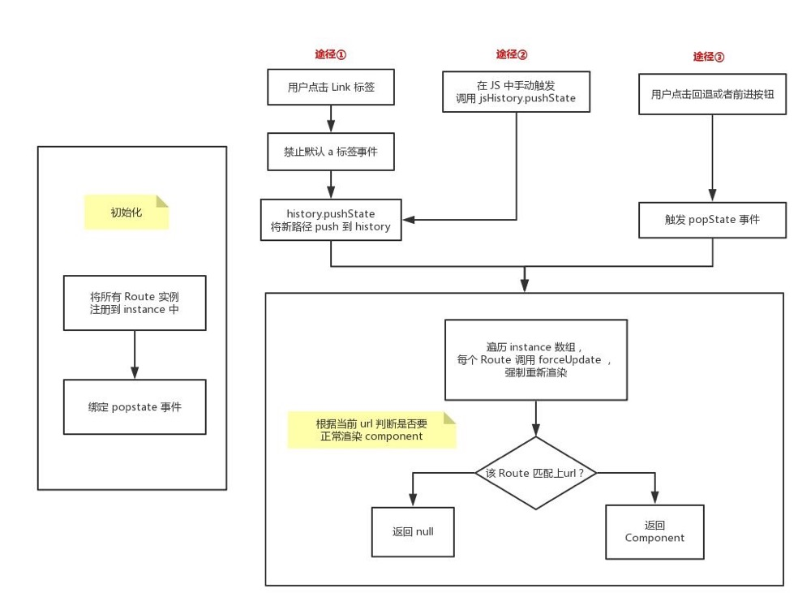

## React-router
`React-router` 的版本从 2 到 3 再到现在的 4， API 变化天翻地覆，这里我们以最新的 v4 来举例。

在 `v4` 版本中，提供的路由能力都是以组件的形式进行呈现，由 `react-router-dom` 来提供，你不需再安装 `react-router`，因为 `react-router-dom` 已经包含了这个库。下面先通过 `react-router-dom` 写一个简单的例子。

``` js
import { BrowserRouter as Router, Link, Route } from 'react-router-dom';
const HomeView = () => <div>Home</div>;
const AboutView = () => <div>About</div>;
const TopicsView = ({ match }) => (<div>
  <h2>Topics</h2>
  <ul>
    <li><Link to={`${match.url}/topic1`} >Topic1</Link></li>
    <li><Link to={`${match.url}/topic2`} >Topic2</Link></li>
    <li><Link to={`${match.url}/topic3`} >Topic3</Link></li>
  </ul>
  <Route path={ `${match.url}/topic1` } component={ () => <div>Topic1</div> } /> 
  <Route path={ `${match.url}/topic2` } component={ () => <div>Topic2</div> } /> 
  <Route path={ `${match.url}/topic3` } component={ () => <div>Topic3</div> } /> 
</div>)

class App extends Component {
  render() {
    return (
      <Router>
        <div>
          <ul>
            <li><Link to="/">home</Link></li>
            <li><Link to="/about">about</Link></li>
            <li><Link to="/topics">topics</Link></li>
          </ul>
          <Route exact path="/" component={HomeView} />
          <Route path="/about" component={AboutView} />
          <Route path="/topics" component={TopicsView} />
          <Route component={() => <div>Always show</div>} />
        </div>
      </Router>
    );
  }
}
```

* 当 `path` 匹配上路由时则显示 `component`
* 匹配不上则不显示
* 如果没有 `path` 字段则默认一直显示
* 而 `exact` 字段则表示必须要完全匹配，避免像 `path='/'` 匹配上 `path='/about'` 这样的情况。

**所谓的局部刷新，其本质在于：当路由发生变化时，跟当前 `url` 匹配的 `component` 正常渲染，跟当前 `url` 不匹配的 `component` 渲染为 `null`，没错，就是这么简单粗暴。**


### 基于 React 的 Hash 路由系统
有了前面的理论基础，相信实现基于 React 的 Hash 路由系统应该不是什么难事吧，
首先是 Link 组件的实现：
``` js
export class Link extends Component {
  render() {
    const { to, children } = this.props;
    return <a href={`#${to}`}>{children}</a>;
  }
}
```

简单地返回一个 `a` 标签，并且在链接前面加 `# 代表软路由`，并不是真正意义的跳转。接着是 Route 组件的实现：

``` js
export class Route extends Component {
  componentWillMount() {
    window.addEventListener('hashchange', this.updateView, false);
  }
  componentWillUnmount() {
    window.removeEventListener('hashchange', this.updateView, false);
  }
  updateView = () => {
    this.forceUpdate();
  }
  render() {
    const { path, exact, component } = this.props;
    const match = matchPath(window.location.hash, { exact, path });
    if (!match) {
      return null;
    }
    if (component) {
      return React.createElement(component, { match });
    }
    return null;
  }
}

function matchPath(hash, options) {
  // 截断 hash 首位的 #
  hash = hash.slice(1);
  const { exact = false, path } = options;
  // 如果没有传入 path，代表始终匹配
  if (!path) {
    return {
      path: null,
      url: hash,
      isExact: true
    };
  }
  const match = new RegExp(path).exec(hash);
  if (!match) {
    // 什么都没匹配上
    return null;
  }
  const url = match[0];
  const isExact = hash === url;
  if (exact && !isExact) {
    // 匹配上了，但不是精确匹配
    return null;
  }
  return {
    path,
    url,
    isExact
  };
}
```

实现的方式也不难：
* 当注册 `Route` 组件的时候，将组件更新的回调函数添加到 `hashchange` 事件中，而组件卸载时候移除组件更新的回调函数避免内存泄漏。
* 这样当页面 `hash` 值变化时就会触发所有注册的回调函数的执行，使所有 `Route` 组件都去更新实例。
* 在 `render` 函数的实现中，有个 `matchPath` 函数来判断当前路径是否与该组件对应的路径匹配，如果匹配不上，则返回 `null`，如果匹配上了，就渲染该 `Route` 组件对应的 `Component` 组件。

这样一个简单的 `Hash` 路由就已经实现了，当然，我们在初次加载页面的时候 `hash` 值是不带 `/`，所以导致无法加载 `Index` 组件，所以我们在 `HashRouter` 组件中添加一次 `hash` 的变化，这样就保证的首次加载页面的准确性。

``` js
export class HashRouter extends Component {
  componentDidMount() {
    window.location.hash = '/';
  }
  render() {
    return this.props.children;
  }
}
```

### 基于 React 的 History 路由系统


大致分为两步：
* 在初始化的过程中，将所有 `Route` 实例添加到一个 `instances` 数组，并且为每个组件都绑定 `popstate` 事件。
* 在三种触发路由更新的途径结束后，遍历所有 `instances` 中的实例，强制重新渲染，从而达到更新的目的。

代码实现如下：首先是创建 `instances` 数组
``` js
// 注册 component 实例
const instances = [];
const register = (component) => instances.push(component);
const unregister = (component) => instances.splice(instances.indexOf(component), 1);
```

`Route` 组件大致相同，不同在于注册和卸载钩子函数的不同：初始化时需添加到 `instances` 中和绑定 `popstate` 事件。

``` js
export class Route extends Component {
  componentWillMount() {
    window.addEventListener('popstate', this.handlePopState);
    register(this);
  }
  componentWillUnmount() {
    window.removeEventListener('popstate', this.handlePopState);
    unregister(this);
  }
  handlePopState = () => {
    this.forceUpdate();
  };
  // ...
}
```

`Link` 组件实现：需要阻止默认事件并且当点击的时候需要广播所有实例强制触发更新。

``` js
export class Link extends Component {
  handleClick = e => {
    e.preventDefault();
    const { to } = this.props;
    window.history.pushState({}, null, to);
    instances.forEach(instance => instance.forceUpdate());
  };
  render() {
    const { to, children } = this.props;
    return (
      <a href={to} onClick={this.handleClick}>
        {children}
      </a>
    );
  }
}
```