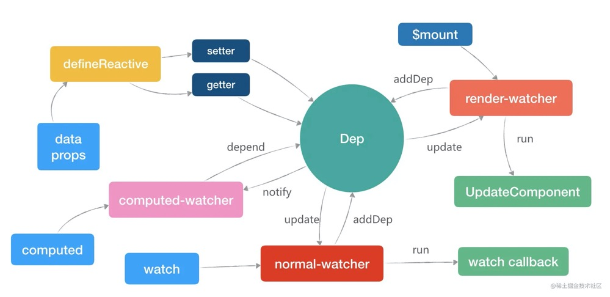

# 对 Vue 的理解
* 渐进式框架
  Vue 包含了声明式渲染、组件化系统、客户端路由、大规模状态管理、构建工具、数据持久化、跨平台支持等，但在实际开发中，并没有强制要求开发者之后某一特定功能，而是根据需求逐渐扩展。
## 一、Vue核心特性
### 数据驱动（MVVM)
MVVM表示的是 Model-View-ViewModel

* Model：模型层，负责处理业务逻辑以及和服务器端进行交互
* View：视图层：负责将数据模型转化为UI展示出来，可以简单的理解为HTML页面
* ViewModel：视图模型层，用来连接Model和View，是Model和View之间的通信桥梁

### 响应式系统
* 数据模型 `data`：Vue 实例在创建过程中，对数据模型data的每一个属性加入到响应式系统中，当数据被更改时，视图将得到响应，同步更新。data必须采用函数的方式 return，不使用 return 包裹的数据会在项目的全局可见，会造成变量污染；使用return包裹后数据中变量只在当前组件中生效，不会影响其他组件。
* 计算属性 `computed`：computed基于组件响应式`依赖`进行计算得到结果并`缓存`起来。只在相关响应式依赖发生改变时它们才会重新求值，也就是说，只有它依赖的响应式数据（data、prop、computed本身）发生变化了才会重新计算。那什么时候应该使用计算属性呢？模板内的表达式非常便利，但是设计它们的初衷是用于简单运算的。在模板中放入太多的逻辑会让模板过重且难以维护。
* 监听器 `watch`：监听器watch作用如其名，它可以监听响应式数据的变化，响应式数据包括 data、prop、computed，当响应式数据发生变化时，可以做出相应的处理。当需要在数据变化时执行异步或开销较大的操作时，这个方式是最有用的。

### 响应式原理
在 Vue 中，数据模型下的所有属性，会被 Vue 使用 `Object.defineProperty` （Vue3.0 使用 Proxy）进行数据劫持代理。响应式的核心机制是观察者模式，数据是被观察的一方，一旦发生变化，通知所有观察者，这样观察者可以做出响应，比如当观察者为视图时，视图可以做出视图的更新。
Vue.js 的响应式系统以来三个重要的概念，Observer、Dep、Watcher。
详见 [Vue2 响应式原理](./Vue2%20响应式原理.md)

#### 发布者-Observer
Observe 扮演的角色是发布者，他的主要作用是在组件vm初始化的时，调用defineReactive函数，使用Object.defineProperty方法对对象的每一个子属性进行数据劫持/监听，即为每个属性添加getter和setter，将对应的属性值变成响应式。
在组件初始化时，调用initState函数，内部执行initState、initProps、initComputed方法，分别对data、prop、computed进行初始化，让其变成响应式。
初始化props时，对所有props进行遍历，调用defineReactive函数，将每个 prop 属性值变成响应式，然后将其挂载到_props中，然后通过代理，把vm.xxx代理到vm._props.xxx中。
同理，初始化data时，与prop相同，对所有data进行遍历，调用defineReactive函数，将每个 data 属性值变成响应式，然后将其挂载到_data中，然后通过代理，把vm.xxx代理到vm._data.xxx中。
初始化computed，首先创建一个观察者对象computed-watcher，然后遍历computed的每一个属性，对每一个属性值调用defineComputed方法，使用Object.defineProperty将其变成响应式的同时，将其代理到组件实例上，即可通过vm.xxx访问到xxx计算属性。

#### 调度中心/订阅器-Dep
Dep 扮演的角色是调度中心/订阅器，在调用defineReactive将属性值变成响应式的过程中，也为每个属性值实例化了一个Dep，主要作用是对观察者（Watcher）进行管理，收集观察者和通知观察者目标更新，即当属性值数据发生改变时，会遍历观察者列表（dep.subs），通知所有的 watcher，让订阅者执行自己的update逻辑。
其dep的任务是，在属性的getter方法中，调用dep.depend()方法，将观察者（即 Watcher，可能是组件的render function，可能是 computed，也可能是属性监听 watch）保存在内部，完成其依赖收集。在属性的setter方法中，调用dep.notify()方法，通知所有观察者执行更新，完成派发更新。

#### 观察者-Watcher
Watcher 扮演的角色是订阅者/观察者，他的主要作用是为观察属性提供回调函数以及收集依赖，当被观察的值发生变化时，会接收到来自调度中心Dep的通知，从而触发回调函数。
而Watcher又分为三类，normal-watcher、 computed-watcher、 render-watcher。

normal-watcher：在组件钩子函数watch中定义，即监听的属性改变了，都会触发定义好的回调函数。

computed-watcher：在组件钩子函数computed中定义的，每一个computed属性，最后都会生成一个对应的Watcher对象，但是这类Watcher有个特点：当计算属性依赖于其他数据时，属性并不会立即重新计算，只有之后其他地方需要读取属性的时候，它才会真正计算，即具备lazy（懒计算）特性。

render-watcher：每一个组件都会有一个render-watcher, 当data/computed中的属性改变的时候，会调用该Watcher来更新组件的视图。

这三种Watcher也有固定的执行顺序，分别是：computed-render -> normal-watcher -> render-watcher。这样就能尽可能的保证，在更新组件视图的时候，computed 属性已经是最新值了，如果 render-watcher 排在 computed-render 前面，就会导致页面更新的时候 computed 值为旧数据。

## 二、组件化
* 降低整个系统的耦合度，在保持接口不变的情况下，我们可以替换不同的组件快速完成需求，例如输入框，可以替换为日历、时间、范围等组件作具体的实现
* 调试方便，由于整个系统是通过组件组合起来的，在出现问题的时候，可以用排除法直接移除组件，或者根据报错的组件快速定位问题，之所以能够快速定位，是因为每个组件之间低耦合，职责单一，所以逻辑会比分析整个系统要简单
* 提高可维护性，由于每个组件的职责单一，并且组件在系统中是被复用的，所以对代码进行优化可获得系统的整体升级

### 插槽 slot
* 默认插槽
* 具名插槽
* 作用域插槽
原理：当自组件 `vm` 实例化时，获取到父组件传入的 slot 内容，存放到 `vm.$slots` 和 `vm.$scopedSlots`。当组件进行渲染时，遇到 `<slot>` 标签，进行替换。

### 模版编译
将 `<template>` 转换为渲染函数，详见 [Vue2 模版编译](./Vue%20模版编译.md)

### 预编译
对于 Vue 组件来说，模版编译只会在组件实例化时候编译一次，生成 `render` 后不会再编译。编译对组件的 `runtime` 是一种性能损耗。所以模版编译的过程可以在构建时候完成。
比如 `webpack` 的 `vue-loader` 依赖了 `vue-template-compiler` 模块，在 webpack 构建（build）过程中，将 `template` 预编译成 `render`，在 `runtime` 直接跳过模版编译过程。

## 三、指令系统
指令 (Directives) 是带有 v- 前缀的特殊属性作用：当表达式的值改变时，将其产生的连带影响，响应式地作用于 DOM

**Vue 的双向绑定和方便性主要就是由指令来实现**

常用指令
* 条件渲染指令 v-if
* 列表渲染指令v-for
* 属性绑定指令v-bind
* 事件绑定指令v-on
* 双向数据绑定指令v-model

## 四、Vue 和 JQuery 的区别
JQ 基本上都是直接对 Dom 操作，Vue只需要关注数据的改动，试图的变化有框架帮忙实现。

## 五、Vue 和 React 对比
相同点
* 都有组件化思想
* 都支持服务器端渲染
* 都有Virtual DOM（虚拟dom）
* 数据驱动视图
* 都有支持native的方案：Vue的weex、React的React native
* 都有自己的构建工具：Vue的vue-cli、React的Create React App

不同点
* 数据流向的不同。react从诞生开始就推崇单向数据流，而Vue是双向数据流
* 数据变化的实现原理不同。react使用的是不可变数据，而Vue使用的是可变的数据
* 组件化通信的不同。react中我们通过使用回调函数来进行通信的，而Vue中子组件向父组件传递消息有两种方式：事件和回调函数
* diff算法不同。react主要使用diff队列保存需要更新哪些DOM，得到patch树，再统一操作批量更新DOM。Vue 使用双向指针，边对比，边更新DOM