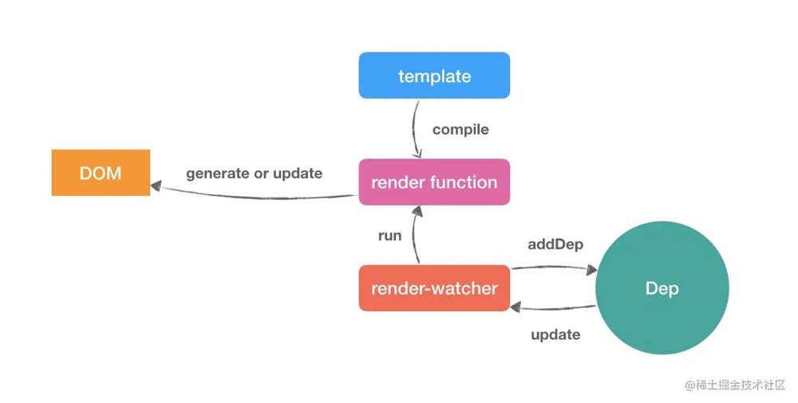

## snabbdom
在 `Vue` 中，`template` 被编译成浏览器可执行的 `render function`，然后配合响应式系统，将 `render function` 挂载在 `render-watcher` 中，当有数据更改的时候，调度中心 `Dep` 通知该 `render-watcher` 执行 `render function`，完成视图的渲染与更新。

整个流程看似通顺，但是当执行 `render function` 时，如果每次都全量删除并重建 DOM，这对执行性能来说，无疑是一种巨大的损耗，因为我们知道，浏览器的DOM很“昂贵”的，当我们频繁的更新 DOM，会产生一定的性能问题。
为了解决这个问题，Vue 使用 JS 对象将浏览器的 DOM 进行的抽象，这个抽象被称为 `Virtual DOM`。`Virtual DOM` 的每个节点被定义为 `VNode`，当每次执行 `render function` 时，Vue 对更新前后的 `VNode` 进行 `Diff` 对比，找出尽可能少的我们需要更新的真实 DOM 节点，然后只更新需要更新的节点，从而解决频繁更新 DOM 产生的性能问题。

参见 [解析 snabbdom](https://github.com/creeperyang/blog/issues/33)