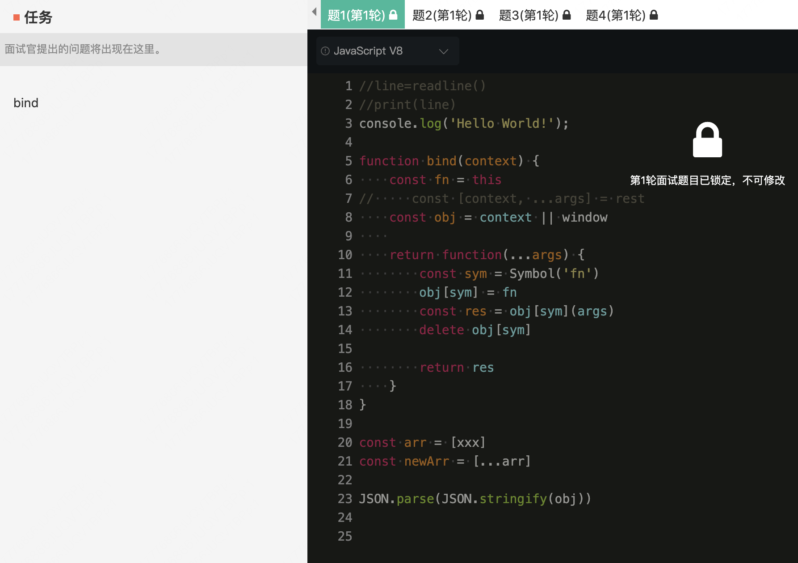
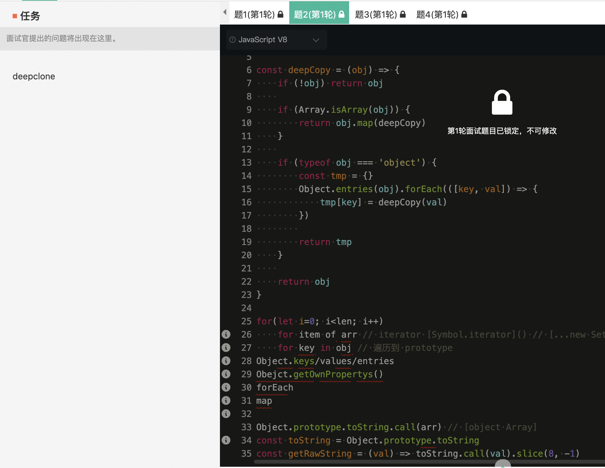
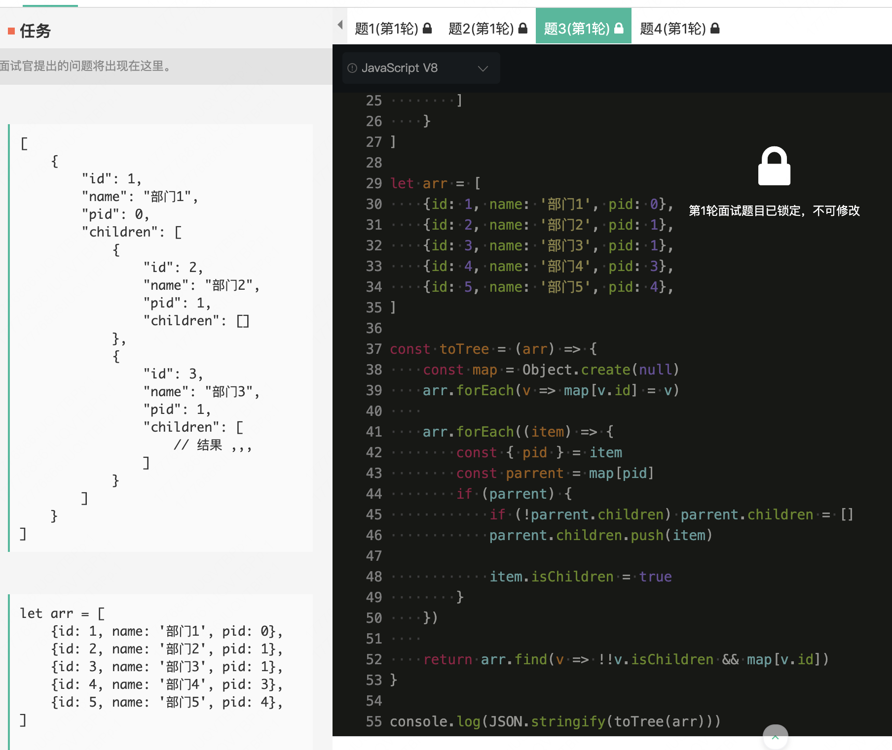
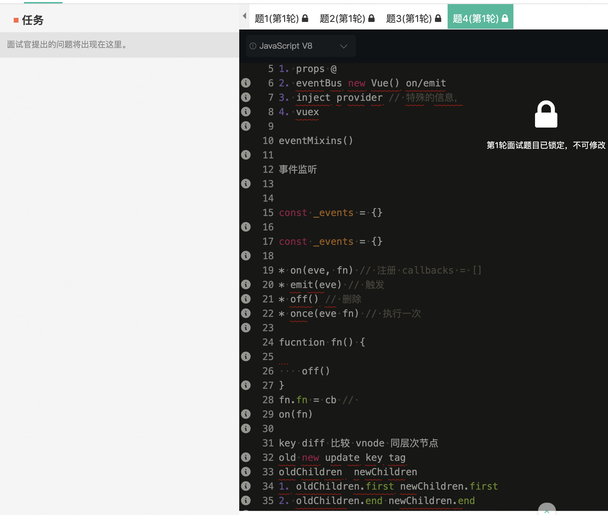
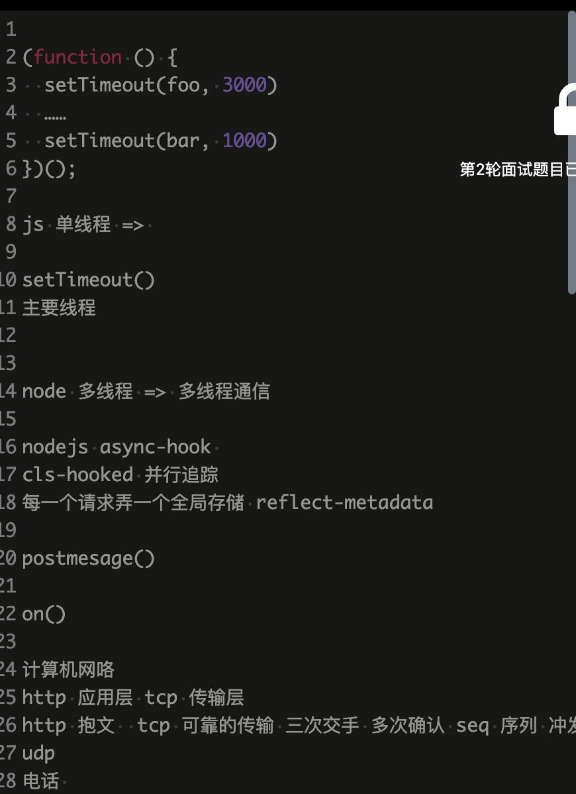
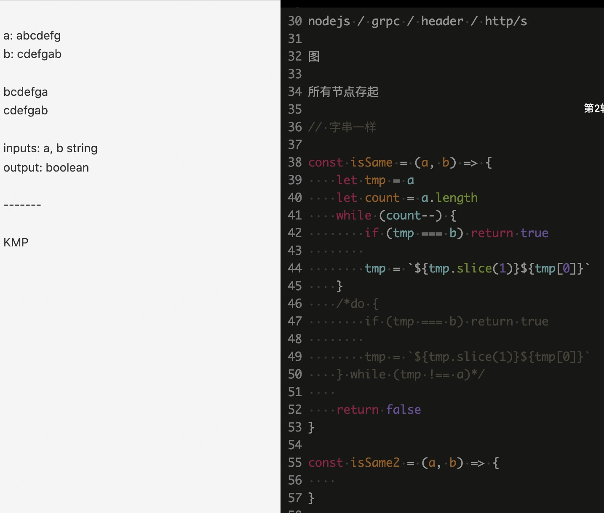
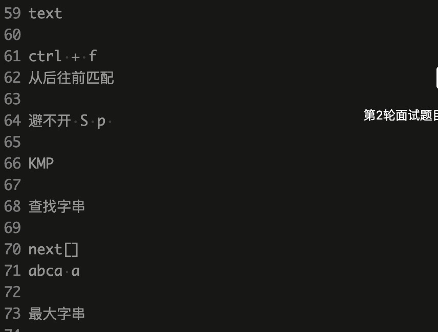

部门 -- 视频与数据智能
* 业务相关：分析图像，抽象出数据，图像视频处理
* 技术相关：大文件、大数据处理；算法；性能优化；web-worker
* 技术组成：专家组（从业务部门抽取），架构和方向，技术预研，技术分享
* 项目机会：内部team/项目，共享，公共化，组件化，脚手架
* 不要在意技术边界，跳出前端，了解各部分框架功能

## 一面
* 手写 bind，扩展 call、apply、new

---

* 手写 deepclone（深拷贝）

---

* 数组转树

---

* vue相关，组件通行，事件监听，diff

---

## 二面
* 异步调用，浏览器线程
* **nodejs 多线程、多进程**
* web-worker 通信
* **nodejs async_hooks** 扩展 cls-hooked、reflect-metadata
* 网络相关：rpc、tcp、http 比较

---

* 算法1，看能否通过滑动使两字符串相等
  * 暴力比较 O(n^2)
  * 将字符串存成双链表
  * 通过最大字串做处理

---

* 从上面最大字串，扩展有没看过相关的字符串算法
  * text ctrl+f 算法 从右往左匹配
  * KMP 算法，next 数组（最大前后缀字串）

---

**面试官给的建议：简历东西有点杂，考虑到后面规划，要细致且明确，找一块领域深入学习**