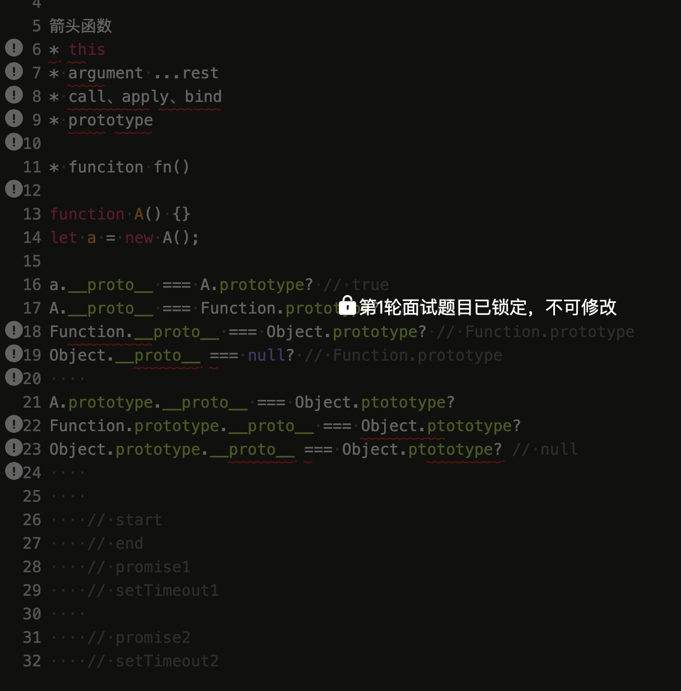
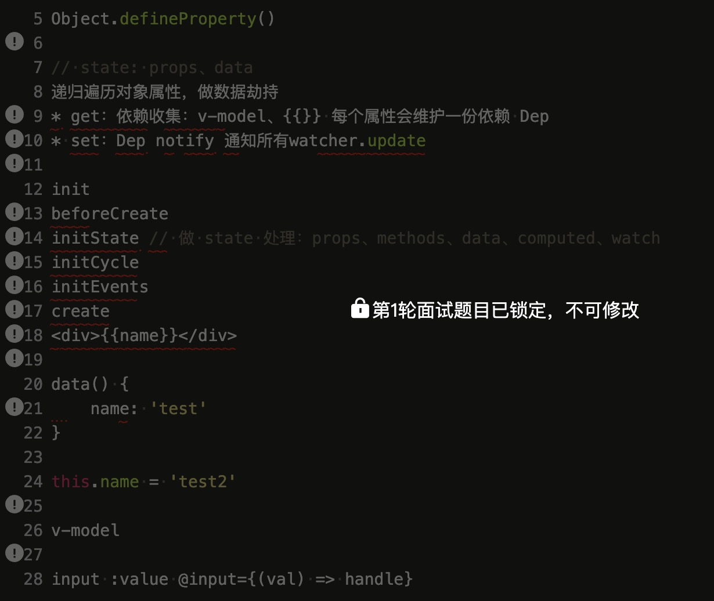

深圳 
面试系统、海外服务、中台架构组

## 一面
* 算法1，数组，without()
* 算法2，**相交链表节点** -- leetcode 160
* 箭头函数
  * 无 arguments，使用 ...rest
  * 无 this，无 call、apply、bind
  * 无 prototype
* prototype
* 异步调用，打印顺序

---

* vue相关

---

## 二面
* 算法1，邮箱校验（string & regexp）
* 获取两个 dom 元素最短路径
* es 相关
* codemirror