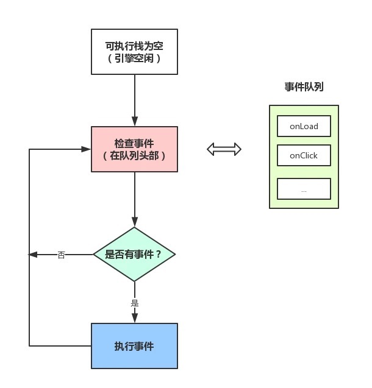
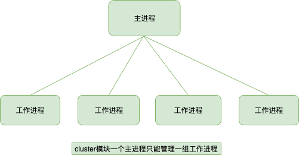
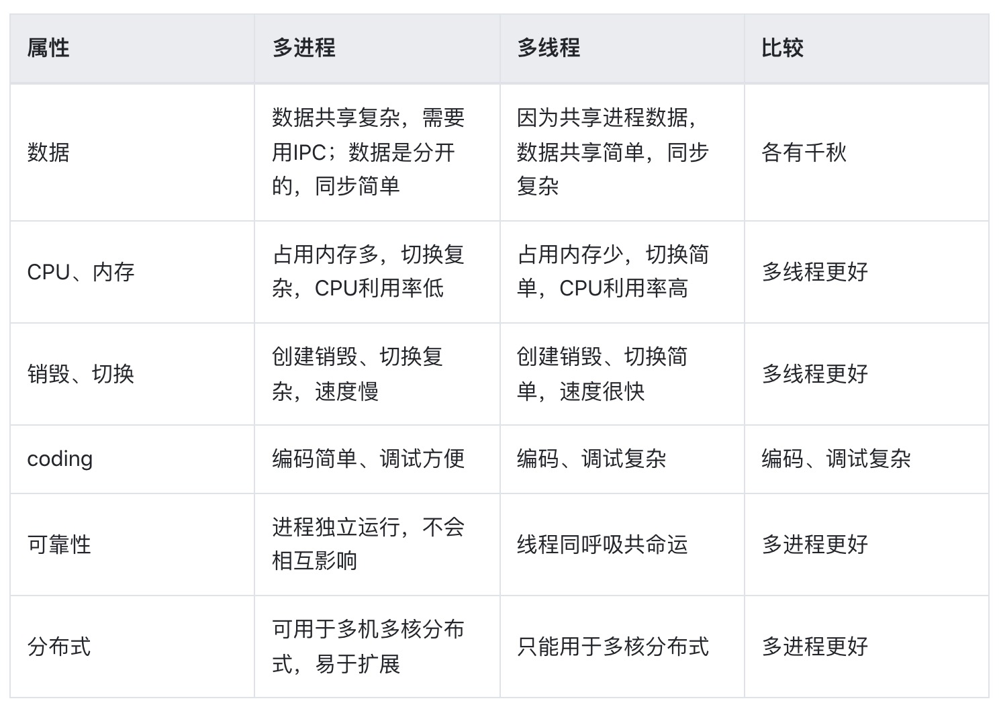

## 进程(process) & 线程(thread)
* 进程是cpu**资源分配**的最小单位（是能拥有资源和独立运行的最小单位）
* 线程是cpu**调度**的最小单位（线程是建立在进程的基础上的一次程序运行单位，一个进程中可以有多个线程）
* 进程之间相互独立，但同一进程下的各个线程之间共享程序的内存空间(包括代码段、数据集、堆等)及一些进程级的资源(如打开文件和信号)。
* 调度和切换：线程上下文切换比进程上下文切换要快得多。
---

### 进程
进程包括要执行的代码、代码操作的数据，以及进程控制块 `PCB（Processing Control Block）`，因为程序就是代码在数据集上的执行过程，而执行过程的状态和申请的资源需要记录在一个数据结构（PCB）里。所以进程由代码、数据、PCB 组成。


PCB 中记录着 pid、执行到的代码地址、进程的状态（阻塞、运行、就绪等）以及用于通信的信号量、管道、消息队列等数据结构。


### 进程间通信
不同进程之间因为可用的内存不同，所以要通过一个中间介质通信。
#### 同一台机器上的进程通信
* `信号量（简单标记）`：如果是简单的标记，通过一个数字来表示，放在 PCB 的一个属性里，这叫做信号量，比如锁的实现就可以通过信号量。
  比如信号量初始值是1，进程1来访问一块内存的时候，就把信号量设为0，然后进程2也来访问的时候看到信号量为0，就知道有其他进程在访问了，就不访问了。
* `管道（读写文件）`：但是信号量不能传递具体的数据啊，传递具体数据还得用别的方式。比如我们可以通过**读写文件的方式来通信**，这就是管道，如果是在**内存中的文件**，叫做`匿名管道`，没有文件名，如果是真实的**硬盘的文件**，是有文件名的，叫做`命名管道`。
  文件需要先打开，然后再读和写，之后再关闭，这也是管道的特点。**管道是基于文件的思想封装的，之所以叫管道，是因为只能一个进程读、一个进程写，是单向的（半双工）**。而且还需要目标进程同步的消费数据，不然就会阻塞住。
  这种管道的方式实现起来很简单，就是一个文件读写，但是只能用在两个进程之间通信，只能同步的通信。其实管道的同步通信也挺常见的，就是 stream 的 pipe 方法。
* `消息队列（异步队列）`：管道实现简单，但是同步的通信比较受限制，那如果想做成**异步通信**呢？加个**队列**做缓冲（buffer）不就行了，这就是消息队列。
  消息队列也是两个进程之间的通信，但是不是基于文件那一套思路，虽然也是单向的，但是有了一定的异步性，可以放很多消息，之后一次性消费。
* `共享内存（多个进程共享）`：管道、消息队列都是两个进程之间的，如果**多个进程之间**呢？
  我们可以通过申请一段多进程都可以操作的内存，叫做共享内存，用这种方式来通信。由一个进程创建，各进程都可以向该内存读写数据，效率比较高。
  共享内存虽然效率高、也能用于多个进程的通信，但也不全是好处，因为多个进程都可以读写，那么就很容易乱，要自己控制顺序，比如通过进程的信号量（标记变量）来控制。

#### 不同机器上的进程通信
本地过程调用就是我们上面说的**信号量、管道、消息队列、共享内存**的通信方式，但是如果是网络上的，那就要通过网络协议来通信了，这个其实我们用的比较多，比如 http、websocket。
* `socket`：其他的都是同一台主机之间的进程通信，而在不同主机的进程通信就要用到socket的通信方式了，比如发起http请求，服务器返回数据
---

浏览器每个 tab 标签页是一个进程，包含了多个线程
### Chrome 浏览器进程
* `Browser 进程`：浏览器主进程，只有一个。
  * 浏览器界面展示、交互，前进、后退、收藏等
  * 负责各个页面的管理，创建和销毁其他进程
  * 将 `Renderer进程` 得到的内存中的 `Bitmap`，绘制到用户界面上
  * 处理不可见操作，网络请求，文件访问等
  * 同时提供存储功能
* `GPU进程`：最多一个，用于3D绘制等。
* `网络进程`：负责发起和接受网络请求。
* `插件进程`：每种类型的插件对应一个进程，仅当使用该插件时才创建。
* `渲染引擎（浏览器内核）`：内部是多线程的。核心任务是将HTML、CSS、JS转为用户可以与之交互的网页，`排版引擎Blink` 和 `JS引擎V8` 都是运行在该进程中，默认情况下Chrome会为每个Tab标签页创建一个渲染进程
  * `GUI渲染线程`：负责渲染页面，解析html和CSS、构建DOM树、CSSOM树、渲染树、布局和绘制页面，重绘重排也是在该线程执行。
  * `JS引擎线程`：一个tab页中只有一个JS引擎线程(单线程)，负责解析和执行JS。它与GUI渲染线程不能同时执行，只能一个一个来，如果JS执行过长就会导致阻塞掉帧。
  * `事件触发线程`：主要用来控制**事件循环**，比如JS执行遇到计时器，AJAX异步请求，鼠标点击等，就会将对应任务添加到事件触发线程中，在对应事件符合触发条件触发时，就把事件添加到待处理队列的队尾，等JS引擎处理（当JS引擎空闲时才会去执行）
  * `计时器线程`：指`setInterval` 和 `setTimeout`，因为JS引擎是单线程的，所以如果处于阻塞状态，那么计时器就会不准了，所以需要单独的线程来负责计时器工作（计时完毕后，添加到**事件队列**)。W3C在HTML标准中规定，规定要求 `setTimeout` 中低于4ms的时间间隔算为**4ms**。
  * `异步http请求线程`：XMLHttpRequest连接后浏览器开的一个线程，比如请求有回调函数，异步线程就会将回调函数加入**事件队列**，等待JS引擎空闲执行

  > `GUI渲染线程` 与 `JS引擎线程` 互斥！
  由于 `JavaScript` 是可操纵 `DOM` 的，如果在修改这些元素属性同时渲染界面（即 `JS引擎线程` 和 `UI线程` 同时运行），那么渲染线程前后获得的元素数据就可能不一致了。因此为了防止渲染出现不可预期的结果，浏览器设置 `GUI渲染线程` 与 `JS引擎线程` 为互斥的关系，当 `JS引擎线程` 执行时 `GUI线程` 会被挂起，GUI更新会被保存在一个**队列（浏览器可做优化**）中等到引擎线程空闲时立即被执行。
  所以说 **JS阻塞页面加载**。当浏览器在执行JavaScript程序的时候，GUI渲染线程会被保存在一个队列中，直到JS程序执行完成，才会接着执行。因此如果JS执行的时间过长，这样就会造成页面的渲染不连贯，导致页面渲染加载阻塞的感觉。
---

#### [HTML5 Web Workers](https://developer.mozilla.org/en-US/docs/Web/API/Web_Workers_API/Using_web_workers)
* 单独的 js 脚本文件，运行在独立的 `全局context`，没有 `window` 变量，可通过 `self` 获取。
* `Dedicated workers`：通过 `Worker("path/to/worker/script")` 创建的实例
  * 由 `渲染引擎线程` 创建的一个线程，不能和其他 `渲染引擎线程` 共享
  * 主代码向 worker 通信：`Worker.postMessage` 和 `onmessage`
  * worker 向主代码通信：`self.postMessage` 和 `Worker.onmessage/addEventListener('message', fn)`
* `Shared workers`：通过 `SharedWorker("path/to/worker/script")` 创建的实例
  * 浏览器所有页面共享，独立进程管理，只会有一个。
  * 主代码向 SharedWorker 通信：`SharedWorker.port.postMessage` 和 `onconnect`
  * SharedWorker 向主代码通信：`port.postMessage` 和 `SharedWorker.port.onmessage`
---

### Event Loop
JS异步依赖于 `事件触发线程` 管理的 `事件队列`，每个异步调用结束会往 `事件队列` 添加一个回调函数，等到 JS 引擎空闲会逐个执行，这个检查时轮训着的，所以也叫 `事件循环`。
每个线程都有自己的事件循环，每个 web worker 也是，保证了能够独立执行。同源的标签共享一个事件循环，所以能够同步通信。


* macrotask
  * setTimeout / setInterval
  * setImmediate
  * MessageChannel
  * postMessage
* microtask
  * Promise
  * MutationObserver：监听dom变化
  * process.nextTick(NodeJS)
  
* 宏任务的回调会添加到 `事件队列`，每次执行完一个回调，浏览器会重新渲染。
* 宏任务中碰到微任务，会在执行完这个宏任务后执行所有微任务，然后重新渲染，继续执行下一个宏任务。
  ``` js
  for (macroTask of macroTaskQueue) {
    // 1. Handle current MACRO-TASK
    handleMacroTask();

    // 2. Handle all MICRO-TASK
    for (microTask of microTaskQueue) {
        handleMicroTask(microTask);
    }
  }
  ```
  

### NodeJS 进程
#### child_process
* `child_process.spawn() shell`：适用于返回大量数据，例如图像处理，二进制数据处理。
* `child_process.exec() shell`：适用于小量数据，maxBuffer 默认值为 200 * 1024 超出这个默认值将会导致程序崩溃，数据量过大可采用 spawn。
* `child_process.execFile() 可执行文件`：类似 child_process.exec()，区别是不能通过 shell 来执行，不支持像 I/O 重定向和文件查找这样的行为
* `child_process.fork() js文件`： 衍生新的进程，进程之间是相互独立的，每个进程都有自己的 V8 实例、内存，系统资源是有限的，不建议衍生太多的子进程出来，通长根据系统 CPU 核心数设置。

上面方法都遵循其他 Node.js API 典型的惯用异步编程模式。每个方法都返回 `ChildProcess` 实例。 这些对象实现了 `Node.js` `EventEmitter API`，允许父进程注册在子进程的生命周期中发生某些事件时调用的监听器函数。

> CPU 核心数这里特别说明下，fork 确实可以开启多个进程，但是并不建议衍生出来太多的进程，cpu核心数的获取方式const cpus = require('os').cpus();,这里 cpus 返回一个对象数组，包含所安装的每个 CPU/内核的信息，二者总和的数组哦。假设主机装有两个cpu，每个cpu有4个核，那么总核数就是8。

请记住，衍生的 Node.js 子进程独立于父进程，除了两者之间建立的 IPC 通信通道。 每个进程都有自己的内存，具有自己的 V8 实例。 由于需要额外的资源分配，不建议衍生大量子 Node.js 进程。

##### child_process.fork
`child_process.fork()` 方法是 `child_process.spawn()` 的特例，专门用于衍生新的 `Node.js` 进程。 与 `child_process.spawn()` 一样，返回 `ChildProcess` 对象。 返回的 `ChildProcess` 将有额外的内置**通信通道**，允许消息在父进程和子进程之间来回传递。 
详见 `subprocess.send()`，可以通过 `message` 事件接收这些消息。消息经过序列化和解析。结果消息可能与最初发送的消息不同。
请记住，衍生的 `Node.js` 子进程独立于父进程，除了两者之间建立的 `IPC` 通信通道。 每个进程都有自己的内存，具有自己的 `V8` 实例。 由于需要额外的资源分配，不建议衍生大量子 `Node.js` 进程。

**高级序列化**
子进程支持 `IPC` 的序列化机制，该机制基于 `v8 模块的序列化 API`，基于 `HTML 结构化克隆算法`。 这通常功能更强大，支持更多内置的 `JavaScript` 对象类型，例如 `BigInt`、`Map` 和 `Set`、`ArrayBuffer` 和 `TypedArray`、`Buffer`、`Error`、`RegExp` 等。

但是，这种格式不是 `JSON` 的完整超集，例如 在此类内置类型的对象上设置的属性不会通过序列化步骤传递。 此外，性能可能不等同于 `JSON`，具体取决于传递数据的结构。 因此，此功能需要在调用 `child_process.spawn()` 或 `child_process.fork()` 时通过将 `serialization` 选项设置为 `advanced` 来选择加入。


例子（感觉跟 worker 使用差不多，但 worker 是线程，fork 是进程）
``` js
// app.js
const http = require('http');
const fork = require('child_process').fork;

const server = http.createServer((req, res) => {
  if(req.url == '/compute'){
    const compute = fork('./fork_compute.js');
    compute.send('开启一个新的子进程');

    // 当一个子进程使用 process.send() 发送消息时会触发 'message' 事件
    compute.on('message', sum => {
      res.end(`Sum is ${sum}`);
      compute.kill();
    });

    // 子进程监听到一些错误消息退出
    compute.on('close', (code, signal) => {
      console.log(`收到close事件，子进程收到信号 ${signal} 而终止，退出码 ${code}`);
      compute.kill();
    })
  }else{
    res.end(`ok`);
  }
});
server.listen(3000, 127.0.0.1, () => {
  console.log(`server started at http://${127.0.0.1}:${3000}`);
});
```

``` js
// fork_compute.js
const computation = () => {
  let sum = 0;
  console.info('计算开始');
  console.time('计算耗时');

  for (let i = 0; i < 1e10; i++) {
    sum += i
  };

  console.info('计算结束');
  console.timeEnd('计算耗时');
  return sum;
};

process.on('message', msg => {
  console.log(msg, 'process.pid', process.pid); // 子进程id
  const sum = computation();

  // 如果Node.js进程是通过进程间通信产生的，那么，process.send()方法可以用来给父进程发送消息
  process.send(sum);
})
```
---

#### cluster
``` js
const http = require('http');
const numCPUs = require('os').cpus().length;
const cluster = require('cluster');
if(cluster.isMaster){
  console.log('Master proces id is',process.pid);
  // fork workers
  for(let i= 0;i<numCPUs;i++){
    cluster.fork();
  }
  cluster.on('exit',function(worker,code,signal){
    console.log('worker process died,id',worker.process.pid)
  })
}else{
  // Worker可以共享同一个TCP连接
  // 这里是一个http服务器
  http.createServer(function(req,res){
    res.writeHead(200);
    res.end('hello word');
  }).listen(8000);
}
```


`cluster模块` 调用 `fork` 方法来创建子进程，该方法与 `child_process.fork`是同一个方法。
`cluster模块` 采用的是经典的**主从模型**，`Cluster` 会创建一个 `master`，然后根据你指定的数量复制出多个子进程，可以使用 `cluster.isMaster` 属性判断当前进程是 `master` 还是 `worker(工作进程)`。由 `master` 进程来管理所有的子进程，**主进程不负责具体的任务处理，主要工作是负责调度和管理**。

`cluster模块` 使用内置的**负载均衡**来更好地处理线程之间的压力，该负载均衡使用了 `Round-robin` 算法（也被称之为`循环算法`）。当使用 `Round-robin` 调度策略时，`master` `accepts()` 所有传入的连接请求，然后将相应的TCP请求处理发送给选中的工作进程（该方式仍然通过`IPC`来进行通信）。

> typeorm 对从库的选择也有内置的均衡算法
``` js
/**
 * Determines how slaves are selected:
 * RR: Select one alternately (Round-Robin).
 * RANDOM: Select the node by random function.
 * ORDER: Select the first node available unconditionally.
 */
readonly selector?: "RR" | "RANDOM" | "ORDER";
```

开启多进程时候端口疑问讲解：如果多个 `Node进程` 监听同一个端口时会出现  `Error:listen EADDRIUNS` 的错误，而 `cluster模块` 为什么可以让**多个子进程监听同一个端口**呢?
原因是 `master进程` 内部启动了一个 `TCP服务器`，而真正监听端口的只有这个服务器，当来自前端的请求触发服务器的 `connection` 事件后，`master` 会将对应的 `socket` 具柄发送给子进程。(类似 ShareWorker ？可以看作是 master 拦截然后事件分发)

---

#### child_process & cluster
无论是 `child_process模块` 还是 `cluster模块`，为了解决 `Node.js实例` **单线程运行无法利用多核 CPU 的问题**而出现的。核心就是父进程（即 master 进程）负责监听端口，接收到新的请求后将其分发给下面的 worker 进程。

cluster内部隐式的构建TCP服务器的方式来说对使用者确实简单和透明了很多，但是这种方式无法像使用child_process那样灵活，因为一直主进程只能管理一组相同的工作进程，而自行通过child_process来创建工作进程，一个主进程可以控制多组进程。原因是child_process操作子进程时，可以隐式的创建多个TCP服务器。（cluster 只有一个 TCP 服务器，child_process 可以创建多个）

#### 进程守护
* pm2
* forever

#### Node.js关于单线程的误区
`Node` 中最核心的是 `v8` 引擎，在 Node 启动后，会创建 `v8` 的实例，这个实例是多线程的。
* 主线程：编译、执行代码。
* 编译/优化线程：在主线程执行的时候，可以优化代码。
* 分析器线程：记录分析代码运行时间，为 Crankshaft 优化代码执行提供依据。
* 垃圾回收的几个线程。
所以大家常说的 `Node` 是单线程的指的是 `JavaScript` 的执行是单线程的(开发者编写的代码运行在单线程环境中)，但 `Javascript` 的宿主环境，无论是 `Node` 还是`浏览器`都是多线程的因为 `libuv` 中有线程池的概念存在的，`libuv` 会通过类似线程池的实现来模拟不同操作系统的异步调用，这对开发者来说是不可见的。



