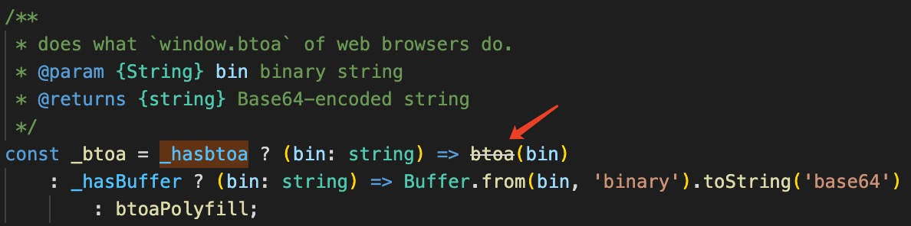
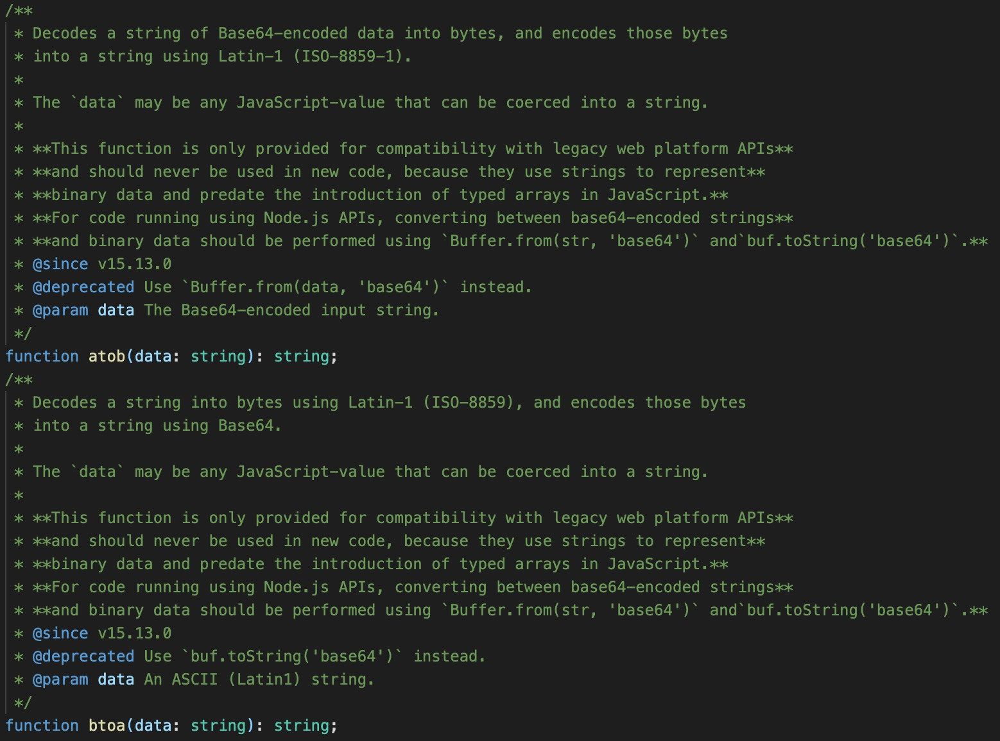

## JS base64 字符编码小记

> 参考工具包 [js-base64](https://github.com/dankogai/js-base64.git)

项目中使用到 js-base64 处理字符串编码解码，翻了源码做一下记录。

处理 base64 编码的主要是下面一段
``` js
const _hasbtoa = typeof btoa === 'function'

const _btoa = _hasbtoa ? (bin: string) => btoa(bin)
    : _hasBuffer ? (bin: string) => Buffer.from(bin, 'binary').toString('base64')

const btoaPolyfill = (bin: string) => {
    // console.log('polyfilled');
    let u32, c0, c1, c2, asc = ''
    const pad = bin.length % 3;
    for (let i = 0; i < bin.length;) {
        if ((c0 = bin.charCodeAt(i++)) > 255 ||
            (c1 = bin.charCodeAt(i++)) > 255 ||
            (c2 = bin.charCodeAt(i++)) > 255)
            throw new TypeError('invalid character found')
        u32 = (c0 << 16) | (c1 << 8) | c2
        asc += b64chs[u32 >> 18 & 63]
            + b64chs[u32 >> 12 & 63]
            + b64chs[u32 >> 6 & 63]
            + b64chs[u32 & 63]
    }
    return pad ? asc.slice(0, pad - 3) + "===".substring(pad) : asc
};

export { btoa: _btoa }
```

#### 从代码可以看到处理编码主要有三个方法
1. [`btoa`](https://developer.mozilla.org/en-US/docs/Web/API/btoa) - 全局方法，编码字符串为 base64 格式，其中每个字符被作为二进制字节（1 byte / 8 bits）处理。 对应的解码方法为 [`atob`](https://developer.mozilla.org/en-US/docs/Web/API/atob)。
   
2. [`NodeJS Buffer`](https://nodejs.org/api/buffer.html) - 上面的 `btoa` 方法并不是推荐使用的，在 VSCode 编辑器上可以看到带有 [@deprecated](https://jsdoc.app/tags-deprecated.html)。推荐通过 `Buffer` 做处理编码转换。
   
   

3. 最后是 polyfill 方法。


十进制转二进制：num.toString(2)
二进制转十进制：parseInt(num, 2)

https://www.ruanyifeng.com/blog/2007/10/ascii_unicode_and_utf-8.html

const b64chs = {
  0: "A",
  1: "B",
  2: "C",
  3: "D",
  4: "E",
  5: "F",
  6: "G",
  7: "H",
  8: "I",
  9: "J",
  10: "K",
  11: "L",
  12: "M",
  13: "N",
  14: "O",
  15: "P",
  16: "Q",
  17: "R",
  18: "S",
  19: "T",
  20: "U",
  21: "V",
  22: "W",
  23: "X",
  24: "Y",
  25: "Z",
  26: "a",
  27: "b",
  28: "c",
  29: "d",
  30: "e",
  31: "f",
  32: "g",
  33: "h",
  34: "i",
  35: "j",
  36: "k",
  37: "l",
  38: "m",
  39: "n",
  40: "o",
  41: "p",
  42: "q",
  43: "r",
  44: "s",
  45: "t",
  46: "u",
  47: "v",
  48: "w",
  49: "x",
  50: "y",
  51: "z",
  52: "0",
  53: "1",
  54: "2",
  55: "3",
  56: "4",
  57: "5",
  58: "6",
  59: "7",
  60: "8",
  61: "9",
  62: "+",
  63: "/",
  64: "=",
}