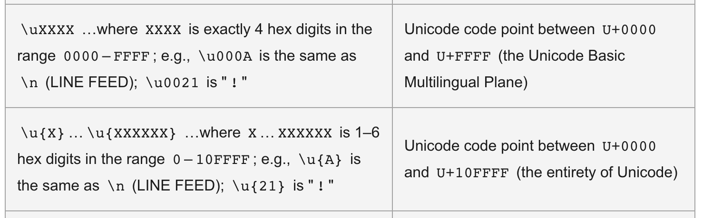

## JS base64 字符编码小记

项目中使用到 js-base64 处理字符串编码解码，翻了源码做一下记录。

> [工具包 js-base64](https://github.com/dankogai/js-base64.git)
> [Base64-doc](https://developer.mozilla.org/en-US/docs/Glossary/Base64)
### 处理 base64 编码的主要是下面一段
``` ts
const _hasbtoa = typeof btoa === 'function'
const _hasBuffer = typeof Buffer === 'function';

const _btoa = _hasbtoa ? (bin: string) => btoa(bin)
  : _hasBuffer ? (bin: string) => Buffer.from(bin, 'binary').toString('base64')

const btoaPolyfill = (bin: string) => {
  // console.log('polyfilled');
  let u32, c0, c1, c2, asc = ''
  const pad = bin.length % 3;
  for (let i = 0; i < bin.length;) {
    if ((c0 = bin.charCodeAt(i++)) > 255 ||
        (c1 = bin.charCodeAt(i++)) > 255 ||
        (c2 = bin.charCodeAt(i++)) > 255)
      throw new TypeError('invalid character found')

    u32 = (c0 << 16) | (c1 << 8) | c2
    asc += b64chs[u32 >> 18 & 63]
      + b64chs[u32 >> 12 & 63]
      + b64chs[u32 >> 6 & 63]
      + b64chs[u32 & 63]
  }
  return pad ? asc.slice(0, pad - 3) + "===".substring(pad) : asc
};

export { btoa: _btoa }
```

#### 从代码可以看到处理编码主要有三个方法
1. [btoa](https://developer.mozilla.org/en-US/docs/Web/API/btoa) - 对应的解码方法为 [atob](https://developer.mozilla.org/en-US/docs/Web/API/atob)。
  
   > 官方定义：The btoa() method creates a Base64-encoded ASCII strig from a [binary string](https://developer.mozilla.org/en-US/docs/Web/API/DOMString/Binary) (i.e., a String object in which each character in the string is treated as a byte of binary data).
  
   关于 `binary string`：JS string 采用的是 UTF-16 编码方式存储的，意味着每个字符占两个字节的内存空间。可以表示 `2**16 - 1 = 65535` 种不同的字符。
   而 `binary string` 每个 `data` 为一个字节，即最大为`2**8 - 1 = 255`。
   `btoa` 方法处理 string 内部是转为 binary string 方式去处理的，或者说超过255的字符会报异常：
  
   ``` js
    String.fromCharCode(255) // "ÿ"
    String.fromCharCode(256) // "Ā"
    btoa("ÿ") // "/w=="
    btoa("Ā") // Uncaught DOMException: Failed to execute 'btoa' on 'Window': The string to be encoded contains characters outside of the Latin1 range.
   ```

   针对以上情况，官方给了两个解决方法：
   * 将整个字符串转义后再进行编码，注意需要转义成 UTF-8 格式。可以利用 [encodeURIComponent](https://developer.mozilla.org/zh-CN/docs/Web/JavaScript/Reference/Global_Objects/encodeURIComponent) 和 [decodeURIComponent](https://developer.mozilla.org/zh-CN/docs/Web/JavaScript/Reference/Global_Objects/decodeURIComponent)

   ``` js
    // 方法一
    function utf8_to_b64( str ) {
      return window.btoa(unescape(encodeURIComponent( str )));
    }

    function b64_to_utf8( str ) {
      return decodeURIComponent(escape(window.atob( str )));
    }

    // Usage:
    utf8_to_b64('✓ à la mode'); // "4pyTIMOgIGxhIG1vZGU="
    b64_to_utf8('4pyTIMOgIGxhIG1vZGU='); // "✓ à la mode"

    // 方法二 - 因为方法一中的 unescape 和 escape 不推荐使用了
    function b64EncodeUnicode(str) {
      return btoa(encodeURIComponent(str).replace(/%([0-9A-F]{2})/g, function(match, p1) {
          return String.fromCharCode('0x' + p1);
      }));
    }
    b64EncodeUnicode('✓ à la mode'); // "4pyTIMOgIGxhIG1vZGU="
   ``` 

   * 中间做一层编码转换，将每个 `JS string` 字符处理成两个 `binary string data`:

   ``` js
    // convert a Unicode string to a string in which
    // each 16-bit unit occupies only one byte
    function toBinary(string) {
      const codeUnits = new Uint16Array(string.length);
      for (let i = 0; i < codeUnits.length; i++) {
        codeUnits[i] = string.charCodeAt(i);
      }
      const charCodes = new Uint8Array(codeUnits.buffer);
      let result = '';
      for (let i = 0; i < charCodes.byteLength; i++) {
        result += String.fromCharCode(charCodes[i]);
      }
      return result;
    }

    // a string that contains characters occupying > 1 byte
    const myString = "☸☹☺☻☼☾☿";

    // 解码
    const converted = toBinary(myString);
    const encoded = btoa(converted);
    console.log(encoded); 
    
    function fromBinary(binary) {
      const bytes = new Uint8Array(binary.length);
      for (let i = 0; i < bytes.length; i++) {
        bytes[i] = binary.charCodeAt(i);
      }
      const charCodes = new Uint16Array(bytes.buffer);
      let result = '';
      for (let i = 0; i < charCodes.length; i++) {
        result += String.fromCharCode(charCodes[i]);
      }
      return result;
    }

    const decoded = atob(encoded);
    const original = fromBinary(decoded);
    console.log(original);                // ☸☹☺☻☼☾☿
   ```

   > 扩展阅读：
   [JavaScript typed arrays](https://developer.mozilla.org/en-US/docs/Web/JavaScript/Typed_arrays) are array-like objects that provide a mechanism for reading and writing raw binary data in memory buffers.
   阮一峰 n年前的博客 - [字符编码笔记](https://www.ruanyifeng.com/blog/2007/10/ascii_unicode_and_utf-8.html)
   知乎文章 - [Unicode 与 UTF 编码](https://zhuanlan.zhihu.com/p/51202412)

2. [NodeJS Buffer](https://nodejs.org/api/buffer.html) - 上面的 `btoa` 方法并不是推荐使用的，在 VSCode 编辑器上可以看到带有 [@deprecated](https://jsdoc.app/tags-deprecated.html)。推荐通过 `Buffer` 做处理编码转换。
  
  
  ``` ts
  /**
  * Decodes a string of Base64-encoded data into bytes, and encodes those bytes
  * into a string using Latin-1 (ISO-8859-1).
  *
  * The `data` may be any JavaScript-value that can be coerced into a string.
  *
  * **This function is only provided for compatibility with legacy web platform APIs**
  * **and should never be used in new code, because they use strings to represent**
  * **binary data and predate the introduction of typed arrays in JavaScript.**
  * **For code running using Node.js APIs, converting between base64-encoded strings**
  * **and binary data should be performed using `Buffer.from(str, 'base64')` and`buf.toString('base64')`.**
  * @since v15.13.0
  * @deprecated Use `Buffer.from(data, 'base64')` instead.
  * @param data The Base64-encoded input string.
  */
  function atob(data: string): string;
  /**
  * Decodes a string into bytes using Latin-1 (ISO-8859), and encodes those bytes
  * into a string using Base64.
  *
  * The `data` may be any JavaScript-value that can be coerced into a string.
  *
  * **This function is only provided for compatibility with legacy web platform APIs**
  * **and should never be used in new code, because they use strings to represent**
  * **binary data and predate the introduction of typed arrays in JavaScript.**
  * **For code running using Node.js APIs, converting between base64-encoded strings**
  * **and binary data should be performed using `Buffer.from(str, 'base64')` and`buf.toString('base64')`.**
  * @since v15.13.0
  * @deprecated Use `buf.toString('base64')` instead.
  * @param data An ASCII (Latin1) string.
  */
  function btoa(data: string): string;
  ```

3. 最后是 polyfill 方法。
  --TODO Base64原理可以先看扩展阅读，之后补充
  `btoaPolyfill` 方法里面用到的 `b64chs` 是一个字符映射表，但我发现不太对，所以另外写了一份：

  ``` ts
  const b64chs = {
    0: "A",
    1: "B",
    2: "C",
    3: "D",
    4: "E",
    5: "F",
    6: "G",
    7: "H",
    8: "I",
    9: "J",
    10: "K",
    11: "L",
    12: "M",
    13: "N",
    14: "O",
    15: "P",
    16: "Q",
    17: "R",
    18: "S",
    19: "T",
    20: "U",
    21: "V",
    22: "W",
    23: "X",
    24: "Y",
    25: "Z",
    26: "a",
    27: "b",
    28: "c",
    29: "d",
    30: "e",
    31: "f",
    32: "g",
    33: "h",
    34: "i",
    35: "j",
    36: "k",
    37: "l",
    38: "m",
    39: "n",
    40: "o",
    41: "p",
    42: "q",
    43: "r",
    44: "s",
    45: "t",
    46: "u",
    47: "v",
    48: "w",
    49: "x",
    50: "y",
    51: "z",
    52: "0",
    53: "1",
    54: "2",
    55: "3",
    56: "4",
    57: "5",
    58: "6",
    59: "7",
    60: "8",
    61: "9",
    62: "+",
    63: "/",
  }

  const btoaPolyfill = (bin: string) => {
    // console.log('polyfilled');
    let u32, c0, c1, c2, asc = ''
    const pad = bin.length % 3;
    for (let i = 0; i < bin.length;) {
      if ((c0 = bin.charCodeAt(i++)) > 255 ||
          (c1 = bin.charCodeAt(i++)) > 255 ||
          (c2 = bin.charCodeAt(i++)) > 255)
        throw new TypeError('invalid character found')

      u32 = (c0 << 16) | (c1 << 8) | c2
      asc += b64chs[u32 >> 18 & 63]
        + b64chs[u32 >> 12 & 63]
        + b64chs[u32 >> 6 & 63]
        + b64chs[u32 & 63]
    }
    return pad ? asc.slice(0, pad - 3) + "===".substring(pad) : asc
  };

  btoaPolyfill('a') // "YQ=="
  btoa('a') // "YQ=="
  ```

  [String.prototype.charCodeAt](https://developer.mozilla.org/en-US/docs/Web/JavaScript/Reference/Global_Objects/String/charCodeAt) 方法返回字符的 `UTF-16 code` - `0x0000 - 0xFFFF`。
  -- TODO 补充 String.prototype.codePointAt 以及 unicode 转义的关系 (例如 '\u626c' => '扬')
  

  > 扩展阅读：
  知乎文章 - [Base64 原理](https://zhuanlan.zhihu.com/p/111700349)

  相关工具方法：
  * 十进制转二进制：num.toString(2)
  * 二进制转十进制：parseInt(num, 2)