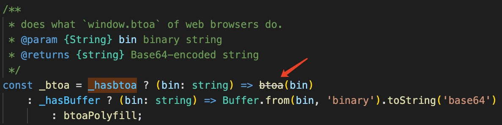
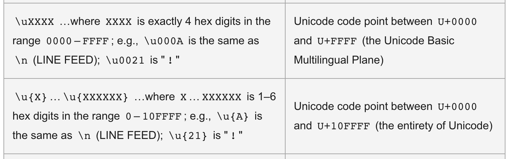

## JS base64 字符编码小记

项目中使用到 js-base64 处理字符串编码解码，翻了源码做一下记录。

> [工具包 js-base64](https://github.com/dankogai/js-base64.git)
> [Base64](https://developer.mozilla.org/en-US/docs/Glossary/Base64)
### 处理 base64 编码的主要是下面一段
``` ts
const _hasbtoa = typeof btoa === 'function'
const _hasBuffer = typeof Buffer === 'function';

const _btoa = _hasbtoa ? (bin: string) => btoa(bin)
  : _hasBuffer ? (bin: string) => Buffer.from(bin, 'binary').toString('base64')
  : btoaPolyfill

const btoaPolyfill = (bin: string) => {
  // console.log('polyfilled');
  let u32, c0, c1, c2, asc = ''
  const pad = bin.length % 3;
  for (let i = 0; i < bin.length;) {
    if ((c0 = bin.charCodeAt(i++)) > 255 ||
        (c1 = bin.charCodeAt(i++)) > 255 ||
        (c2 = bin.charCodeAt(i++)) > 255)
      throw new TypeError('invalid character found')

    u32 = (c0 << 16) | (c1 << 8) | c2
    asc += b64chs[u32 >> 18 & 63]
      + b64chs[u32 >> 12 & 63]
      + b64chs[u32 >> 6 & 63]
      + b64chs[u32 & 63]
  }
  return pad ? asc.slice(0, pad - 3) + "===".substring(pad) : asc
};

export { btoa: _btoa }
```

#### 从代码可以看到处理编码主要有三个方法
1. [btoa](https://developer.mozilla.org/en-US/docs/Web/API/btoa) - 对应的解码方法为 [atob](https://developer.mozilla.org/en-US/docs/Web/API/atob)。
  
   > 官方定义：The btoa() method creates a Base64-encoded ASCII strig from a [binary string](https://developer.mozilla.org/en-US/docs/Web/API/DOMString/Binary) (i.e., a String object in which each character in the string is treated as a byte of binary data).
  
   JS string 采用的是 UTF-16 编码方式存储的，意味着每个字符占两个字节的内存空间。可以表示 `2**16 = 65536 (0 ~ 65535)` 种不同的字符。
   而 `binary string` 每个 `data` 为一个字节，即最大为`2**8 = 256 (0 ~ 255)`。
   `btoa` 方法处理 string 内部是转为 binary string 方式去处理的，或者说超过255的字符会报异常：
  
   ``` js
    String.fromCharCode(255) // "ÿ"
    String.fromCharCode(256) // "Ā"
    btoa("ÿ") // "/w=="
    btoa("Ā") // Uncaught DOMException: Failed to execute 'btoa' on 'Window': The string to be encoded contains characters outside of the Latin1 range.
   ```

   针对以上情况，官方给了两个解决方法：
   * 将整个字符串转义后再进行编码，注意需要将字符转义成 `Byte` 单元。可以利用 [encodeURIComponent](https://developer.mozilla.org/zh-CN/docs/Web/JavaScript/Reference/Global_Objects/encodeURIComponent) 和 [decodeURIComponent](https://developer.mozilla.org/zh-CN/docs/Web/JavaScript/Reference/Global_Objects/decodeURIComponent)

   ``` js
    // 方法一
    function utf8_to_b64( str ) {
      return window.btoa(unescape(encodeURIComponent( str )));
    }

    function b64_to_utf8( str ) {
      return decodeURIComponent(escape(window.atob( str )));
    }

    // Usage:
    utf8_to_b64('✓ à la mode'); // "4pyTIMOgIGxhIG1vZGU="
    b64_to_utf8('4pyTIMOgIGxhIG1vZGU='); // "✓ à la mode"

    // 方法二 - 因为方法一中的 unescape 和 escape 不推荐使用了
    function b64EncodeUnicode(str) {
      return btoa(encodeURIComponent(str).replace(/%([0-9A-F]{2})/g, function(match, p1) {
          return String.fromCharCode('0x' + p1);
      }));
    }
    b64EncodeUnicode('✓ à la mode'); // "4pyTIMOgIGxhIG1vZGU="
   ``` 

   * 中间做一层编码转换，将每个 `JS string` 字符处理成两个 `binary string data`:

   ``` js
    // convert a Unicode string to a string in which
    // each 16-bit unit occupies only one byte
    function toBinary(string) {
      const codeUnits = new Uint16Array(string.length);
      for (let i = 0; i < codeUnits.length; i++) {
        codeUnits[i] = string.charCodeAt(i);
      }
      const charCodes = new Uint8Array(codeUnits.buffer);
      let result = '';
      for (let i = 0; i < charCodes.byteLength; i++) {
        result += String.fromCharCode(charCodes[i]);
      }
      return result;
    }

    // a string that contains characters occupying > 1 byte
    const myString = "☸☹☺☻☼☾☿";

    // 解码
    const converted = toBinary(myString);
    const encoded = btoa(converted);
    console.log(encoded); 
    
    function fromBinary(binary) {
      const bytes = new Uint8Array(binary.length);
      for (let i = 0; i < bytes.length; i++) {
        bytes[i] = binary.charCodeAt(i);
      }
      const charCodes = new Uint16Array(bytes.buffer);
      let result = '';
      for (let i = 0; i < charCodes.length; i++) {
        result += String.fromCharCode(charCodes[i]);
      }
      return result;
    }

    const decoded = atob(encoded);
    const original = fromBinary(decoded);
    console.log(original);                // ☸☹☺☻☼☾☿
   ```

   > 扩展阅读：
   [JavaScript typed arrays](https://developer.mozilla.org/en-US/docs/Web/JavaScript/Typed_arrays) are array-like objects that provide a mechanism for reading and writing raw binary data in memory buffers.
   阮一峰 n年前的博客 - [字符编码笔记](https://www.ruanyifeng.com/blog/2007/10/ascii_unicode_and_utf-8.html)
   知乎文章 - [Unicode 与 UTF 编码](https://zhuanlan.zhihu.com/p/51202412)

2. [NodeJS Buffer](https://nodejs.org/api/buffer.html) - 上面的 `btoa` 方法并不是推荐使用的，在 VSCode 编辑器上可以看到带有 [@deprecated](https://jsdoc.app/tags-deprecated.html)。推荐通过 `Buffer` 做处理编码转换。
  
  
  ``` ts
  /**
  * Decodes a string of Base64-encoded data into bytes, and encodes those bytes
  * into a string using Latin-1 (ISO-8859-1).
  *
  * The `data` may be any JavaScript-value that can be coerced into a string.
  *
  * **This function is only provided for compatibility with legacy web platform APIs**
  * **and should never be used in new code, because they use strings to represent**
  * **binary data and predate the introduction of typed arrays in JavaScript.**
  * **For code running using Node.js APIs, converting between base64-encoded strings**
  * **and binary data should be performed using `Buffer.from(str, 'base64')` and`buf.toString('base64')`.**
  * @since v15.13.0
  * @deprecated Use `Buffer.from(data, 'base64')` instead.
  * @param data The Base64-encoded input string.
  */
  function atob(data: string): string;
  /**
  * Decodes a string into bytes using Latin-1 (ISO-8859), and encodes those bytes
  * into a string using Base64.
  *
  * The `data` may be any JavaScript-value that can be coerced into a string.
  *
  * **This function is only provided for compatibility with legacy web platform APIs**
  * **and should never be used in new code, because they use strings to represent**
  * **binary data and predate the introduction of typed arrays in JavaScript.**
  * **For code running using Node.js APIs, converting between base64-encoded strings**
  * **and binary data should be performed using `Buffer.from(str, 'base64')` and`buf.toString('base64')`.**
  * @since v15.13.0
  * @deprecated Use `buf.toString('base64')` instead.
  * @param data An ASCII (Latin1) string.
  */
  function btoa(data: string): string;
  ```

3. 最后是 polyfill 方法。
  --TODO Base64原理可以先看扩展阅读，之后补充
  `btoaPolyfill` 方法里面用到的 `b64chs` 是一个字符映射表，但我发现不太对，所以另外写了一份：

  ``` ts
  const b64chs = {
    0: "A",
    1: "B",
    2: "C",
    3: "D",
    4: "E",
    5: "F",
    6: "G",
    7: "H",
    8: "I",
    9: "J",
    10: "K",
    11: "L",
    12: "M",
    13: "N",
    14: "O",
    15: "P",
    16: "Q",
    17: "R",
    18: "S",
    19: "T",
    20: "U",
    21: "V",
    22: "W",
    23: "X",
    24: "Y",
    25: "Z",
    26: "a",
    27: "b",
    28: "c",
    29: "d",
    30: "e",
    31: "f",
    32: "g",
    33: "h",
    34: "i",
    35: "j",
    36: "k",
    37: "l",
    38: "m",
    39: "n",
    40: "o",
    41: "p",
    42: "q",
    43: "r",
    44: "s",
    45: "t",
    46: "u",
    47: "v",
    48: "w",
    49: "x",
    50: "y",
    51: "z",
    52: "0",
    53: "1",
    54: "2",
    55: "3",
    56: "4",
    57: "5",
    58: "6",
    59: "7",
    60: "8",
    61: "9",
    62: "+",
    63: "/",
  }

  const btoaPolyfill = (bin: string) => {
    // console.log('polyfilled');
    let u32, c0, c1, c2, asc = ''
    const pad = bin.length % 3;
    for (let i = 0; i < bin.length;) {
      if ((c0 = bin.charCodeAt(i++)) > 255 ||
          (c1 = bin.charCodeAt(i++)) > 255 ||
          (c2 = bin.charCodeAt(i++)) > 255)
        throw new TypeError('invalid character found')

      u32 = (c0 << 16) | (c1 << 8) | c2
      asc += b64chs[u32 >> 18 & 63]
        + b64chs[u32 >> 12 & 63]
        + b64chs[u32 >> 6 & 63]
        + b64chs[u32 & 63]
    }
    return pad ? asc.slice(0, pad - 3) + "===".substring(pad) : asc
  };

  btoaPolyfill('a') // "YQ=="
  btoa('a') // "YQ=="
  ```

  [String.prototype.charCodeAt](https://developer.mozilla.org/en-US/docs/Web/JavaScript/Reference/Global_Objects/String/charCodeAt) 方法返回字符的 `UTF-16 code` - `0x0000 - 0xFFFF`。
  即它只会处理两个字节的字符，有些字符例如中文字符是4个字节，则会解析失败。
  
  ``` js
  String.fromCharCode(65535).charCodeAt() // 65535
  String.fromCharCode(65536).charCodeAt() // 0
  String.fromCharCode(65537).charCodeAt() // 1
  ```

  [String.prototype.codePointAt](https://developer.mozilla.org/en-US/docs/Web/JavaScript/Reference/Global_Objects/String/codePointAt) 方法可以处理这种越界的情况：
  ``` js
  String.fromCodePoint(65535).codePointAt() // 65535
  String.fromCodePoint(65536).codePointAt() // 65536
  String.fromCodePoint(65537).codePointAt() // 65537
  ```
  
### Unicode 表示方式


平常写的字符串可以通过 `Unicode` 转义:
``` js
'\u626c' // '扬'

"😍".codePointAt().toString(16) // "1f60d"
"\u{1f60d}" // "😍"
```

 ### Unicode、UTF-8、UTF-16、UTF-32的区别？
（1）Unicode
在说Unicode之前需要先了解一下ASCII码：ASCII 码（American Standard Code for Information Interchange）称为美国标准信息交换码。
● 它是基于拉丁字母的一套电脑编码系统。
● 它定义了一个用于代表常见字符的字典。
● 它包含了"A-Z"(包含大小写)，数据"0-9" 以及一些常见的符号。
● 它是专门为英语而设计的，有128个编码，对其他语言无能为力
ASCII码可以表示的编码有限，要想表示其他语言的编码，还是要使用Unicode来表示，可以说Unicode是ASCII 的超集。

Unicode全称 Unicode Translation Format，又叫做统一码、万国码、单一码。Unicode 是为了解决传统的字符编码方案的局限而产生的，它为每种语言中的每个字符设定了统一并且唯一的二进制编码，以满足跨语言、跨平台进行文本转换、处理的要求。

Unicode的实现方式（也就是编码方式）有很多种，常见的是UTF-8、UTF-16、UTF-32和USC-2。
（2）UTF-8
UTF-8是使用最广泛的Unicode编码方式，它是一种可变长的编码方式，可以是1—4个字节不等，它可以完全兼容ASCII码的128个字符。

注意： UTF-8 是一种编码方式，Unicode是一个字符集合。

UTF-8的编码规则：
● 对于单字节的符号，字节的第一位为0，后面的7位为这个字符的Unicode编码，因此对于英文字母，它的Unicode编码和ACSII编码一样。
● 对于n字节的符号，第一个字节的前n位都是1，第n+1位设为0，后面字节的前两位一律设为10，剩下的没有提及的二进制位，全部为这个符号的Unicode码 。

来看一下具体的Unicode编号范围与对应的UTF-8二进制格式 ：
编码范围（编号对应的十进制数）	二进制格式
0x00—0x7F （0-127）	0xxxxxxx
0x80—0x7FF （128-2047）	110xxxxx 10xxxxxx
0x800—0xFFFF  （2048-65535）	1110xxxx 10xxxxxx 10xxxxxx
0x10000—0x10FFFF  （65536以上）	11110xxx 10xxxxxx 10xxxxxx 10xxxxxx
那该如何通过具体的Unicode编码，进行具体的UTF-8编码呢？步骤如下：
● 找到该Unicode编码的所在的编号范围，进而找到与之对应的二进制格式
● 将Unicode编码转换为二进制数（去掉最高位的0）
● 将二进制数从右往左一次填入二进制格式的X中，如果有X未填，就设为0

来看一个实际的例子：
“马” 字的Unicode编码是：0x9A6C，整数编号是39532
（1）首选确定了该字符在第三个范围内，它的格式是 1110xxxx 10xxxxxx 10xxxxxx
（2）39532对应的二进制数为1001 1010 0110 1100
（3）将二进制数填入X中，结果是：11101001 10101001 10101100
（3）UTF-16
1. 平面的概念
在了解UTF-16之前，先看一下平面的概念：
Unicode编码中有很多很多的字符，它并不是一次性定义的，而是分区进行定义的，每个区存放65536（216）个字符，这称为一个平面，目前总共有17 个平面。

最前面的一个平面称为基本平面，它的码点从0 — 216-1，写成16进制就是U+0000 — U+FFFF，那剩下的16个平面就是辅助平面，码点范围是 U+10000—U+10FFFF。
2. UTF-16 概念：
UTF-16也是Unicode编码集的一种编码形式，把Unicode字符集的抽象码位映射为16位长的整数（即码元）的序列，用于数据存储或传递。Unicode字符的码位需要1个或者2个16位长的码元来表示，因此UTF-16也是用变长字节表示的。
3. UTF-16 编码规则：
● 编号在 U+0000—U+FFFF 的字符（常用字符集），直接用两个字节表示。
● 编号在 U+10000—U+10FFFF 之间的字符，需要用四个字节表示。
4. 编码识别
那么问题来了，当遇到两个字节时，怎么知道是把它当做一个字符还是和后面的两个字节一起当做一个字符呢？

UTF-16 编码肯定也考虑到了这个问题，在基本平面内，从 U+D800 — U+DFFF 是一个空段，也就是说这个区间的码点不对应任何的字符，因此这些空段就可以用来映射辅助平面的字符。

辅助平面共有 220 个字符位，因此表示这些字符至少需要 20 个二进制位。UTF-16 将这 20 个二进制位分成两半，前 10 位映射在 U+D800 — U+DBFF，称为高位（H），后 10 位映射在 U+DC00 — U+DFFF，称为低位（L）。这就相当于，将一个辅助平面的字符拆成了两个基本平面的字符来表示。

因此，当遇到两个字节时，发现它的码点在 U+D800 —U+DBFF之间，就可以知道，它后面的两个字节的码点应该在 U+DC00 — U+DFFF 之间，这四个字节必须放在一起进行解读。
5. 举例说明
以 "𡠀" 字为例，它的 Unicode 码点为 0x21800，该码点超出了基本平面的范围，因此需要用四个字节来表示，步骤如下：
● 首先计算超出部分的结果：0x21800 - 0x10000
● 将上面的计算结果转为20位的二进制数，不足20位就在前面补0，结果为：0001000110 0000000000
● 将得到的两个10位二进制数分别对应到两个区间中
● U+D800 对应的二进制数为 1101100000000000， 将0001000110填充在它的后10 个二进制位，得到 1101100001000110，转成 16 进制数为 0xD846。同理，低位为 0xDC00，所以这个字的UTF-16 编码为 0xD846 0xDC00
（4） UTF-32
UTF-32 就是字符所对应编号的整数二进制形式，每个字符占四个字节，这个是直接进行转换的。该编码方式占用的储存空间较多，所以使用较少。

比如“马” 字的Unicode编号是：U+9A6C，整数编号是39532，直接转化为二进制：1001 1010 0110 1100，这就是它的UTF-32编码。
（5）总结
Unicode、UTF-8、UTF-16、UTF-32有什么区别？
● Unicode 是编码字符集（字符集），而UTF-8、UTF-16、UTF-32是字符集编码（编码规则）；
● UTF-16 使用变长码元序列的编码方式，相较于定长码元序列的UTF-32算法更复杂，甚至比同样是变长码元序列的UTF-8也更为复杂，因为其引入了独特的代理对这样的代理机制；
● UTF-8需要判断每个字节中的开头标志信息，所以如果某个字节在传送过程中出错了，就会导致后面的字节也会解析出错；而UTF-16不会判断开头标志，即使错也只会错一个字符，所以容错能力教强；
● 如果字符内容全部英文或英文与其他文字混合，但英文占绝大部分，那么用UTF-8就比UTF-16节省了很多空间；而如果字符内容全部是中文这样类似的字符或者混合字符中中文占绝大多数，那么UTF-16就占优势了，可以节省很多空间；


  > 扩展阅读：
  知乎文章 - [Base64 原理](https://zhuanlan.zhihu.com/p/111700349)

  相关工具方法：
  * 十进制转二进制：num.toString(2)
  * 二进制转十进制：parseInt(num, 2)