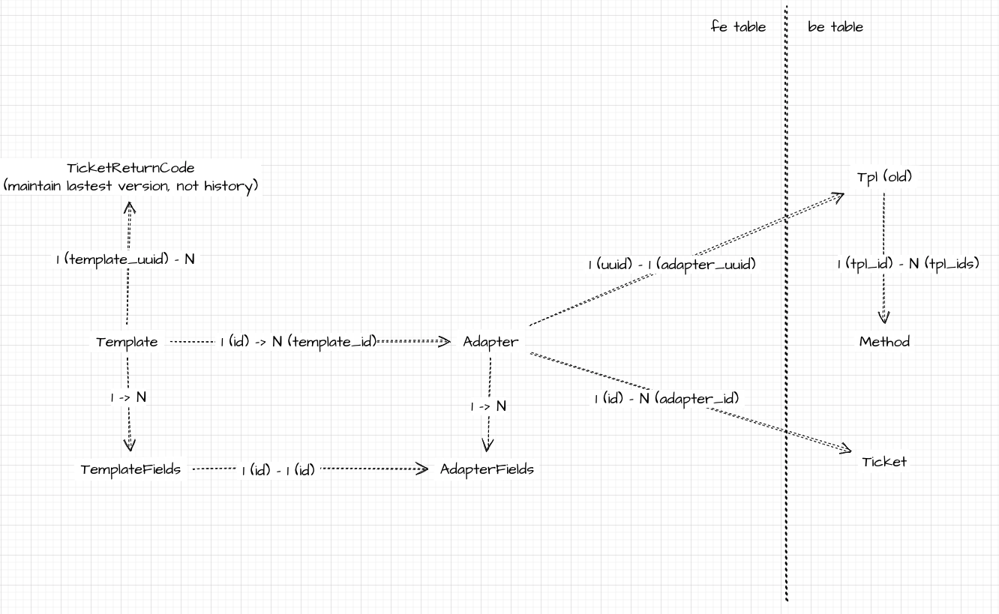
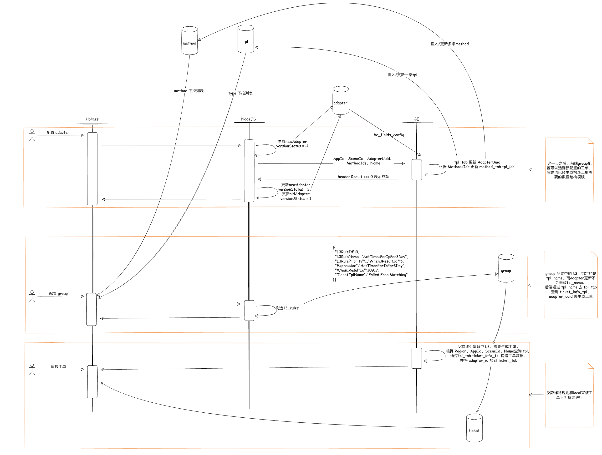
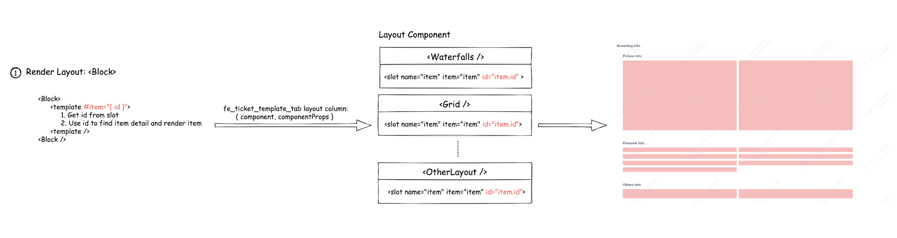
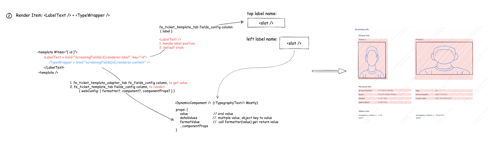

## 前端开发相关
1. 工单基本信息配置：**name/type**、appID、sceneID、method
2. 工单内容配置：模块分类（picture info、personal info、others），项（所取字段、字段来源：pb字段、函数值、加验数据、其他数据来源）、模块位置（布局）
3. 工单拒绝原因配置：拒绝原因、拒绝码、单选多选、后端返回单个多个、优先级、remark

工单配置分为 template（复用） 和 adapter
* tpl：`name/type`、项的展示配置、拒绝原因
* adapter：appID、sceneID、`method`，项的内容配置

工单配置更新后，风控生成工单就按照新的配置，也即生成过的工单类型、展示、内容都不再变化。

### db设计

#### template：自增id（唯一）、uuid（版本变化不变，不唯一）、fields_config（json，类型为 TplFieldItem[]，保证扩展性）
``` ts
// 内结构规范，小驼峰
{
  id            // uuid
  priority      // 优先级，两列布局平分按顺序展示
  type          // 字段类型
  label         // 字段展示 Label，json 指定，若只指定 label 名称则为 { name: 'UserName' }
  block         // 指定展示区域，picture / personal / other / 其他待定
  dataKeys      // json arry，指明内含数据源，定义对应数据源变量名，比如 ['country', 'province', 'city']，在对应 Adapter 界面需要对应层级设置，最终在组件渲染时，以该变量名称传入组件内部，提供给到组件内部渲染
  webConfig     // json object 字段展示配置，默认格式 { component(展示组件Name，对应界面选择的字段类型), formatter(数据格式化参数), componentProps(组件参数) }
}

// 值的渲染流程：原始值（value）-----(utils.formatter)-----→ 格式化后值（formatValue） ----------( component + props + value + formatValue )------------→ 组件渲染

// 内结构规范，小驼峰
type WebConfig = {
  formatter?: {
    emptyValue?: string
    functionName?: AutoTicket.FunctionName
    script?: string
    // [key: string]: any
  }
  component?: string
  componentProps?: Record<string, any>
  tooltip?: boolean
}
{
  // 数据格式化参数
  formatter: {
     // 默认包含
     emptyValue,    // 空值
     functionName,  // 数据处理函数名，数据处理前函数名，优先级高于 formatter
     script,        // 数据处理 script 脚本，动态执行（一期可先不考虑）
      
    // 更多根据 type 决定，参考以下表
    ...
  },
 
   // 展示组件（若不指定则是使用【类型默认组件】） 
  component,
  // 组件参数
  componentProps: {
     tooltip,             // tooltip 提示   
     className,           // 类名
     style,               // 样式  
  }
}
```

##### formatter
* text：TypographyText
``` ts
{
  type: 'text',
  webConfig: {
    formatter: {
       tpl: '${Address}.${Province}.${City}'
    }
  }
}
```
* enum：TypographyText
``` ts
{
  type: 'enum',
  webConfig: {
    formatter: {
       type: 'static',
        name: 'AppId'
    }
  }
}
```
* link：TypographyText
``` ts
{
  type: 'link',
  webConfig: {
    formatter: {
        tpl: '/log/${RequestId}'
    }
  }
}
```
* date：TypographyText
``` ts
{
  type: 'date',
  webConfig: {
    formatter: {
       format: 'YYYY-MM-DD HH:mm:DD'
    }
  }
}
```
* img：Photo
``` ts
{
  type: 'img',
  webConfig: {
    componentProps: {
       width: 100,
        height: 100
    }
  }
}
```
* number：TypographyText
``` ts
{
  type: 'number',
  webConfig: {
    formatter: {
       decimals: 2,
      isThousands: 0,
        divisor: 1,
        appendUnit: 'W'
    }
  }
}
```

#### adapter：自增id（唯一）、uuid（版本变化不变，不唯一）、fe_fields_config（json，类型为 AdapterFeFieldItem[]，保证扩展性）
``` ts
// 内结构规范，小驼峰
interface AdapterFeFieldItem {
  dataIndex: string
  dataSource: ValueOf<typeof FETCH_TYPE_MAP>
  templateFieldId: string
  key?: string // 关联 dataKeys 内具体值
  enumTag?: string // 枚举名
}

{
  dataIndex             // 数据字段 key，可使用连缀登记，遵循 lodash get 规范
  dataSource            // 字段数据源, 1-pb, 2-verify, 3-feature, 等
  templateFieldId       // 对应模版字段ID
  key                   // 模版配的字段名
  enumTag
}
```

#### ticket_tab
``` ts
{
  // 新增以下字段
  adapter_id        // ada ID，取 DB 自增 ID 即可
 
  // 以下为旧的渲染，历史迁移逐步往上面迁移
  ticket_category
  ticket_ticket_subtype
}
```

#### ticket_return_code_tab
* 新工单渲染：ticket_tab ----adapter_id----> Adapt ----template_id----> template ----template_uuid----> return_code
* 历史工单：ticket_category & ticket_ticket_subtype ----> return_code
* 历史工单迁移，需要将过去手动擦db的数据加上 template_uuid
``` ts
{
  // 新增以下字段
  template_uuid         // 关联到的是 template 表的 template_uuid 字段
}
```

### 后端对接方案
前后端对齐，需要基于 adapter，adapter_tab 存放了前端渲染相关的 template_id，以及后端构造工单数据相关的 be_config_config，因此一些相关表需要新增 adapter_id：
* ticket_tab：新增 adapter_id
* tpl_tab：新增 adapter_uuid

配置流程：
1. 配置（add/edit）adapter时，前端更新 adapter_tab，然后调后端接口，通知后端将 adapter_uuid 更新到 tpl_tab:
   1. 后端根据 adapter_uuid 查询 adapter_tab 查询获取（version_status = current）be_fields_config，处理后生成数据模版json，更新 tpl
   2. 后端根据更新的 tpl，联动修改 method_tab，保证 method_tab 和 tpl_tab 能够关联查询
2. 配置 group 时，选择 method & type，前端需要将 type_name 也写入 group 的 L3 配置，后端根据 type_name 去 tpl_tab 查询数据模版，进而生成新工单
3. 工单渲染时，前端根据 adapter_id 去 adapter_tab 查询获取 template_id，进行渲染。




### 组件设计
#### Block
布局适配器，根据用户设置的 layout.component 参数可指定具体渲染什么布局（暂未开放，此功能保留开发，便于后续扩展），默认为 Waterfalls，布局类组件多为可复用组件，需要暴露 item slot，并且使用 item.id 保证每项唯一。



``` ts
export default Vue.extend({
  functional: true,
  props: {
    title: {
      type: String
    },
    component: {
      type: String,
      default: 'Waterfalls'
    },
    componentProps: {
      type: Object,
      default: () => {}
    }Block
  },
  render(h, ctx) {
    const { props } = ctx
    const { component, componentProps, title } = props
    const layoutDom = h(component, { ...ctx.data, props: componentProps }, ctx.children)
    return (
      <div class="screening-block">
        {title ? (
          <typography-text class="title" level={3}>
            {title}
          </typography-text>
        ) : null}
        {layoutDom}
      </div>
    )
  }
})
```

每一项为 `LabelText` + `TypeWrapper`，LabelText 处理 name 与 content 之间的位置关系，并且包含默认展示样式。TypeWrapper 为动态渲染部分，依然保留定制开发部分（通过 field item 的 webConfig.component 指定渲染什么组件）。

#### LabelText + TypeWrapper


``` ts
@Component({
  components: { ...Typer }
})
export default class TypeWrapper extends Vue {
  @Prop({
    type: String
    // validator: (value) => RE_FIELD_TYPES.includes(value)
  })
  private readonly type: AutoTicket.FieldType

  @Prop()
  private readonly value: unknown

  @Prop({
    type: Object
  })
  private readonly dataValues: Record<string, any>

  @Prop({
    type: Object,
    default: () => {}
  })
  private readonly formatter: Record<string, any>

  @Prop({
    type: String
  })
  private readonly component: string

  @Prop({
    type: Object,
    default: () => {}
  })
  private readonly componentProps: Record<string, any>

  @Prop({
    type: String
  })
  private readonly enumTag: string

  @Inject()
  private readonly ticketContextFn: () => AutoTicket.TicketContext

  private get ticketContext() {
    return this.ticketContextFn()
  }

  // computed
  private get config(): Config {
    const { type, $props } = this
    const config: Config = merge(cloneDeep(defaultConfig.typer[type]), $props as Props, {
      ticketContext: this.ticketContext
    })
    const { value, dataValues } = config
    const { functionName, emptyValue, script } = config.formatter || {}

    // TODO: 是否抽象到 Formatter
    let formatValue = value
    if (isEmpty(value) && isEmpty(dataValues) && emptyValue) {
      formatValue = emptyValue
    } else if (functionName) {
      const keys = ['value', 'dataValues', 'formatter', 'ticketContext', 'enumTag'] as const
      formatValue = Formatter[functionName](pick(config, keys))
    } else if (script) {
      // TODO: 动态脚本
    }

    return { ...config, formatValue }
  }

  render(h: CreateElement) {
    const { component, componentProps, value, dataValues, formatValue } = this.config
    return h(
      component,
      {
        props: { ...(componentProps || {}), value, dataValues, formatValue },
        on: this.$listeners,
        scopedSlots: this.$scopedSlots
      },
      formatValue
    )
  }
}
```

**值的渲染流程：原始值（value）-----(utils.formatter)-----→ 格式化后值（formatValue） ----------( component + props + value + formatValue )------------→ 组件渲染**

##### Formatter
动态引入所有 utils.formatter，导出map，文件名为key
``` ts
// include: ./*.ts
const files = require.context('.', true, /\.\/([^/])+(\.ts$)/)

const Formatter = {} as Record<AutoTicket.FunctionName, AutoTicket.FormatterFn>
files.keys().forEach((path) => {
  const name = path.replace(/(\.\/|\.ts$)/g, '')
  if (name === 'index') return

  const output = files(path)
  Object.entries(output).forEach(([key, func]) => {
    if (key && func) {
      Formatter[
        (key === 'default' ? name : key) as AutoTicket.FunctionName
      ] = func as AutoTicket.FormatterFn
    }
  })
})

export default Formatter

```


### Vue 相关技巧
* 通过 Mixin 划分组件业务逻辑，Mixin 可以嵌套
* slot 将具体实现暴露给外部，组件使用变得灵活，而且可以减少 props 的传递层数
``` ts
<slot name="name">
  {{ name }}
</slot>
```
* Provide & Inject 类似于全局 context，一些较深且比较孤立的 props 可以使用该方法传递。