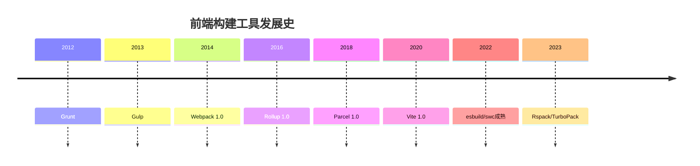
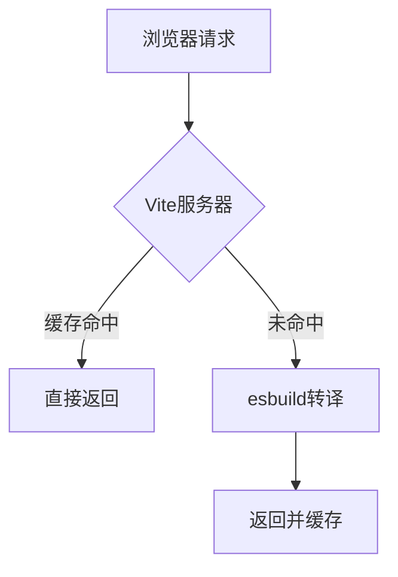
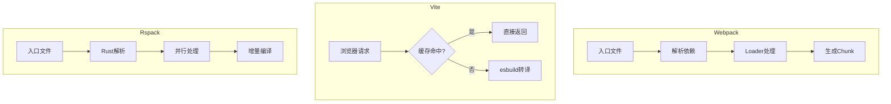
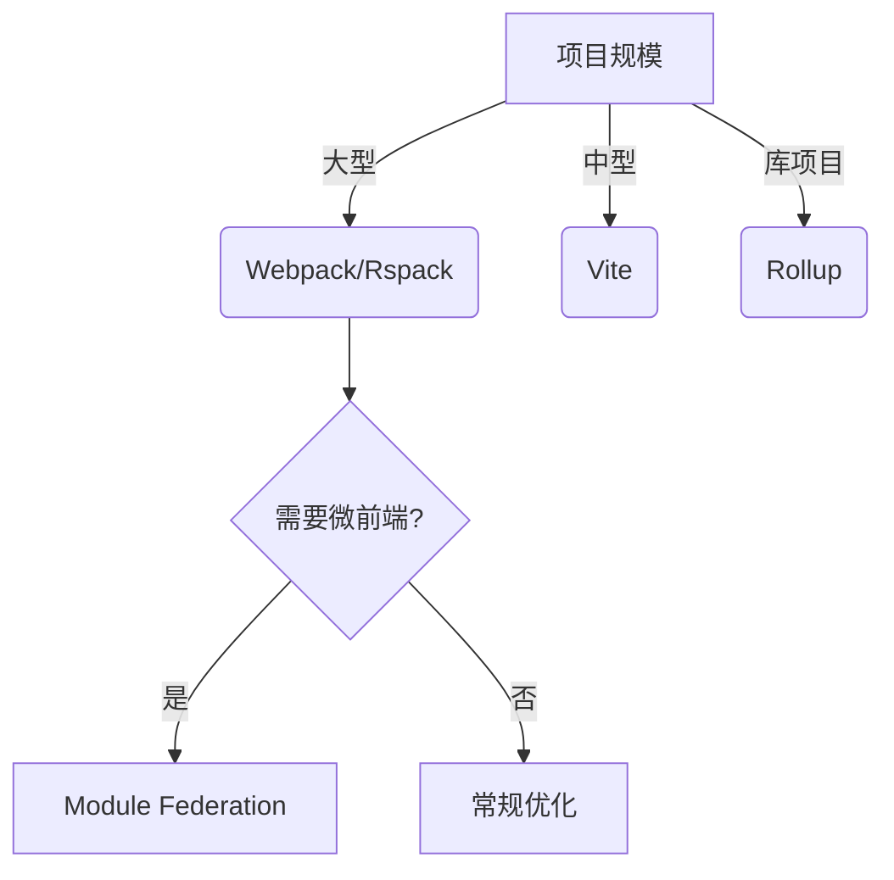

# 前端工程化构建体系全景指南

## 1. 构建工具演进历程

### 1.1 发展脉络


### 1.2 技术代际划分
- **第一代**：Grunt/Gulp（任务运行器）
- **第二代**：Webpack/Rollup（打包器） 
- **第三代**：Vite/Snowpack（基于ESM）
- **第四代**：esbuild/swc（原生语言实现）

## 2. 核心工具深度解析

### 2.1 Webpack架构原理
**核心模块**：
- **Compiler**：编译调度中心
- **Compilation**：单次构建过程
- **Module**：模块抽象
- **Chunk**：代码块管理

**依赖分析流程**：
1. 从Entry开始解析AST
2. 收集import/require依赖
3. 构建完整依赖图
4. 生成Chunk并进行优化

### 2.2 Vite设计哲学
**双引擎架构**：
- **开发环境**：原生ESM即时服务
  - 按需编译
  - 缓存机制
  - HMR优化
- **生产环境**：Rollup打包
  - 成熟的代码分割
  - 优化的输出结构

**性能关键**：


### 2.3 新兴工具对比
**Rspack vs TurboPack**：
| 维度       | Rspack         | TurboPack      |
|------------|----------------|----------------|
| 开发公司   | 字节跳动       | Vercel         |
| 语言       | Rust           | Rust           |
| 兼容性     | Webpack兼容    | Next.js深度集成|
| 构建速度   | 快10倍         | 快20倍         |

## 3. 构建原理深度对比

### 3.1 编译流程差异


### 3.2 关键性能指标
| 工具       | 冷启动(ms) | HMR(ms) | 生产构建(s) |
|------------|------------|---------|-------------|
| Webpack    | 3000+      | 500+    | 120+        |
| Vite       | <500       | <100    | 60+         |
| Rspack     | <800       | <200    | 40+         |
| TurboPack  | <300       | <50     | 30+         |

### 3.3 企业级实战案例

**案例1：大型中台项目**
- **挑战**：500+模块，20+入口
- **方案**：
  ```js
  // webpack配置优化
  {
    cache: { type: 'filesystem' },
    snapshot: { managedPaths: [/node_modules/] },
    experiments: { 
      lazyCompilation: true,
      incrementalRebuild: true 
    }
  }
  ```
- **效果**：构建时间从8min→2min

**案例2：微前端架构**
- **方案**：
  ```js
  // 基座配置
  new ModuleFederationPlugin({
    remotes: {
      app1: `app1@${getDeployUrl('app1')}/remoteEntry.js`,
      app2: `app2@${getDeployUrl('app2')}/remoteEntry.js`
    }
  })
  ```
- **关键点**：
  - 独立版本管理
  - 共享依赖控制
  - 部署协调机制

## 4. 监控与分析体系

### 4.1 构建过程监控
**关键指标**：
- 各阶段耗时分析
- 内存使用曲线
- 并发任务利用率

**工具推荐**：
```bash
# 使用speed-measure-webpack-plugin
const SpeedMeasurePlugin = require('speed-measure-webpack-plugin')
smp.wrap(config)
```

### 4.2 产物分析
**分析方法**：
1. **体积分析**：
   ```bash
   webpack-bundle-analyzer
   ```
2. **重复依赖检测**：
   ```bash
   npm ls react
   ```
3. **代码覆盖率**：
   ```bash
   chrome://coverage
   ```

## 5. 前沿趋势展望

### 5.1 技术方向
- **Rust/Wasm工具链**：swc/oxc/rolldown
- **Bundleless**：Vike/Astro
- **智能构建**：基于AI的优化建议
- **标准化**：WinterCG规范推进

### 5.2 选型决策树

