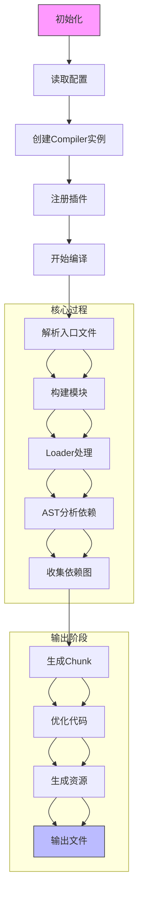
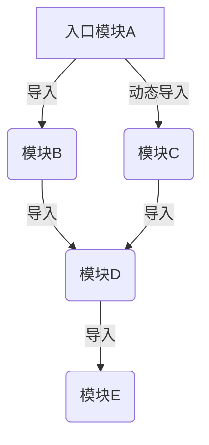
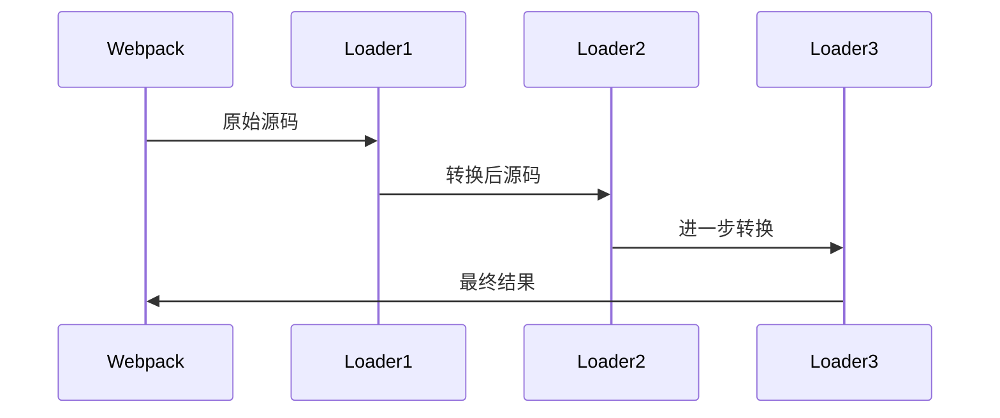
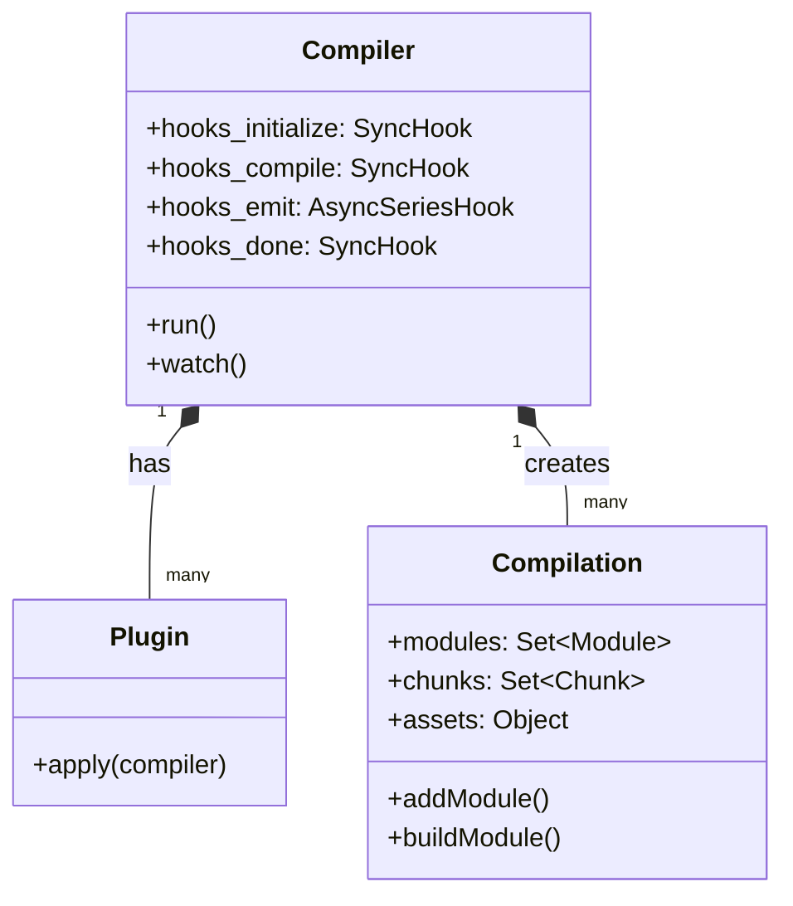

# Webpack 核心原理详解

## 1. Webpack 核心概念
Webpack 是一个静态模块打包工具，核心功能是将各种资源转换为依赖图(dependency graph)中的模块。

```javascript
// webpack 基本配置示例
module.exports = {
  entry: './src/index.js', // 入口文件
  output: {
    path: path.resolve(__dirname, 'dist'),
    filename: 'bundle.js'
  },
  module: {
    rules: [] // 加载器规则
  },
  plugins: [] // 插件配置
};
```

## 2. 工作流程详解
### 2.0 Webpack 完整工作流程图

Webpack 的工作流程可以分为以下几个阶段，每个阶段都有对应的生命周期钩子：

### 2.1 初始化阶段
```javascript
// 初始化过程伪代码
const config = merge(cliArgs, configFile); // 合并配置
const compiler = new Compiler(config); // 创建Compiler实例

// 触发初始化钩子
compiler.hooks.initialize.call();

// 注册所有插件
config.plugins.forEach(plugin => {
  plugin.apply(compiler); // 调用插件的apply方法
});
```

### 2.2 编译阶段
1. **模块解析**：
   - 从entry出发，解析文件路径
   - 根据module.rules匹配对应的loader
   - 使用enhanced-resolve库解析模块路径(enhanced-resolve是webpack的一个核心依赖,用于解析模块的绝对路径,支持node_modules查找、别名解析等功能)

2. **模块构建**：
```javascript
// 模块构建过程
function buildModule(module) {
  // 1. 读取原始源码
  const source = fs.readFileSync(module.filePath);
  
  // 2. 调用loader链处理源码
  const transformed = runLoaders(source, module.loaders);
  
  // 3. 解析AST收集依赖
  const deps = parseDependencies(transformed.code);
  
  // 4. 转换为webpack模块
  return new NormalModule({
    source: transformed,
    dependencies: deps
  });
}
```

3. **生成Chunk**：
   - 根据入口模块和动态导入语句分割代码
   - 应用SplitChunksPlugin优化策略
   - 生成最终包含运行时代码的Chunk

### 2.3 输出阶段
```javascript
// 输出过程伪代码
compiler.hooks.emit.tapAsync('Output', (compilation, callback) => {
  // 1. 创建输出目录
  fs.mkdirSync(outputPath, { recursive: true });
  
  // 2. 写入每个Chunk文件
  compilation.chunks.forEach(chunk => {
    const filename = chunk.name + '.js';
    fs.writeFileSync(
      path.join(outputPath, filename),
      chunk.render()
    );
  });
  
  // 3. 写入辅助文件(如sourcemap)
  writeAuxiliaryFiles(compilation);
  
  callback();
});
```

## 3. 模块化机制
Webpack 实现了自己的模块化系统，核心是 `__webpack_require__` 函数：

```javascript
// Webpack 生成的模块加载函数
function __webpack_require__(moduleId) {
  // 检查模块是否已缓存
  if(installedModules[moduleId]) {
    return installedModules[moduleId].exports;
  }
  // 创建新模块并缓存
  var module = installedModules[moduleId] = {
    i: moduleId,
    l: false,
    exports: {}
  };
  // 执行模块函数
  modules[moduleId].call(
    module.exports, 
    module, 
    module.exports, 
    __webpack_require__
  );
  // 标记为已加载
  module.l = true;
  // 返回模块的exports
  return module.exports;
}
```

## 4. 依赖图构建详解
Webpack 通过AST分析构建完整的依赖图，过程如下：

### 4.1 模块解析过程
```javascript
// 增强的模块解析过程
function resolveModule(context, request) {
  // 1. 尝试直接解析路径
  try {
    return {
      path: path.resolve(context, request),
      query: ''
    };
  } catch (err) {
    // 2. 尝试添加扩展名(.js, .jsx, .ts等)
    const extensions = ['.js', '.jsx', '.ts', '.json'];
    for (const ext of extensions) {
      const fullPath = path.resolve(context, request + ext);
      if (fs.existsSync(fullPath)) {
        return { path: fullPath, query: '' };
      }
    }
    // 3. 尝试解析为目录下的index文件
    const indexPath = path.resolve(context, request, 'index.js');
    if (fs.existsSync(indexPath)) {
      return { path: indexPath, query: '' };
    }
  }
  throw new Error(`Cannot resolve module '${request}'`);
}
```

### 4.2 深度依赖分析
```javascript
// 完整的AST依赖分析
function analyzeDependencies(module) {
  const ast = parser.parse(module.code, {
    sourceType: 'module',
    plugins: ['jsx', 'typescript']
  });

  const dependencies = [];
  const dynamicImports = [];

  traverse(ast, {
    // 处理静态import
    ImportDeclaration(path) {
      dependencies.push({
        type: 'static',
        request: path.node.source.value,
        loc: path.node.loc
      });
    },
    
    // 处理动态import()
    CallExpression(path) {
      if (path.node.callee.type === 'Import') {
        dynamicImports.push({
          type: 'dynamic',
          request: path.node.arguments[0].value,
          loc: path.node.loc
        });
      }
    },
    
    // 处理require调用
    CallExpression(path) {
      if (path.node.callee.name === 'require') {
        dependencies.push({
          type: 'cjs',
          request: path.node.arguments[0].value,
          loc: path.node.loc
        });
      }
    }
  });

  return { dependencies, dynamicImports };
}
```

### 4.3 依赖图可视化


## 5. 加载器(Loader)深度解析
Loader 是Webpack的核心转换器，工作流程如下：

### 5.1 Loader执行流程


### 5.2 完整Loader实现
```javascript
// 高级Loader示例 - 支持缓存和sourcemap
module.exports = function(source, sourceMap, meta) {
  // 1. 获取Loader上下文和配置
  const callback = this.async(); // 转为异步模式
  const options = this.getOptions();
  const resourcePath = this.resourcePath;
  
  // 2. 检查缓存
  const cacheKey = getCacheKey(source, options);
  this.cacheable(true); // 启用缓存
  
  if (this.cache && this.cache[cacheKey]) {
    return callback(null, ...this.cache[cacheKey]);
  }
  
  // 3. 实际转换逻辑
  transformAsync(source, options)
    .then(({ code, map, ast }) => {
      // 4. 处理sourcemap链
      if (sourceMap) {
        map = combineSourceMaps(sourceMap, map);
      }
      
      // 5. 缓存结果
      if (this.cache) {
        this.cache[cacheKey] = [code, map, { ast }];
      }
      
      // 6. 返回转换结果
      callback(null, code, map, { ast });
    })
    .catch(callback);
};

// 支持链式调用和pitch阶段
module.exports.pitch = function(remainingRequest, precedingRequest, data) {
  // pitch阶段可以拦截loader链
  if (shouldIntercept(remainingRequest)) {
    return `module.exports = require(${JSON.stringify('-!' + remainingRequest)})`;
  }
};
```

### 5.3 常用Loader模式
1. **链式Loader**：多个Loader按从右到左顺序执行
2. **内联Loader**：在import语句中指定Loader `import 'style-loader!css-loader!./styles.css'`
3. **前置Loader**：通过`!`前缀绕过normal Loaders
4. **后置Loader**：通过`!!`前缀绕过所有Loader

## 6. 插件系统深度解析
Webpack插件基于Tapable的事件系统，核心概念：

### 6.1 插件架构图


### 6.2 完整插件示例
```javascript
// 高级插件实现 - 资源优化插件
class OptimizePlugin {
  apply(compiler) {
    // 1. 注册多个钩子
    compiler.hooks.thisCompilation.tap('OptimizePlugin', (compilation) => {
      compilation.hooks.optimizeChunkAssets.tapAsync(
        'OptimizePlugin', 
        (chunks, callback) => this.optimize(chunks, callback)
      );
    });
    
    // 2. 自定义优化逻辑
    this.optimize = (chunks, callback) => {
      const optimizationTasks = [];
      
      chunks.forEach(chunk => {
        chunk.files.forEach(file => {
          optimizationTasks.push(new Promise(resolve => {
            const source = compilation.assets[file].source();
            const optimized = minify(source);
            compilation.assets[file] = {
              source: () => optimized,
              size: () => optimized.length
            };
            resolve();
          }));
        });
      });
      
      Promise.all(optimizationTasks).then(() => callback());
    };
  }
}

// 3. 插件使用方式
compiler.apply(new OptimizePlugin({
  minifyOptions: { /* 压缩配置 */ }
}));
```

### 6.3 核心钩子详解
1. **compiler.hooks**
   - entryOption: 处理entry配置
   - afterPlugins: 插件注册完成后
   - afterResolvers: resolver设置完成后
   - beforeRun: 开始执行前
   - run: 开始编译
   - watchRun: 监听模式启动
   - beforeCompile: 编译前
   - compile: 创建新compilation
   - thisCompilation: 初始化compilation
   - compilation: compilation创建完成
   - make: 开始分析依赖
   - afterCompile: 编译完成
   - emit: 生成资源到output前
   - afterEmit: 资源生成后
   - done: 完成构建

2. **compilation.hooks**
   - buildModule: 开始构建模块
   - succeedModule: 模块构建成功
   - finishModules: 所有模块完成
   - optimize: 开始优化
   - optimizeModules: 优化模块
   - optimizeChunks: 优化chunks
   - optimizeChunkAssets: 优化chunk资源
   - afterOptimizeChunkAssets: 优化后
   - afterOptimizeAssets: 所有优化完成


## 7. 完整工作流程示例
```javascript
// 简化的Webpack工作流程
class Compiler {
  constructor(config) {
    this.config = config;
    this.hooks = {
      compile: new SyncHook(),
      emit: new SyncHook(['compilation']),
      done: new SyncHook()
    };
  }
  
  run() {
    // 1. 初始化
    this.hooks.compile.call();
    
    // 2. 编译
    const compilation = this.compile();
    
    // 3. 生成资源
    this.hooks.emit.call(compilation);
    
    // 4. 输出
    this.emitFiles(compilation);
    
    // 5. 完成
    this.hooks.done.call();
  }
  
  compile() {
    // 实际的编译逻辑...
  }
  
  emitFiles() {
    // 文件输出逻辑...
  }
}
```

## 总结
Webpack 的核心原理可以概括为：
1. **模块化**：将所有资源视为模块
2. **依赖分析**：构建完整的依赖关系图
3. **代码生成**：将依赖图转换为可执行的bundle
4. **插件系统**：通过事件钩子扩展功能
5. **加载器**：转换非JavaScript资源
