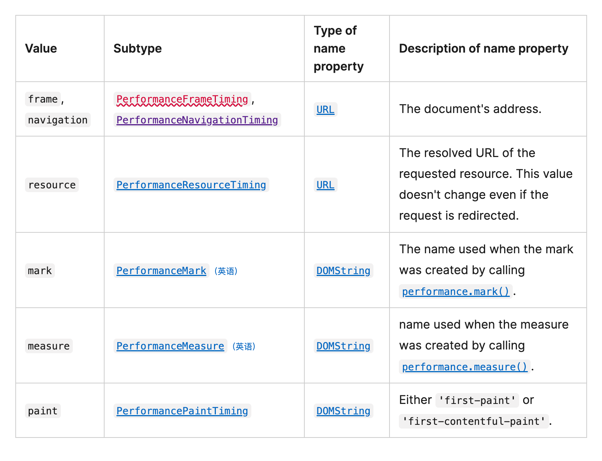
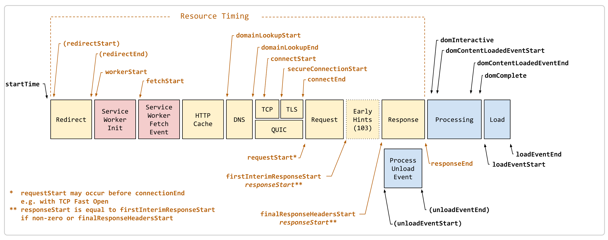
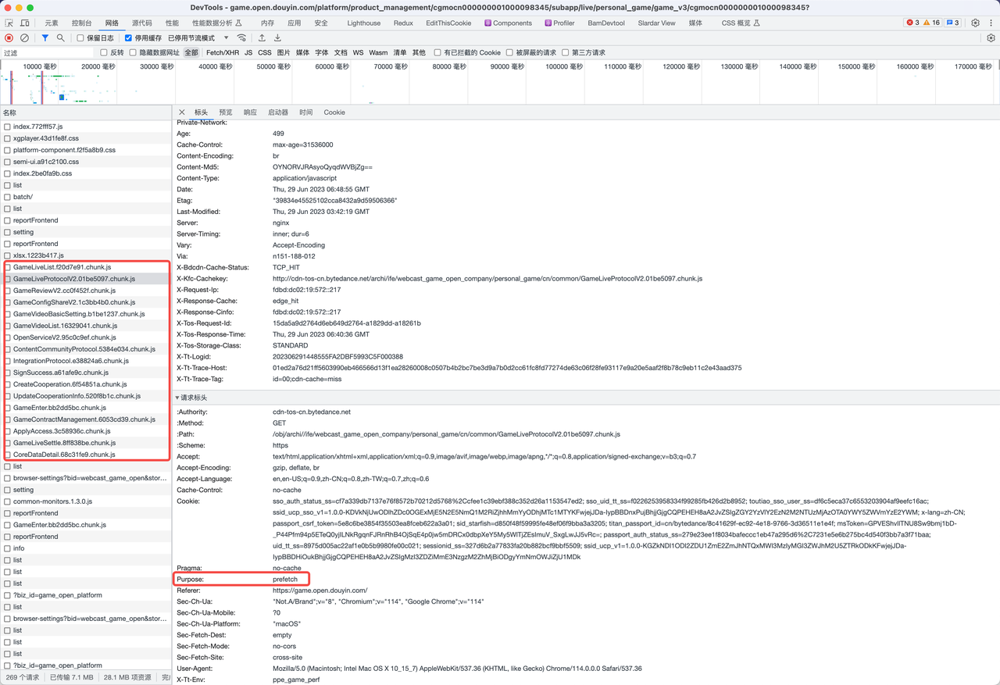
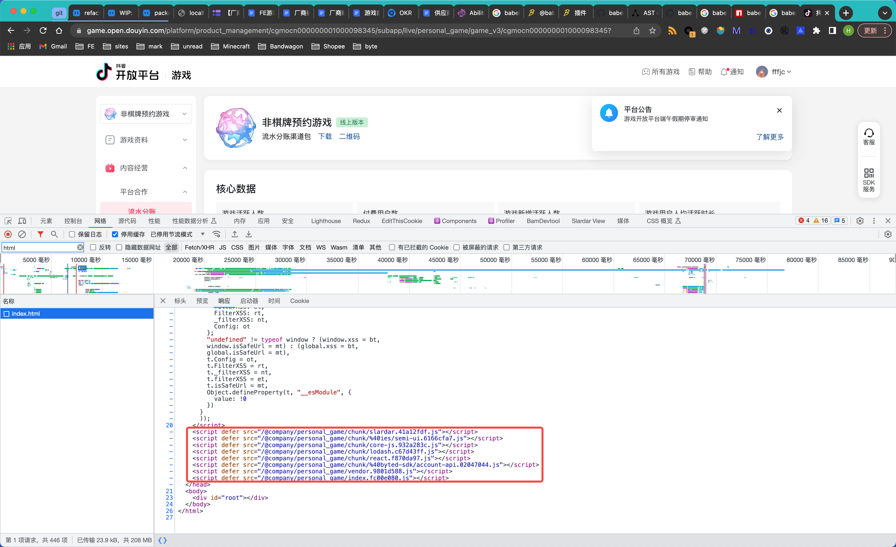
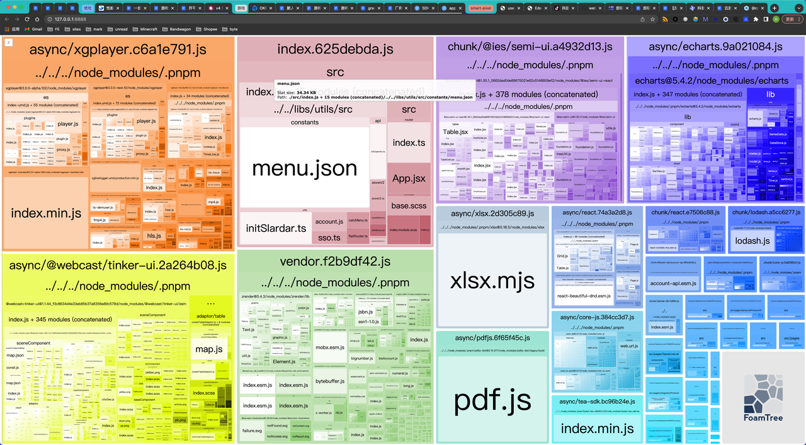

## 指标
FMP(First Contentful Paint)
LCP(Largest Contentful Paint )
TTI (Time To Interactive)
FMP、LCP、TTI、SI、CLS、TBT

## 数据采集

### [PerformanceObserver](https://developer.mozilla.org/zh-CN/docs/Web/API/PerformanceObserver)
``` js
function perf_observer(list, observer) {
  var entries = list.getEntries();
  for (var i = 0; i < entries.length; i++) {
    // Process navigation" events
  }
}
var observer2 = new PerformanceObserver(perf_observer);
observer2.observe({ entryTypes: ["navigation"] });
```
**observer.observe(options);**


以 **navigation** 为例，返回的 [entries](https://developer.mozilla.org/zh-CN/docs/Web/API/PerformanceNavigationTiming) 有如下属性
* PerformanceEntry.entryType：返回 "navigation"。
* PerformanceEntry.name：返回文档的 URL。
* PerformanceEntry.startTime：返回值为 0 的 DOMHighResTimeStamp。
* PerformanceEntry.duration：返回 timestamp 值，即 PerformanceNavigationTiming.loadEventEnd 和 PerformanceEntry.startTime 属性之间的差值。详见下图

#### 经典的资源加载计时指标
该接口的属性允许你计算某些资源计时指标。常见用例包括：
- 计算重定向时间（redirectEnd - redirectStart）
- 计算 ServiceWorker 处理时间（fetchStart - workerStart）
- 检查是否命中本地缓存（transferSize = 0）
- 计算 DNS 查询耗时（domainLookupEnd - domainLookupStart）
- 计算 TCP 握手耗时（connectEnd - connectStart）
- 计算 TLS 协商耗时（requestStart - secureConnectionStart）
- 计算请求耗时（responseStart - requestStart）
- 计算临时请求耗时（firstInterimResponseStart - finalResponseHeadersStart）
- 计算获取请求（fetch）的时间（不包括重定向）（responseEnd - fetchStart）
- 检查内容是否被压缩（decodedBodySize 不应该是 encodedBodySize）
- 检查是否使用了现代和快速的协议（nextHopProtocol 应该是 HTTP/2 或 HTTP/3）
- 检查正确的资源是否阻止渲染（renderBlockingStatus）

以 **paint** 为例
``` js
const observer = new PerformanceObserver(function(entryList) {
  const perfEntries = entryList.getEntries();
  for (const perfEntry of perfEntries) {
    if (perfEntry.name === "first-paint") {
      const FP = perfEntry;
      console.log("首次像素绘制 时间：", FP?.startTime); // 674ms（div 设有背景图，会在元素渲染时生成 FP 指标）
    } else if (perfEntry.name === "first-contentful-paint") {
      const FCP = perfEntry;
      console.log("首次内容绘制 时间：", FCP?.startTime); // 1174ms
      observer.disconnect(); // 断开观察，不再观察了
    }
  }
});

// 观察 paint 相关性能指标
observer.observe({ entryTypes: ["paint"] });
```

## 看板建设
Slardar

## 告警建设
TODO

## 优化（根据指标，分析优化）
[chrome performance 面板](./Chrome%20DevTools%20Performance%20功能详解.pdf)

### 网络优化
- preconnect、dns-prefetch
  ``` html
  <link rel="preconnect" href="https://fonts.googleapis.com/" >
  <link rel="dns-prefetch" href="https://fonts.googleapis.com/">
  ```
- HTTP2
- 开启 br 压缩
- 资源预处理
  preload、prefetch、prerender

### 打包优化
- 拆/合包
- webpack SplitChunksPlugin
#### 拆包策略
- **尽可能按需加载 -- 减少首屏包体积**
  路由按需加载，通过 loadable 实现。原理是动态 import，内部处理为 prefetch，浏览器空闲加载
  - 加上 webpackChunkName，提高缓存使用率。通过 babel 插件实现，不需要手动填写。
  ``` js
  const GameLiveList = loadable(
    () => import(/* webpackChunkName: "GameLiveList", webpackPrefetch: true */ '../pages/GameLiveList')
  );
  ```
  
    1. 配置生成的路由 chunkName
    ``` js
    output: {
      chunkFilename: 'common/[name].[chunkhash:8].chunk.js',
    }
    ```
    2. 根据动态 import 路径，自动生成 chunkName
    ``` js
    // babel 插件
    function getChunkName(filename) {
      return filename.replace(/^\.\.\//, '').replace(/(\.)*\//g, '-');
    }

    function hasComment(comment) {
      return comment && comment.value.replace(/\*+/g, '').trim().startsWith('webpackChunkName');
    }

    module.exports = function ({ types: t }) {
      return {
        visitor: {
          CallExpression(path) {
            if (path.node.callee.type !== 'Import') {
              return;
            }

            const [arg] = path.node.arguments;
            const [comment] = arg.leadingComments || [];

            if (!hasComment(comment)) {
              // 添加 webpackChunkName 让生成的 chunkName 与文件名一致
              t.addComment(arg, 'leading', `webpackChunkName: '${getChunkName(arg.value)}'`);
            }
          },
        },
      };
    };
    ```
  - 依赖包的按需加载 async chunk，通过 cacheGroups 实现，保证 group 优先级最高。存放于目录 /async。
  - 通过分析入口文件，手动动态 import 实现按需加载，通过 loadable 实现。
- **合理拆包 -- 减少最大包体积**
  1. 将较大的依赖包单独打包 split chunk，后续也可抽离公共包，通过 cacheGroups 实现，优先级低于 async chunk，但高于其他 chunk。存放于目录 /chunk。
    公共依赖：1. CDN 2. external 3. federation
  2. 其余的依赖包打包到一起作为 vendor chunk。
  3. 入口文件通过 webpack 自动拆包，拆解为 index chunk，以及部分按需加载的 chunk。
  4. 抽离公共依赖包。
  ``` js
  {
    // webpack 拆包参数
    chunks: 'all',
    minRemainingSize: 0,
    minSize: 20000,
    minChunks: 1,
    maxAsyncRequests: 30,
    maxInitialRequests: 30,
    enforceSizeThreshold: 50000,

    // 自定义拆包规则
    cacheGroups: {
      defaultVendors: {
        test: /[\\/]node_modules[\\/]/,
        priority: -10,
        reuseExistingChunk: true,
        name: 'vendor',
        filename: '[name].[contenthash:8].js',
      },
      default: {
        minChunks: 2,
        priority: -20,
        reuseExistingChunk: true,
        filename: '[name].[contenthash:8].js',
      },
      // 业务组件库特殊处理，需要优先级低于依赖组件库semi，这样可以覆盖semi样式
      webcast_game_open_components: {
        test: /\/packages\/libs\/components\/.*/,
        // 加载优先级要比semi低(100)，这样可以覆盖semi样式
        priority: 99,
        reuseExistingChunk: true,
        name: "webcast_game_open_components",
        minSize: 1,
        minChunks: 1,
      },
      ...moduleNames.reduce((groups, moduleName, idx) => {
        return {
          // async chunk，按需加载
          [`async-${moduleName}`]: {
            chunks: 'async',
            test: new RegExp(`[\/]node_modules[\/][^\/]*${moduleName}`), // 只识别 node_modules 下一级目录名称，保证匹配精确
            // test: new RegExp(moduleName),
            priority: 1000 + idx,
            reuseExistingChunk: true,
            name: `async/${moduleName}`,
            filename: '[name].[contenthash:8].js',
          },
          // split chunk，defer 加载
          [`${moduleName}`]: {
            test: new RegExp(`[\/]node_modules[\/][^\/]*${moduleName}`), // 只识别 node_modules 下一级目录名称，保证匹配精确
            // test: new RegExp(moduleName),
            priority: 100 + idx,
            reuseExistingChunk: true,
            name: `chunk/${moduleName}`,
            filename: '[name].[contenthash:8].js',
          },
        };
      }),
    },
  }
  ```
**拆包效果**
- 首屏只会加载 index chunk、vendor chunk，以及 /chunk 目录下的 split chunk。chunk 脚本直接嵌入 html 文件，defer 加载。
- 路由 chunk、async chunk按需加载。



#### 删除无用依赖

#### 解决依赖包多版本重复引用
- webpack alias
- overrides
- npm dedupe
- https://github.com/scinos/yarn-deduplicate

#### 用体积小的依赖包替换
- moment -> dayjs
- lodash -> lodash-es

### CDN

### Tree shaking
- sideEffects

### 压缩
js、css、html 采用webpack插件去压缩

### 图片
- 择图片可以优先使用webp格式。
- 矢量图片的话可以选择svg
- 预加载、懒加载
- 占位

### 接口预请求
> 在资源加载同时发起请求server接口，提早获取server接口的数据
开平挂载菜单之前需要依赖几个server remote的数据，这些依赖的数据会阻塞菜单内容的渲染，所以应该提早发起请求，并行请求js资源请求和用户数据。

### 微前端
主应用可以预请求子应用 garfish preload

#### 直接inject html
将几个纯数据请求的接口在html上写死，等资源加载结束后读window.x变量，获取结果。如果有结果就是成功优化，没有结果就是不赚不亏。
``` html
<script defer>
  function prefetchApi({url, hoistField, cb}) {
    var resp = null;
    var xhr = new XMLHttpRequest();
    xhr.open('GET', '//'+window.location.host + url, true);
    xhr.onreadystatechange = function (e) {
      if (xhr.readyState === XMLHttpRequest.DONE || xhr.readyState === 4) {
        const status = xhr.status
        if (status === 0 || (status >= 200 && status < 400)) {
          try {
            const result = JSON.parse(xhr.responseText)
            resp = result
          } catch (e) {
            console.error(e)
          }
        } else {
          console.error(xhr.responseText)
        }
        window[hoistField] = resp
        if (cb) {
          cb(xhr);
        }
      }
    }
    xhr.send();
  }

  const hoistUserInfoKey = 'PRE_USER_INFO'
  const hoistResourceKeyMap = 'PRE_RESOURCE_KEY_MAP'

  // init
  prefetchApi({
    url: '/open_platform/user/info?subject_aid=3542',
    hoistField: hoistUserInfoKey,
    cb(xhr) {
      const headers = xhr.getAllResponseHeaders();
      window.HAS_PPE_HEADER = headers.includes('x-user-ppe');

      const resp = window[hoistUserInfoKey];
      const role_id = resp && resp.data && resp.data.role_id;
      const hoistRoleInfoKey = 'PRE_ROLE_INFO-'+role_id

      if (typeof role_id !== 'undefined') {
        prefetchApi({
          url: '/open_platform/perm/role/info?subject_aid=3542&role_id='+role_id,
          hoistField: hoistRoleInfoKey,
        })
      }
    }
  })
  prefetchApi({
    url: '/open_platform/perm/resource_key_map?subject_aid=3542',
    hoistField: hoistResourceKeyMap,
  })

  // product_management
  if (location.pathname.includes('/product_management/')) {
    const [_, __, gameId] = location.pathname.match(/(\/product_management\/)([^\\/]+)/)
    const hoistGameInfoKey = 'PRE_GAME_INFO-'+gameId

    // game info
    prefetchApi({
      url: '/open_platform/union/v3/game_open_platform/info?subject_aid=3542&unified_game_id='+gameId,
      hoistField: hoistGameInfoKey,
    })
  }
</script>
```

## 治理
根据监控平台排查问题
- 通过slardar找出问题线索。
  1. 错误堆栈看不出错误，探索数据
  2. 错误信息详情
    1. 按照指引看需要内容
    2. 可以通过附身（【内部】附身功能操作手册）到具体的用户上看具体的业务错误，如果是通用的js错误要注意用户的浏览器环境。
- Mock 接口返回
通过浏览器插件，匹配拦截请求。
https://chromewebstore.google.com/detail/tweak-mock-and-modify-htt/feahianecghpnipmhphmfgmpdodhcapi
  - 配置接口拦截
  - 开启接口拦截
  - 确认接口被拦截
- 查看组件数据
通过react 浏览器插件，拿到组件传值。
https://chromewebstore.google.com/detail/react-developer-tools/fmkadmapgofadopljbjfkapdkoienihi
- 获取form api
可以通过复制下面代码到浏览器控制台，线上拿到form api。
通过react虚拟dom和真实dom的联系，通过真实dom找到虚拟dom，找到form的context，捞出真实的props。
  ``` js
  const formApi = ((idx) => {
    const formDom = document.querySelectorAll('form')[idx];
    const key = Object.keys(formDom).find(el =>
      el.startsWith('__reactInternalInstance') || el.startsWith('__reactFiber'),
    );
    if (!key) {
      return;
    }

    const formApi = formDom?.[key]?.return?.return?.memoizedProps?.value;
    return formApi;
  })(0);
  ```
- 复现下载多版本浏览器
  Chromium
  - 查看chromium的版本信息对应的[branches](https://chromiumdash.appspot.com/branches)。
  - 以下载 chrome@70 为例，复制branches为 587811。去[这里](https://commondatastorage.googleapis.com/chromium-browser-snapshots/index.html?)找到对应的系统版本，下载对应chromium的版本。
  - 下载完成后解压，就拿到了 Arm 版本的 Chromium。 然而打开时又出现了新的问题：
  `Chromium is damaged and can't be opened. You should move it to the Trash.`
  遇到这个报错必须要移除对应的验证：`xattr -c ./Chromium.app`
- 打开后，访问 `chrome://version/`，可以看到版本号为 70.0.3538.110，这个版本号就是对应的 Chrome 版本号。
  Safari
  从苹果官网下载对应的 Safari 浏览器，然后解压，就可以使用了。
  15.6.1
  https://swcdn.apple.com/content/downloads/42/33/012-57329-A_41P2VU6UHN/5fw5vna27fdw4mqfak5adj3pjpxvo9hgh7/Safari15.6.1CatalinaAuto.pkg
  16.6.1
  http://swcdn.apple.com/content/downloads/47/04/042-27539-A_JOWCKWG03T/q1askvrrids8ykmi9ok73aqmj05kzskcya/Safari16.6.1BigSurAuto.pkg