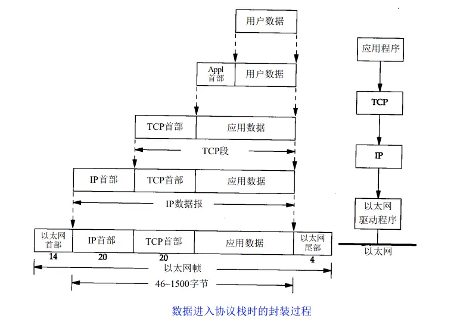
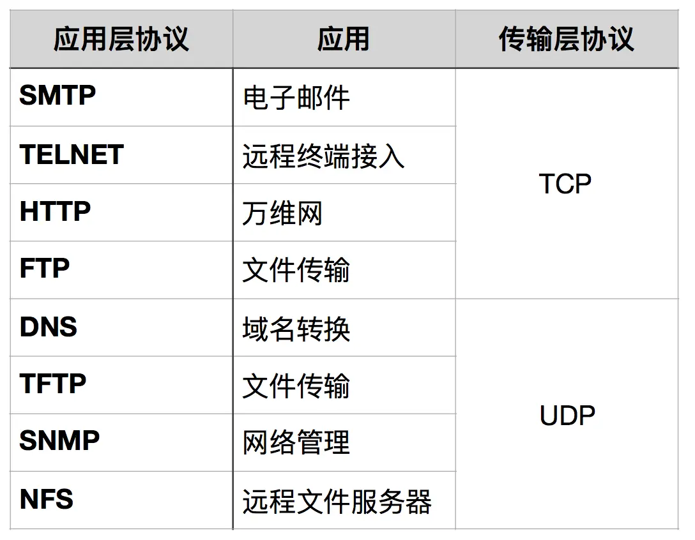
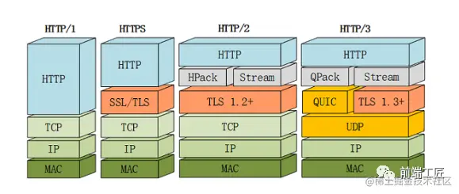

**物理层=>数据链路层=>网络层=>传输层=>会话层=>表示层=>应用层**
* 数据链路层
  数据链路层负责将0、1序列划分为数据帧从一个节点传输到临近的另一个节点,这些节点是通过MAC来唯一标识的(MAC,物理地址，一个主机会有一个MAC地址)。
* 网络层
  - **IP协议**
    - IP协议是TCP/IP协议的核心，所有的TCP，UDP，IMCP，IGMP的数据都以IP数据格式传输。要注意的是，**IP不是可靠的协议**，IP协议没有提供一种数据未传达以后的处理机制，这被认为是上层协议：TCP或UDP要做的事情。
  - **ARP协议**
    - ARP 是根据IP地址获取MAC地址的一种协议。ARP（地址解析）协议是一种解析协议，本来主机是完全不知道这个IP对应的是哪个主机的哪个接口，当主机要发送一个IP包的时候，会首先查一下自己的ARP高速缓存（就是一个**IP-MAC地址**对应表缓存）。
  - **RARP协议**的工作与ARP相反
  - **ICMP协议**
    - IP协议并不是一个可靠的协议，它不保证数据被送达，那么，自然的，保证数据送达的工作应该由其他的模块来完成。其中一个重要的模块就是ICMP(网络控制报文)协议。ICMP不是高层协议，而是IP层的协议。
    - **ping**可以说是ICMP的最著名的应用，是TCP/IP协议的一部分。利用“ping”命令可以检查网络是否连通，可以很好地帮助我们分析和判定网络故障。
    - **traceroute** 是用来侦测主机到目的主机之间所经路由情况的重要工具。
      - traceroute的原理是非常非常的有意思，它收到到目的主机的IP后，首先给目的主机发送一个TTL=1的UDP数据包，而经过的第一个路由器收到这个数据包以后，就自动把TTL减1，而TTL变为0以后，路由器就把这个包给抛弃了，并同时产生 一个主机不可达的ICMP数据报给主机。主机收到这个数据报以后再发一个TTL=2的UDP数据报给目的主机，然后刺激第二个路由器给主机发ICMP数据 报。如此往复直到到达目的主机。这样，traceroute就拿到了所有的路由器IP。
* 传输层
  - **TCP协议**
    - **三次握手** TCP协议是面向连接的协议，在正式收发数据前，必须和对方建立可靠的连接。一个TCP连接必须要经过三次握手才能建立成功。
      1. 第一次握手：建立连接。客户端发送连接请求报文段，将**SYN位置为1，Seq为x**；然后，客户端进入**SYN_SENT**状态，等待服务器的确认；
      2. 第二次握手：服务器收到SYN报文段。服务器收到客户端的SYN报文段，**需要对这个SYN报文段进行确认，设置Ack为x+1(Seq+1)**；同时，自己自己还要发送SYN请求信息，**将SYN位置为1，Seq为y**；服务器端将上述所有信息放到一个报文段（即SYN+ACK报文段）中，一并发送给客户端，此时服务器进入**SYN_RECV**状态；
      3. 第三次握手：客户端收到服务器的SYN+ACK报文段。然后将**Ack设置为y+1**，向服务器发送ACK报文段，这个报文段发送完毕以后，客户端和服务器端都进入**ESTABLISHED**状态，完成TCP三次握手。
      - 三次握手的目的是建立可靠的通信信道，主要的目的就是双方确认自己与对方的发送与接收机能正常。
        第一次握手：客户什么都不能确认；服务器确认了对方发送正常
        第二次握手：客户确认了：自己发送、接收正常，对方发送、接收正常；服务器确认了：自己接收正常，对方发送正常
        第三次握手：客户确认了：自己发送、接收正常，对方发送、接收正常；服务器确认了：自己发送、接收正常，对方发送接收正常
        所以三次握手就能确认双发收发功能都正常，缺一不可。
      - 第三次握手中，如果客户端的ACK未送达服务器，会怎样？
        Server端：由于Server没有收到ACK确认，因此会每隔 3秒 重发之前的SYN+ACK（默认重发五次，之后自动关闭连接进入CLOSED状态），Client收到后会重新传ACK给Server。
        Client端，会出现两种情况：
          - 在Server进行超时重发的过程中，如果Client向服务器发送数据，数据头部的ACK是为1的，所以服务器收到数据之后会读取 ACK number，进入 establish 状态
          - 在Server进入CLOSED状态之后，如果Client向服务器发送数据，服务器会以RST包应答。
    - **四次挥手**
      1. 第一次分手： 主机1（可以使客户端，也可以是服务器端），设置Seq，向主机2发送一个**FIN**报文段；此时，主机1进入**FIN_WAIT_1**状态；这表示主机1没有数据要发送给主机2了；
      2. 第二次分手： 主机2收到了主机1发送的FIN报文段，向主机1回一个ACK报文段，Ack为Seq+1；主机1进入**FIN_WAIT_2**状态；主机2告诉主机1，我“同意”你的关闭请求；主机2进入**CLOSE_WAIT**
      3. 第三次分手： 主机2向主机1发送**FIN**报文段，请求关闭连接，同时主机2进入**LAST_ACK**状态；
      4. 第四次分手： 主机1收到主机2发送的FIN报文段，向主机2发送ACK报文段，然后主机1进入**TIME_WAIT**状态；主机2收到主机1的ACK报文段以后，就关闭连接；此时，主机1等待2MSL后依然没有收到回复，则证明Server端已正常关闭，主机1也可以关闭连接了。服务器结束TCP连接的时间要比客户端早一些。
    - 流量控制
      1. 滑动窗口协议
      2. 流量控制是为了控制发送方发送速率，保证接收方来得及接收。
      3. 接收方发送的确认报文中的窗口字段可以用来控制发送方窗口大小，从而影响发送方的发送速率，这就是流量控制。
      |----数据1-5--->| 
      |<---ACK6(rwnd=3)--| (接收方处理变慢)
      |----数据6-8--->|
      |<---ACK9(rwnd=0)--| (零窗口)
      |----窗口探测包-->|
      |<---ACK9(rwnd=2)--| 
    - 拥塞控制
      1. 拥塞窗口(cwnd)
      2. 慢开始(slow start) cwnd指数增长：1 → 2 → 4 → 8
      3. 拥塞避免(congestion avoidance)
      4. 快重传(fast retransmit)
      5. 快恢复(fast recovery)





## HTTP
**HTTP(Hypertext Transfer Protocol) 超文本传输协议。**

### HTTP 1.0和 HTTP 1.1 有以下区别：
- 连接方面，http1.0 默认使用非持久连接，而 http1.1 默认使用持久连接。http1.1 通过使用**持久连接**来使多个 http 请求复用同一个 TCP 连接，以此来避免使用非持久连接时每次需要建立连接的时延。 `connection: keep-alive`
- http1.1 相对于 http1.0 还新增了很多请求方法，如 PUT、DELETE、OPTIONS 等。
- 资源请求方面，在 http1.0 中，存在一些浪费带宽的现象，例如客户端只是需要某个对象的一部分，而服务器却将整个对象送过来了，并且不支持断点续传功能，http1.1 则在请求头引入了 **range** 头域，它允许只请求资源的某个部分，即返回码是 **206（Partial Content）**，这样就方便了开发者自由的选择以便于充分利用带宽和连接。
- 缓存方面，在 http1.0 中主要使用 header 里的 If-Modified-Since、Expires 来做为缓存判断的标准，http1.1 则引入了更多的缓存控制策略，例如 Etag、If-Unmodified-Since、If-Match、If-None-Match 等更多可供选择的缓存头来控制缓存策略。
- http1.1 中新增了 host 字段，用来指定服务器的域名。http1.0 中认为每台服务器都绑定一个唯一的 IP 地址，因此，请求消息中的 URL 并没有传递主机名（hostname）。但随着虚拟主机技术的发展，在一台物理服务器上可以存在多个虚拟主机，并且它们共享一个IP地址。因此有了 host 字段，这样就可以将请求发往到同一台服务器上的不同网站。

### HTTP1.1 的缺陷
- 高延迟 — 队头阻塞(Head-Of-Line Blocking)
- 无状态特性 — 阻碍交互
- 明文传输 — 不安全性
- 不支持服务端推送

#### 1. 高延迟--带来页面加载速度的降低
虽然近年来网络带宽增长非常快，然而我们却并没有看到网络延迟有相应程度的降低。网络延迟问题主要由于队头阻塞(Head-Of-Line Blocking),导致带宽无法被充分利用。
队头阻塞是指当顺序发送的请求序列中的一个请求因为某种原因被阻塞时，在后面排队的所有请求也一并被阻塞，会导致客户端迟迟收不到数据。针对队头阻塞,人们尝试过以下办法来解决:

- 将同一页面的资源分散到不同域名下，提升连接上限。 Chrome有个机制，对于同一个域名，默认允许同时建立 6 个 TCP持久连接，使用持久连接时，虽然能公用一个TCP管道，但是在一个管道中同一时刻只能处理一个请求，在当前的请求没有结束之前，其他的请求只能处于阻塞状态。另外如果在同一个域名下同时有10个请求发生，那么其中4个请求会进入排队等待状态，直至进行中的请求完成。
- 合并小文件减少资源数。精灵图，Spriting合并多张小图为一张大图,再用JavaScript或者CSS将小图重新“切割”出来的技术。
- 内联(Inlining)资源是另外一种防止发送很多小图请求的技巧，将图片的原始数据嵌入在CSS文件里面的URL里，减少网络请求次数。
- 减少请求数量。拼接(Concatenation)将多个体积较小的JavaScript使用webpack等工具打包成1个体积更大的JavaScript文件,但如果其中1个文件的改动就会导致大量数据被重新下载多个文件。
#### 2、无状态特性--带来的巨大HTTP头部
无状态是指协议对于连接状态没有记忆能力。纯净的 HTTP 是没有 cookie 等机制的，每一个连接都是一个新的连接。
由于报文Header一般会携带"User Agent""Cookie""Accept""Server"等许多固定的头字段（如下图），多达几百字节甚至上千字节，但Body却经常只有几十字节（比如GET请求、204/301/304响应），成了不折不扣的“大头儿子”。Header里携带的内容过大，在一定程度上增加了传输的成本。更要命的是，请求响应报文里有大量字段值都是重复的，非常浪费。
#### 3、明文传输--带来的不安全性
HTTP/1.1在传输数据时，所有传输的内容都是明文，客户端和服务器端都无法验证对方的身份，这在一定程度上无法保证数据的安全性。
#### 4、不支持服务器推送消息


### HTTP 1.1 和 HTTP 2.0 的区别
- **二进制协议**：
  - HTTP/2传输数据量的大幅减少,主要有两个原因:以二进制方式传输和Header 压缩。我们先来介绍二进制传输,HTTP/2 采用二进制格式传输数据，而非HTTP/1.x 里纯文本形式的报文 ，二进制协议解析起来更高效。HTTP/2 将请求和响应数据分割为更小的帧，并且它们采用二进制编码。
  - HHTTP/2 头信息和数据体都是二进制，并且统称为"帧"，可以分为头信息帧和数据帧。 帧的概念是它实现多路复用的基础。把原来的"Header+Body"的消息"打散"为数个小片的二进制"帧"(Frame),用"HEADERS"帧存放头数据、"DATA"帧存放实体数据。HTP/2数据分帧后"Header+Body"的报文结构就完全消失了，协议看到的只是一个个的"碎片"。
  - HTTP/2 中，同域名下所有通信都在单个连接上完成，该连接可以承载任意数量的双向数据流。每个数据流都以消息的形式发送，而消息又由一个或多个帧组成。多个帧之间可以乱序发送，根据帧首部的流标识可以重新组装。
- **header压缩**：
  - HTTP/2 实现了头信息压缩，由于 HTTP 1.1 协议不带状态，每次请求都必须附上所有信息。所以，请求的很多字段都是重复的，比如 Cookie 和 User Agent ，一模一样的内容，每次请求都必须附带，这会浪费很多带宽，也影响速度。
  - HTTP/2并没有使用传统的压缩算法，而是开发了专门的"HPACK”算法，在客户端和服务器两端建立“字典”，用索引号表示重复的字符串，还采用哈夫曼编码来压缩整数和字符串，可以达到50%~90%的高压缩率。
- **多路复用**：
  - 多路复用很好的解决了浏览器限制同一个域名下的请求数量的问题，同时也接更容易实现全速传输。
  - 同域名下所有通信都在单个连接上完成。单个连接可以承载任意数量的双向数据流。
  - 数据流以消息的形式发送，而消息又由一个或多个帧组成，多个帧之间可以乱序发送，因为根据帧首部的流标识可以重新组装。
- **数据流**：
  - HTTP/2 使用了数据流的概念，因为 HTTP/2 的数据包是不按顺序发送的，同一个连接里面连续的数据包，可能属于不同的请求。因此，必须要**对数据包做标记**，指出它属于哪个请求。HTTP/2 将每个请求或回应的所有数据包，称为一个数据流。每个数据流都有一个独一无二的编号。数据包发送时，都必须标记数据流 ID ，用来区分它属于哪个数据流。
- **服务器推送**：
  - HTTP2还在一定程度上改变了传统的“请求-应答”工作模式，服务器不再是完全被动地响应请求，也可以新建“流”主动向客户端发送消息。比如，在浏览器刚请求HTML的时候就提前把可能会用到的JS、CSS文件发给客户端，减少等待的延迟，这被称为"服务器推送"（ Server Push，也叫 Cache push）

### HTTP2.0 的缺陷
虽然 HTTP/2 解决了很多之前旧版本的问题，但是它还是存在一个巨大的问题，主要是底层支撑的 TCP 协议造成的。HTTP/2的缺点主要有以下几点：
- TCP 以及 TCP+TLS 建立连接的延时
- TCP 的队头阻塞并没有彻底解决
- 多路复用导致服务器压力上升，容易 Timeout

#### 1. 建连延时
HTTP/2都是使用TCP协议来传输的，而如果使用HTTPS的话，还需要使用TLS协议进行安全传输，而使用TLS也需要一个握手过程，这样就需要有两个握手延迟过程：
1. 在建立TCP连接的时候，需要和服务器进行三次握手来确认连接成功，即需要消耗完 1.5 个 RTT 之后才能进行数据传输。
2. 进行TLS连接，TLS有两个版本——TLS1.2和TLS1.3，每个版本建立连接所花的时间不同，大致是需要1~2个RTT。
总之，在传输数据之前，我们需要花掉 3～4 个 RTT。
`RTT（Round-Trip Time）:`
往返时延。表示从发送端发送数据开始，到发送端收到来自接收端的确认（接收端收到数据后便立即发送确认），总共经历的时延。
#### 2. 队头阻塞没有彻底解决
上文我们提到在HTTP/2中，多个请求是跑在一个TCP管道中的。但当出现了丢包时，HTTP/2 的表现反倒不如 HTTP/1 了。因为TCP为了保证可靠传输，有个特别的“丢包重传”机制，丢失的包必须要等待重新传输确认，HTTP/2出现丢包时，**整个 TCP 都要开始等待重传**，那么就会阻塞该TCP连接中的所有请求。而对于 HTTP/1.1 来说，可以开启多个 TCP 连接，出现这种情况反到只会影响其中一个连接，剩余的 TCP 连接还可以正常传输数据。
#### 3. 多路复用导致服务器压力上升，容易 Timeout

### HTTP/3简介
Google 在推SPDY的时候就已经意识到了这些问题，于是就另起炉灶搞了一个基于 UDP 协议的“QUIC”协议，让HTTP跑在QUIC上而不是TCP上。而这个“HTTP over QUIC”就是HTTP协议的下一个大版本，HTTP/3。它在HTTP/2的基础上又实现了质的飞跃，真正“完美”地解决了“队头阻塞”问题。


上面我们提到QUIC基于UDP，而UDP是“无连接”的，根本就不需要“握手”和“挥手”，所以就比TCP来得快。此外QUIC也实现了可靠传输，保证数据一定能够抵达目的地。它还引入了类似HTTP/2的“流”和“多路复用”，单个“流"是有序的，可能会因为丢包而阻塞，但其他“流”不会受到影响。具体来说QUIC协议有以下特点：
- 实现了类似TCP的流量控制、传输可靠性的功能
  - 虽然UDP不提供可靠性的传输，但QUIC在UDP的基础之上增加了一层来保证数据可靠性传输。它提供了数据包重传、拥塞控制以及其他一些TCP中存在的特性。
- 实现了快速握手功能
  - 由于QUIC是基于UDP的，所以QUIC可以实现使用0-RTT或者1-RTT来建立连接，这意味着QUIC可以用最快的速度来发送和接收数据，这样可以大大提升首次打开页面的速度。0RTT 建连可以说是 QUIC 相比 HTTP2 最大的性能优势。
- 多路复用，彻底解决TCP中队头阻塞的问题
  - 和TCP不同，QUIC实现了在同一物理连接上可以有多个独立的逻辑数据流（如下图）。实现了数据流的单独传输，就解决了TCP中队头阻塞的问题。
- 连接迁移
  - TCP 是按照 4 要素（客户端 IP、端口, 服务器 IP、端口）确定一个连接的。而 QUIC 则是让客户端生成一个 Connection ID （64 位）来区别不同连接。只要 Connection ID 不变，连接就不需要重新建立，即便是客户端的网络发生变化。由于迁移客户端继续使用相同的会话密钥来加密和解密数据包，QUIC 还提供了迁移客户端的自动加密验证。
- 集成了TLS加密功能

### 网络请求优先级
**浏览器默认优先级规则**：
1. 阻塞渲染资源（CSS、首屏JS） → Highest
2. 预加载资源（`<link rel="preload" />`） → High
3. 图片/字体（视口内可见） → Medium
4. 异步脚本（async/defer） → Low
5. 预取资源（prefetch） → Lowest

``` html
<!-- 强制提升优先级 -->
<link rel="preload" href="font.woff2" as="font" type="font/woff2" crossorigin>

<!-- 优先级提示 -->

<script src="analytics.js" fetchpriority="low"></script>

<!-- Fetch API 设置优先级 -->
<script>
  fetch('/data.json', {
    priority: 'high' // 'low' | 'auto'
  });
</script>
```


## HTTPS
[原理](https://juejin.cn/post/6844903504046211079?searchId=20250325170030299BDAE6564668955061)
1. 首先，浏览器会向服务器发送一个Client Hello消息，其中包含浏览器支持的 **TLS 版本、加密算法集以及一个随机数**。这个消息是握手过程的起始点，用于告知服务器浏览器的基本信息和加密需求。
2. 接着，服务器会回应一个Server Hello消息，其中包含**双方共同支持的 TLS 版本、加密算法集和另一个随机数**。这个消息是服务器对浏览器请求的响应，表示双方已就加密参数达成一致。
3. 然后，服务器会发送一个Certificate消息，其中附加了**服务器的证书**。这个证书用于证明服务器的身份，确保浏览器连接的是真实的、可信任的服务器。浏览器在接收到证书后，会对其进行验证，以确保其有效性。
4. 在证书验证通过后，浏览器会使用**证书中附带的公钥**生成一个pre-master secret，并将其作为Client Key Exchange消息体发送给服务器。这个**pre-master secret是后续生成加密密钥的重要基础**。
5. 服务器在收到pre-master secret后，会使用自己的私钥进行解密，得到原始的pre-master secret。然后，**服务器和浏览器会使用这个pre-master secret和之前收到的对方的随机数，共同生成一个相同的master key。这个master key将用于加密和解密后续所有的通信数据**。
6. 接下来，浏览器会发送一个Change Cipher Spec消息，告知服务器已准备好使用新的加密密钥进行通信。紧接着，浏览器会发送一个使用master key加密的Finished消息，以验证加密密钥的正确性。
7. 服务器在接收到这些消息后，也会进行相应的验证和处理。一旦验证通过，服务器会同样发送一个Change Cipher Spec消息和一个使用master key加密的Finished消息给浏览器，表示握手过程已完成，双方已建立起安全的通信通道。
至此，HTTPS 的握手过程就告一段落了。

## WebSocket
与http协议一样，WebSocket协议也需要通过已建立的TCP连接来传输数据。具体实现上是通过http协议建立通道，然后在此基础上用真正的WebSocket协议进行通信。

### WebSocket 握手
**浏览器请求**
```
GET /chat HTTP/1.1
Host: server.example.com
Origin: http://example.com
Upgrade: websocket
Connection: Upgrade
Sec-WebSocket-Key: x3JJHMbDL1EzLkh9GBhXDw==
Sec-WebSocket-Protocol: chat, superchat
Sec-WebSocket-Version: 13
```
- `Upgrade: websocket; Connection: Upgrade` 告诉 Apache、Nginx 等服务器，发起的请求要用 WebSocket 协议
- `Sec-WebSocket-Key` 是一个 Base64 encode 的值，这个是浏览器随机生成的
- `Sec_WebSocket-Protocol; Sec-WebSocket-Version` 是子协议类型和版本

**服务器返回**
```
HTTP/1.1 101 Switching Protocols
Upgrade: websocket
Connection: Upgrade
Sec-WebSocket-Accept: HSmrc0sMlYUkAGmm5OPpG2HaGWk=
Sec-WebSocket-Protocol: chat
```
- `101 Switching Protocols` 表示服务器切换协议
- `Sec-WebSocket-Protocol: chat` 只能选择浏览器传过来的一个
- `Sec-WebSocket-Accept` 针对浏览器传来的 key 进行加密，用于浏览器接收验证
