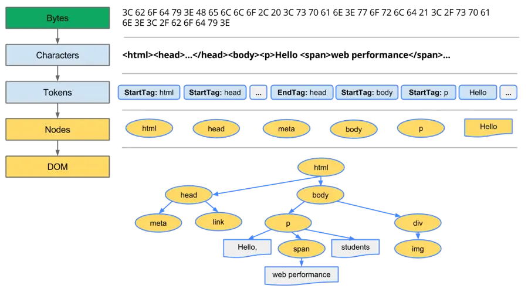
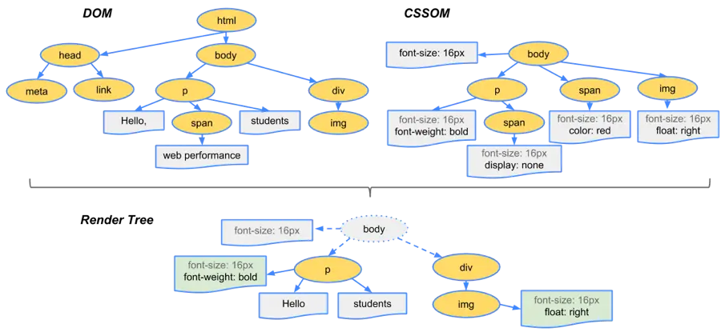

## 浏览器渲染流程
1. 解析HTML，构建DOM树
2. 解析CSS，生成CSS规则树
3. 合并DOM树和CSS规则，生成render树
4. 布局render树（Layout/reflow），负责各元素尺寸、位置的计算
5. 绘制render树（paint），绘制页面像素信息
6. 浏览器会将各层的信息发送给GPU，GPU会将各层合成（composite），显示在屏幕上

渲染完毕后会触发load事件。
DOMContentLoaded 事件触发时，仅当DOM加载完成，不包括样式表，图片，脚本。

### HTML解析
`Bytes → characters → tokens → nodes → DOM`



1. Conversion转换：浏览器将获得的HTML内容（Bytes）基于他的编码转换为单个字符
2. Tokenizing分词：浏览器按照HTML规范标准将这些字符转换为不同的标记token。每个token都有自己独特的含义以及规则集
3. Lexing词法分析：分词的结果是得到一堆的token，此时把他们转换为对象，这些对象分别定义他们的属性和规则
4. DOM构建：因为HTML标记定义的就是不同标签之间的关系，这个关系就像是一个树形结构一样
例如：body对象的父节点就是HTML对象，然后段略p对象的父节点就是body对象

### css加载
CSS解析与HTML类似
* css 由单独的下载线程异步下载
* `css加载` 不会阻塞 DOM 树构建
* `css加载` 会阻塞render构建

### 构建渲染树
当DOM树和CSSOM都有了后，就要开始构建渲染树了
一般来说，渲染树和DOM树相对应的，但不是严格意义上的一一对应
因为有一些不可见的DOM元素不会插入到渲染树中，如`head`这种不可见的标签或者`display: none`等


### 布局（回流）和绘制（重绘）
回流的成本开销要高于重绘，而且一个节点的回流往往回导致子节点以及同级节点的回流。
- 减少逐项更改样式，最好一次性更改style，或者将样式定义为class并一次性更新
- 避免循环操作dom，创建一个documentFragment或div，在它上面应用所有DOM操作，最后再把它添加到window.document
- 使用 `createDocumentFragment`，或者设置 CSS `display: none` 进行操作
- 避免多次读取offset等属性。无法避免则将它们缓存到变量
- 将复杂的元素绝对定位或固定定位，使得它脱离文档流，否则回流代价会很高 （transform 开启图层）
- **注意：改变字体大小会引发回流**

### 简单层与复合层
- 可以认为默认只有一个复合图层，所有的DOM节点都是在这个复合图层下的
- 如果开启了硬件加速功能，可以将某个节点变成复合图层
- 复合图层之间的绘制互不干扰，由GPU直接控制
- 而简单图层中，就算是absolute等布局，变化时不影响整体的回流，但是由于在同一个图层中，仍然是会影响绘制的，因此做动画时性能仍然很低。而复合层是独立的，所以一般做动画推荐使用硬件加速

常用方式
* `transform: translate3d; transform: translateZ(0)`
* `opacity: 0.99` 值 <1 会创建新层叠上下文
* `will-change: transform;`
``` css
.animated-element {
  will-change: transform; /* 创建独立合成层 */
  transform: translateZ(0); /* 硬件加速 */
}
```

``` css
/* 优化前：嵌套层叠上下文 */
.modal {
  position: fixed;
  z-index: 1000;
  /* 创建新层叠上下文 */
  opacity: 0.95;
}

/* 优化后：减少层叠深度 */
.modal {
  position: fixed;
  z-index: 1000;
  /* 移除 opacity 改用背景色 */
  background: rgba(0,0,0,0.95); 
}
```