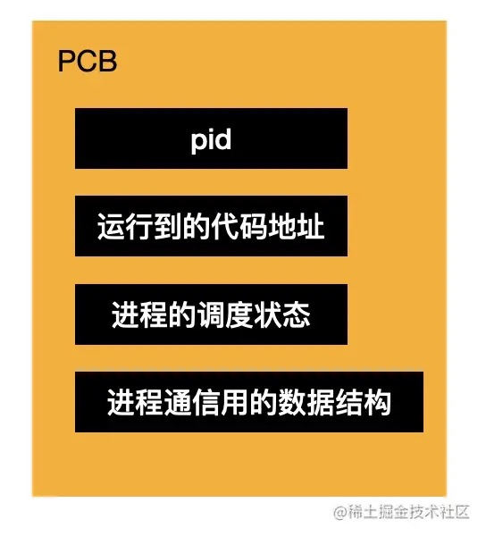
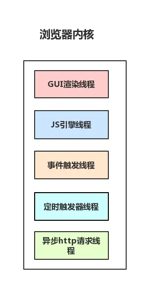
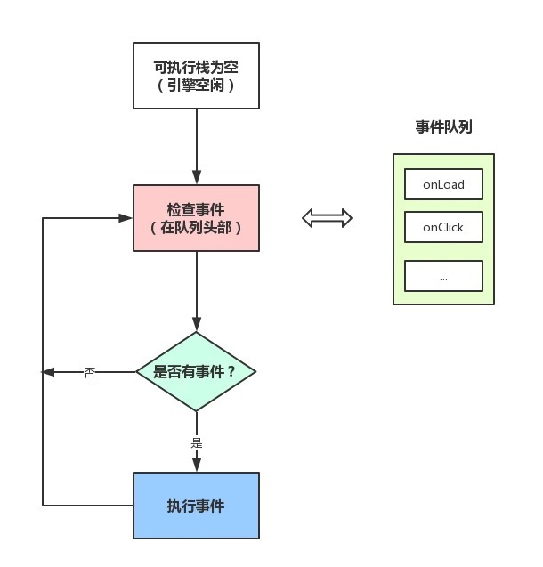

## 进程(process) & 线程(thread)
* 进程是cpu**资源分配**的最小单位（是能拥有资源和独立运行的最小单位）
* 线程是cpu**调度**的最小单位（线程是建立在进程的基础上的一次程序运行单位，一个进程中可以有多个线程）
* 进程之间相互独立，但同一进程下的各个线程之间共享程序的内存空间(包括代码段、数据集、堆等)及一些进程级的资源(如打开文件和信号)。
* 调度和切换：线程上下文切换比进程上下文切换要快得多。
---

### 进程
进程包括要执行的代码、代码操作的数据，以及进程控制块 `PCB（Processing Control Block）`，因为程序就是代码在数据集上的执行过程，而执行过程的状态和申请的资源需要记录在一个数据结构（PCB）里。所以进程由代码、数据、PCB 组成。


PCB 中记录着 pid、执行到的代码地址、进程的状态（阻塞、运行、就绪等）以及用于通信的信号量、管道、消息队列等数据结构。


### 进程间通信
不同进程之间因为可用的内存不同，所以要通过一个中间介质通信。
#### 同一台机器上的进程通信
* `信号量（简单标记）`：如果是简单的标记，通过一个数字来表示，放在 PCB 的一个属性里，这叫做信号量，比如锁的实现就可以通过信号量。
  比如信号量初始值是1，进程1来访问一块内存的时候，就把信号量设为0，然后进程2也来访问的时候看到信号量为0，就知道有其他进程在访问了，就不访问了。
* `管道（读写文件）`：但是信号量不能传递具体的数据啊，传递具体数据还得用别的方式。比如我们可以通过**读写文件的方式来通信**，这就是管道，如果是在**内存中的文件**，叫做`匿名管道`，没有文件名，如果是真实的**硬盘的文件**，是有文件名的，叫做`命名管道`。
  文件需要先打开，然后再读和写，之后再关闭，这也是管道的特点。**管道是基于文件的思想封装的，之所以叫管道，是因为只能一个进程读、一个进程写，是单向的（半双工）**。而且还需要目标进程同步的消费数据，不然就会阻塞住。
  这种管道的方式实现起来很简单，就是一个文件读写，但是只能用在两个进程之间通信，只能同步的通信。其实管道的同步通信也挺常见的，就是 stream 的 pipe 方法。
* `消息队列（异步队列）`：管道实现简单，但是同步的通信比较受限制，那如果想做成**异步通信**呢？加个**队列**做缓冲（buffer）不就行了，这就是消息队列。
  消息队列也是两个进程之间的通信，但是不是基于文件那一套思路，虽然也是单向的，但是有了一定的异步性，可以放很多消息，之后一次性消费。
* `共享内存（多个进程共享）`：管道、消息队列都是两个进程之间的，如果**多个进程之间**呢？
  我们可以通过申请一段多进程都可以操作的内存，叫做共享内存，用这种方式来通信。由一个进程创建，各进程都可以向该内存读写数据，效率比较高。
  共享内存虽然效率高、也能用于多个进程的通信，但也不全是好处，因为多个进程都可以读写，那么就很容易乱，要自己控制顺序，比如通过进程的信号量（标记变量）来控制。

#### 不同机器上的进程通信
本地过程调用就是我们上面说的**信号量、管道、消息队列、共享内存**的通信方式，但是如果是网络上的，那就要通过网络协议来通信了，这个其实我们用的比较多，比如 http、websocket。
* `socket`：其他的都是同一台主机之间的进程通信，而在不同主机的进程通信就要用到socket的通信方式了，比如发起http请求，服务器返回数据
---

浏览器每个 tab 标签页是一个进程，包含了多个线程
### Chrome 浏览器进程
* `Browser 进程`：浏览器主进程，只有一个。
  * 浏览器界面展示、交互，前进、后退、收藏等
  * 负责各个页面的管理，创建和销毁其他进程
  * 将 `Renderer进程` 得到的内存中的 `Bitmap`，绘制到用户界面上
  * 处理不可见操作，网络请求，文件访问等
  * 同时提供存储功能
* `GPU进程`：最多一个，用于3D绘制等。
* `网络进程`：负责发起和接受网络请求。
* `插件进程`：每种类型的插件对应一个进程，仅当使用该插件时才创建。
* `渲染引擎（浏览器内核）`：内部是多线程的。核心任务是将HTML、CSS、JS转为用户可以与之交互的网页，`排版引擎Blink` 和 `JS引擎V8` 都是运行在该进程中，默认情况下Chrome会为每个Tab标签页创建一个渲染进程
  
  * `GUI渲染线程`：负责渲染页面，解析html和CSS、构建DOM树、CSSOM树、渲染树、布局和绘制页面，重绘重排也是在该线程执行。
  * `JS引擎线程`：一个tab页中只有一个JS引擎线程(单线程)，负责解析和执行JS。它与GUI渲染线程不能同时执行，只能一个一个来，如果JS执行过长就会导致阻塞掉帧。
  * `事件触发线程`：主要用来控制**事件循环**，比如JS执行遇到计时器，AJAX异步请求，鼠标点击等，就会将对应任务添加到事件触发线程中，在对应事件符合触发条件触发时，就把事件添加到待处理队列的队尾，等JS引擎处理（当JS引擎空闲时才会去执行）
  * `计时器线程`：指`setInterval` 和 `setTimeout`，因为JS引擎是单线程的，所以如果处于阻塞状态，那么计时器就会不准了，所以需要单独的线程来负责计时器工作（计时完毕后，添加到**事件队列**)。W3C在HTML标准中规定，规定要求 `setTimeout` 中低于4ms的时间间隔算为**4ms**。
  * `异步http请求线程`：XMLHttpRequest连接后浏览器开的一个线程，比如请求有回调函数，异步线程就会将回调函数加入**事件队列**，等待JS引擎空闲执行

  > `GUI渲染线程` 与 `JS引擎线程` 互斥！
  由于 `JavaScript` 是可操纵 `DOM` 的，如果在修改这些元素属性同时渲染界面（即 `JS引擎线程` 和 `UI线程` 同时运行），那么渲染线程前后获得的元素数据就可能不一致了。因此为了防止渲染出现不可预期的结果，浏览器设置 `GUI渲染线程` 与 `JS引擎线程` 为互斥的关系，当 `JS引擎线程` 执行时 `GUI线程` 会被挂起，GUI更新会被保存在一个**队列（浏览器可做优化**）中等到引擎线程空闲时立即被执行。
  所以说 **JS阻塞页面加载**。当浏览器在执行JavaScript程序的时候，GUI渲染线程会被保存在一个队列中，直到JS程序执行完成，才会接着执行。因此如果JS执行的时间过长，这样就会造成页面的渲染不连贯，导致页面渲染加载阻塞的感觉。

#### 如何实现浏览器内多个标签页之间的通信
本质上是找个中间者
- 使用 websocket 协议，因为 websocket 协议可以实现服务器推送，所以服务器就可以用来当做这个中介者。标签页通过向服务器发送数据，然后由服务器向其他标签页推送转发。
- 使用 ShareWorker 的方式，shareWorker 会在页面存在的生命周期内创建一个唯一的线程，并且开启多个页面也只会使用同一个线程。这个时候共享线程就可以充当中介者的角色。标签页间通过共享一个线程，然后通过这个共享的线程来实现数据的交换。
- 使用 localStorage 的方式，我们可以在一个标签页对 localStorage 的变化事件进行监听，然后当另一个标签页修改数据的时候，我们就可以通过这个监听事件来获取到数据。这个时候 localStorage 对象就是充当的中介者的角色。
- 使用 postMessage 方法，如果我们能够获得对应标签页的引用，就可以使用postMessage 方法，进行通信。

---

### Event Loop
JS异步依赖于 `事件触发线程` 管理的 `事件队列`，每个异步调用结束会往 `事件队列` 添加一个回调函数，等到 JS 引擎空闲会逐个执行，这个检查时轮训着的，所以也叫 `事件循环`。
每个线程都有自己的事件循环，每个 web worker 也是，保证了能够独立执行。同源的标签共享一个事件循环，所以能够同步通信。


* macrotask
  * setTimeout / setInterval
  * setImmediate
  * MessageChannel
  * postMessage
  * I/O
  * script(JS 引擎执行)
  * GUI rendering
* microtask
  * Promise.then/catch/finally
  * MutationObserver：监听dom变化
  * fetch API
  * v8 垃圾回收
  * process.nextTick(NodeJS)

* 宏任务的回调会添加到 `事件队列`，每次执行完一个回调，浏览器会重新渲染。
* 宏任务中碰到微任务，会在执行完这个宏任务后执行所有微任务，然后重新渲染，继续执行下一个宏任务。
  ``` js
  for (macroTask of macroTaskQueue) {
    // 1. Handle current MACRO-TASK
    handleMacroTask();

    // 2. Handle all MICRO-TASK
    for (microTask of microTaskQueue) {
        handleMicroTask(microTask);
    }
  }
  ```
  

---

#### [HTML5 Web Workers](https://developer.mozilla.org/en-US/docs/Web/API/Web_Workers_API/Using_web_workers) - JS的多线程
* 单独的 js 脚本文件，运行在独立的 `全局context`，没有 `window` 变量，可通过 `self` 获取。
* `Dedicated workers`：通过 `Worker("path/to/worker/script")` 创建的实例
  * 由 `渲染引擎线程` 创建的一个线程，不能和其他 `渲染引擎线程` 共享
  * 主代码向 worker 通信：`Worker.postMessage` 和 `onmessage`
  * worker 向主代码通信：`self.postMessage` 和 `Worker.onmessage/addEventListener('message', fn)`
* `Shared workers`：通过 `SharedWorker("path/to/worker/script")` 创建的实例
  * 浏览器所有页面共享，独立进程管理，只会有一个。
  * 主代码向 SharedWorker 通信：`SharedWorker.port.postMessage` 和 `onconnect`
  * SharedWorker 向主代码通信：`port.postMessage` 和 `SharedWorker.port.onmessage`