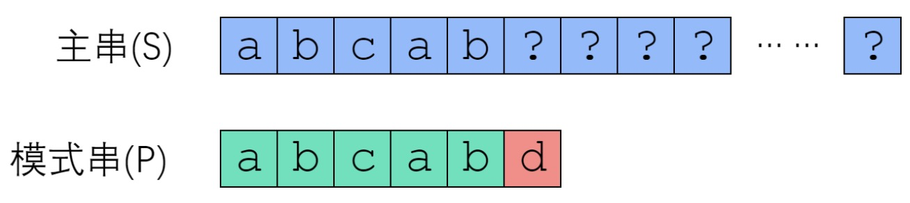
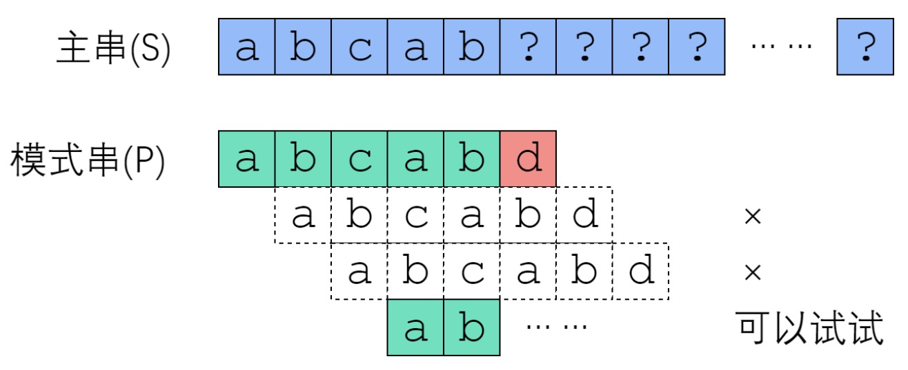
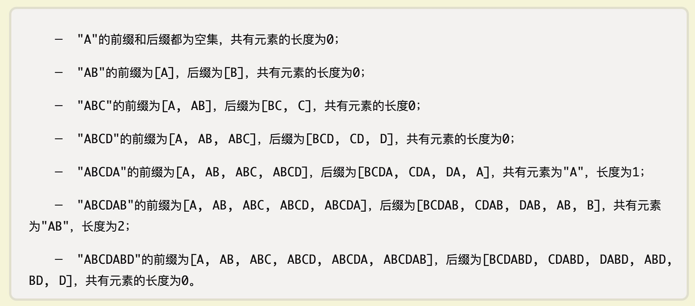
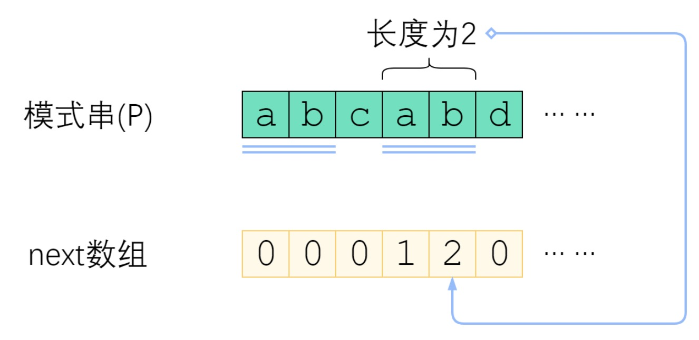
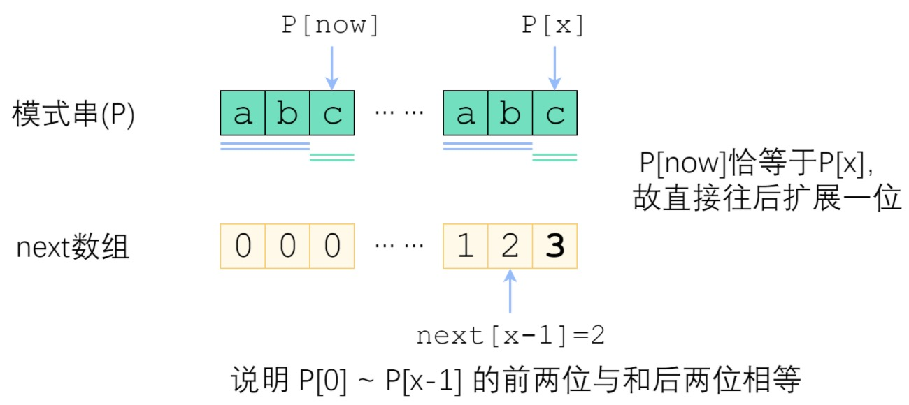
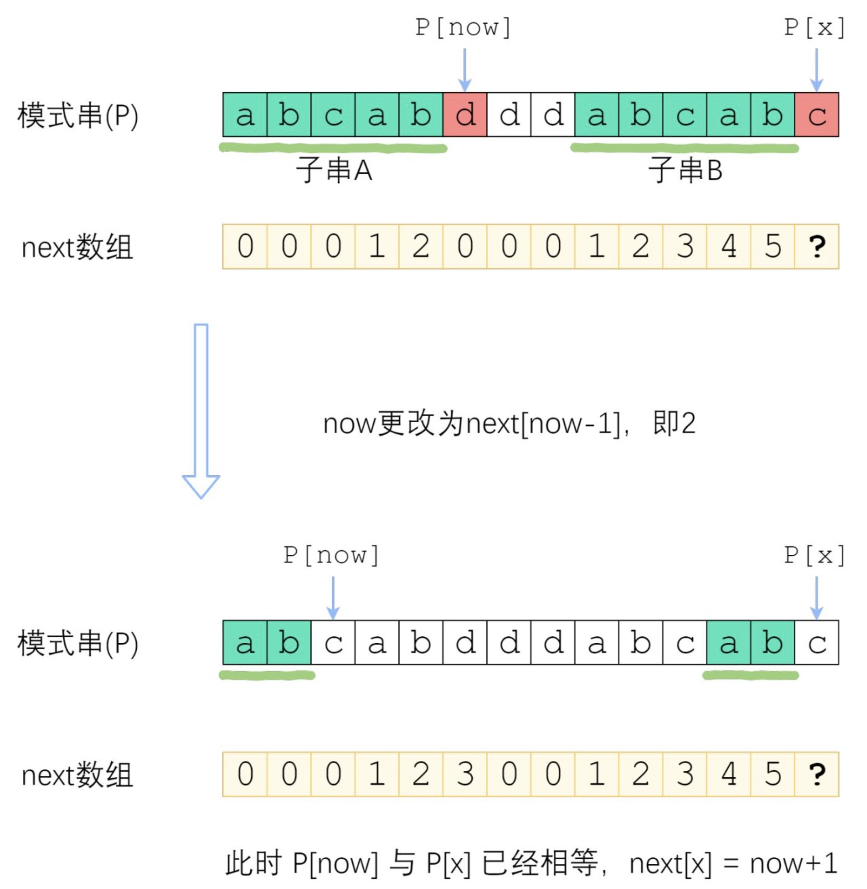

## KMP算法

**字符串匹配算法，时间复杂度为 O(n+m)。其中 n 为主串长度，m 为模式串长度。**

### 暴力解法(Brute-Force)
传统的暴力解法，复杂度为 O((n-m+1)*m)，一般 n 长度比 m 大得多，故复杂度接近 O(nm)。

``` javascript
const bfSearch = (S, P) => {
    const slen = S.length, plen = P.length
    let i = j = 0

    while (i < slen && j < slen) {
        if (S[i] === P[j]) {
            i++
            j++
        } else {
            i = i - j + 1 // 重新回到第二位
            j = 0
        }
    }

    if (j === plen) {
        return i - j // 返回匹配位置
    }

    return -1
}
```

想要降低算法复杂度，只能通过减少比较的“趟数”，因为字符串的比较不可避免的需要从头到尾遍历所有字符。

### KMP
**利用残余的信息，是KMP算法的思想所在。**
每次匹配失败后，会有一些有用信息：主串的某一个子串等于模式串的某一个前缀。
我们需要根据这些信息，设计来跳过 `不可能成功` 的子串。

有如下主串和模式串，第一次匹配失败的位置在模式串的第5位 `P[5]`。

我们来考虑：从 `S[1]`、`S[2]`、`S[3]` 开始的匹配尝试，有没有可能成功。
可以明显看到 `S[1]`、`S[2]` 匹配失败，首字符都不同。但 `S[3]` 是有可能成功的，就目前的信息无法作出进一步的判断。
因此 `S[1]`、`S[2]` 就是需要跳过的 `不可能成功` 的子串。


基于上面的思考，我们来说说 `next数组`。

#### next数组
`next数组` 是针对模式串而言的。P 的 next数组定义为：`next[i]`，表示 `P[0]` 到 `P[i]` 这一子串，使得 `前k个字符恰等于后k个字符` 的最大的k。
即 `P[0-i]` 这一子串，所有的前缀和后缀子串，相同的最大子串长度。


所以 P 的 `next数组` 为 [0,0,0,1,2,0]。


在每次匹配失败时，由匹配成功的子串，计算获得 `next数组`。通过两次遍历的算法复杂度为 O(m^2)。

#### 递推方式求 `next数组`
如果 `next[0]`、`next[1]`、...`next[x-1]` 已知，如何求 `next[x]`？
首先已知 `next[x-1]`，记为 `now`。那么如果 `P[x] === P[now]`，则匹配成功的子串长度加一，即 `next[x] = now + 1`。


如果 `P[x] !== P[now]`，则 `next[x]` 不能设为 `now + 1`。
那我们目的就是在保证 now 还可以用的前提，缩小 now -> newNow，找到符合 `P[x] === P[newNow]` 的。
通过下图可以发现，子串A和子串B相同，newNow 其实求的就是这个子串的最大前后缀串，这个可以通过前面子串A计算的 `next值` 获得


最终实现
``` javascript
// 获取最大前缀后缀匹配长，普通解法，递推法不需要
const getMaxSubStr = (str) => {
    const len = str.length
    if (len <= 1) return 0
    
    let i = 1
    let max = 0
    while (i < len) {
        if (str.slice(0, i) === str.slice(len - i, len)) {
            max = i
        }
        i++
    }

    return max
}
// 获取 next数组
const getNextArr = (str) => {
    const len = str.length
    if (len < 2) return new Array(len).fill(0)

    const arr = [0] // 第一个值固定为0
    let i = 1
    while (i < len) {
        let last = arr[i-1]
        if (str[i] === str[last]) {
            arr.push(last + 1)
        } else {
            arr.push(arr[last]) // arr[last] 获取前匹配子串的最大前后缀
        }
        i++
    }

    return arr
}
const kmpSearch = (S, P) => {
    const slen = S.length, plen = P.length
    let i = j = 0

    const nextArr = getNextArr(P)

    while (i < slen && j < plen) {
        if (S[i] === P[j]) {
            i++
            j++
        } else {
            // 注意，i不再需要移动，只需要移动j到合适的位置继续进行比较
            if (j === 0) {
                i++
                continue
            }
            j = nextArr[j-1] // 匹配错误，获取前一个字符对应的 next值
        }
    }

    if (j === plen) {
        return i - j
    }

    return -1
}
```