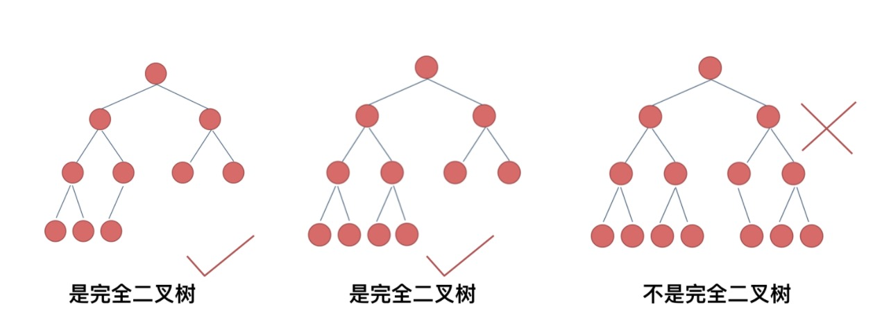
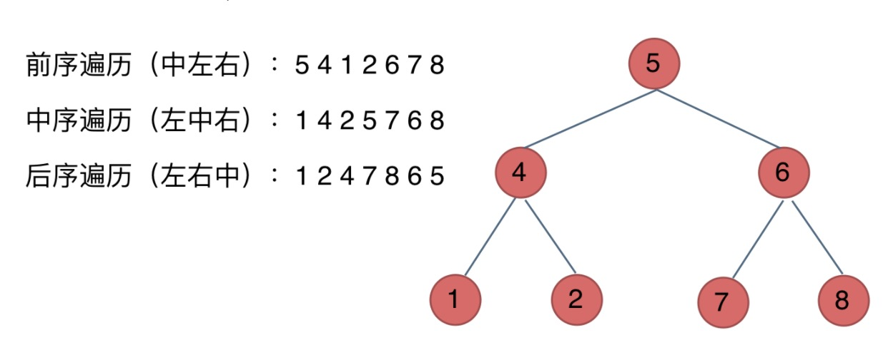

## 术语

* **节点深度：** 根节点到x节点的路径长度。根节点深度为0，第二层节点深度为1，以此类推。
* **节点高度：** 叶子节点到x节点的路径长度。
* **树的深度：** 最大节点深度就是树的深度，也称为高度。
* **度：** 节点的子树数目就是节点的度。

---

## 二叉树(Binary Tree)

### 类型
* **完全二叉树：** 叶子节点从左到右，紧密排列。
  
* **满二叉树：** 全部排满的完全二叉树。
  
* **平衡二叉树：** 左右子树高度差不超过1。
  
* **二叉搜索树：** 二叉搜索树是一个有序树。根节点数值大于左子树，小于右子树。
  

### 遍历方式

#### 链式存储的二叉树节点定义
``` Javascript
class TreeNode {
  constructor(val) {
    this.val = val
    this.left = new TreeNode(null)
    this.right = new TreeNode(null)
  }
}
```

#### 深度优先遍历
顺序是针对根节点而言的。
1. **前序遍历：** 根结点 -> 左子树 -> 右子树
   ``` Javascript
   // 递归法
   const getPreorder = (root, res = []) => {
     if (!root) return

     res.push(root.val)
     getPreorder(root.left, res)
     getPreorder(root.right, res)

     return res
   }

   const preorderTraversal = (root) => {
     if (!root) return []

     return getPreorder(root)
   }

   // 迭代法
   const preorderTraversal = (root) => {
    const stack = []
    const output = []
    let top
    while (root || stack.length) {
      if (root) {
          output.push(root.val)
          stack.push(root)
          root = root.left
      } else {
          top = stack.pop()
          root = top.right
      }
    }
    
    return output
   }
   ```

2. **中序遍历：** 左子树 -> 根结点 -> 右子树
   ``` Javascript
   // 递归法
   const getInorder = (root, res = []) => {
     if (!root) return

     getInorder(root.left, res)
     res.push(root.val)
     getInorder(root.right, res)

     return res
   }

   const inorderTraversal = (root) => {
     if (!root) return []

     return getInorder(root)
   }

   // 迭代法
   const inorderTraversal = (root) => {    
    const stack = []
    const output = []
    let top
    while(root || stack.length) {
      if (root) {
          stack.push(root)
          root = root.left
      } else {
          top = stack.pop() 
          output.push(top.val)
          root = top.right
      }
    }
    
    return output
   }
   ```

3. **后序遍历：** 左子树 -> 右子树 -> 根结点
   ``` Javascript
   // 递归法
   const getPostorder = (root, res = []) => {
    if (!root) return

    getPostorder(root.left, res)
    getPostorder(root.right, res)
    res.push(root.val)

    return res
   }

   const postorderTraversal = (root) => {
     if (!root) return []

     return getPostorder(root)
   }

   // 迭代法
   const postorderTraversal = (root) => {
    const stack = []
    const output = []
    let top
    while (root || stack.length) {
      if (root) {
          stack.push(root)
          output.unshift(root.val)
          root = root.right
      } else {
          top = stack.pop()
          root = top.left
      }
    }
    
    
    return output
   }
   ```


#### 广度优先遍历
* **层次遍历：**
